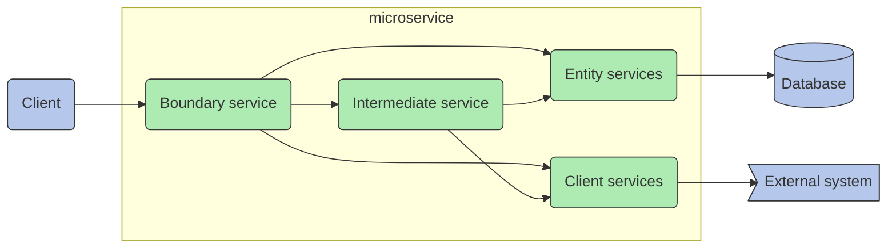
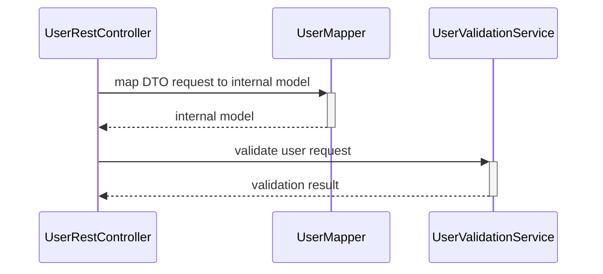
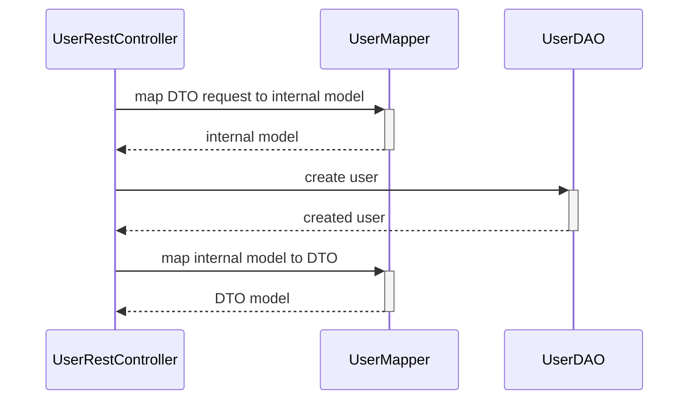

# Quarkus Project Structure in OneCX

| |  The source code of the sample application is located in the documentation repository [Base example](https://github.com/onecx/docs-guides-quarkus/tree/main/docs/modules/quarkus/examples/quarkus/base/example) |
| ----------------------------------------------------------------------------------------------------------------------------------------------------------------------------------------------------------------- |

## [](#%5Fmaven%5Fproject%5Fstructure)Maven Project Structure

OneCx Quarkus project is [Maven](https://maven.apache.org/) project.We use **default maven structure** which includes: java code and resources, helm templates and dockerfile.

Maven project structure

```java
.github                         // github configuration
src                             // source code directory
  main                          // main resources
     docker                     // docker configuration
        Dockerfile.jvm          // JVM docker image
        Dockerfile.native       // Native docker image
     helm                       // helm template
        Chart.yaml              // helm chart for application
        values.yaml             // helm chart values for the application
     openapi                    // openapi definitions
        example-openapi.yaml    // example api definition
     java                       // java source code
     resources                  // application resources
       application.properties   // quarkus configuration
  test                          // test resources
     java                       // java tests
     resources                  // test resources
pom.xml                         // maven project configuration
```

The helm template are in the `src/main/helm` and dockerfile is in the `src/main/docker` directory. GitHub project configuration is defined in the `.github` directory.

## [](#%5Fmaven%5Fconfiguration)Maven Configuration

pom.xml parent configuration

```xml
<parent>
    <groupId>org.tkit.onecx</groupId>
    <artifactId>onecx-quarkus3-parent</artifactId>
    <version>0.67.0</version>
</parent>
```

## [](#%5Fjava%5Fnamings)Java Namings



Basically all our microservice consist of 3 main layers

* Boundary components providing REST api ( or AMQP, Events, …​) to outside world.
* IntermediateService which implements business logic. These components are often omitted.
* Entity services are components taking care of data management, basically fetching storing the data from/to database
* Client services which are

Java classes:

Validation request sequence:



Create user request sequence:



* RestController – Any class named RestController is supposed to expose API to outside world For example: `UserRestController`
* Service – (IntermediateService) the core components containing business logic, shareable piece of codes for other components usually controllers or other services as well. For example: `UserValidationService`
* Mapper - Object mapper for mapping DTO to internal models and vice versa. For example: `UserMapper`.
* DAO - Data access object (JPA entity wrapper) For example: `UserDAO`

Each project should have own package which contains the domain of the project. All projects in the `onecx` context start with a package `org.tkit.onecx` and package `<artefactId | simplified>`

For example our Maven project:

* groupId = `org.tkit.onecx`
* artefactId = `onecx-quarkus-example`

```shell
src
  main
    java
      org.tkit.onecx.quarkus.example
```

Microservice package structure:

```java
domain.models                       // JPA entities
domain.criteria                     // JPA criteria
domain.daos                         // DAO and search criteria for the entities
domain.services                     // Common intermediate shared domain services
rs                                  // common rs classes (CORSFilter, JaxRSActivator..)
rs.internal.controllers             // REST controllers
rs.internal.mappers                 // internal DTOs mappers
rs.internal.services                // internal intermediate services
rs.external.<version>.controllers            // REST controllers
rs.external.<version>.logs                   // log mappers
rs.external.<version>.mappers                // external DTOs mappers
rs.external.<version>.services               // Intermediate services for the rest <version> interface
```

Our [org.tkit.onecx](#example$quarkus/base/example/src/main/java/org/tkit/onecx) package of our example application.

```java
org.tkit.onecx
    quarkus
        example
            domain
                models              // JPA entities
                daos                // DAO for the entities
                services            // DAO for the entities
            rs                      //common rs classes (CORSFilter, JaxRSActivator..)
                controllers         // REST controllers
                internal
                mappers             // internal DTOs mappers
                external
                    <version>
                        controllers // REST controllers
                        mappers     // external DTOs mappers
```

| |  For the rest-controllers we need to have two types of the rest endpoints: internal - which are us only for the internal domain, for example for UI <version \| external> - these REST controllers are external interfaces to rest of the world. For these we need to have version. |
| ------------------------------------------------------------------------------------------------------------------------------------------------------------------------------------------------------------------------------------------------------------------------------------- |

## [](#%5Fdocker)Docker

In the project we have defined two docker files, one for java base docker image and one for native build docker image. The source code for the base docker image can be found in the GitHub repositories [docker-quarkus-native](https://github.com/onecx/docker-quarkus-jvm) and [docker-quarkus-jvm](https://github.com/onecx/docker-quarkus-jvm).

The two `Dockerfiles` look like this:

Dockerfile.jvm definition

```dockerfile
FROM ghcr.io/onecx/docker-quarkus-jvm:0.15.0

COPY --chown=185 target/quarkus-app/lib/ /deployments/lib/
COPY --chown=185 target/quarkus-app/*.jar /deployments/
COPY --chown=185 target/quarkus-app/app/ /deployments/app/
COPY --chown=185 target/quarkus-app/quarkus/ /deployments/quarkus/
USER 185
```

Dockerfile.native definition

```dockerfile
FROM ghcr.io/onecx/docker-quarkus-native:0.10.0

COPY --chown=1001:root target/*-runner /work/application
```

| |  Docker build configuration is defined in the maven parent project. |
| --------------------------------------------------------------------- |

| |  For more information about Quarkus docker extension, please check the official documentation [quarkus-container-image-docker](https://quarkus.io/guides/container-image). |
| ---------------------------------------------------------------------------------------------------------------------------------------------------------------------------- |

## [](#%5Fhelm)Helm

In the `src/main/helm` we muss define `Chart.yaml` in version `v2` and `values.yaml`. The alias for every onecx quarkus application is `app`. The GitHub pipeline will replace the chart `version` and `appVersion` during the build with current service version.

Chart.yaml

```yaml
apiVersion: v2
name: onecx-quarkus-example
version: 0.0.0
appVersion: 0.0.0
description: Onecx quarkus example
keywords:
  - example
sources:
  - https://github.com/onecx/onecx-quarkus-example
maintainers:
  - name: Tkit Developer
    email: tkit_dev@1000kit.org
dependencies:
  - name: helm-quarkus-app
    alias: app
    version: ^0
    repository: oci://ghcr.io/onecx/charts
```

values.yaml

```yaml
app:
 name: svc
 db:
   enabled: true
 image:
  repository: "onecx/onecx-quarkus-example"
```

In our example we did activate the `database` configuration `app.db.enabled: true`.

| |  For product base delivery helm-of-helm we do need to specify the app.name, which is the name of the component in the product (for example svc, bff, operator). |
| ----------------------------------------------------------------------------------------------------------------------------------------------------------------- |

For more details of the helm template configuration check the repository of [helm-quarkus-app](https://github.com/onecx/helm-quarkus-app) and the [Helm documentation](https://helm.sh/docs/).
