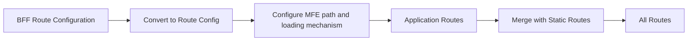
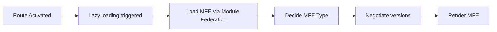

# Use of Module Federation in Shell router

**Shell Router** is the center for dynamic micro frontend loading. **Module federation** is used in **Shell Router** to:

* Configure routes to use **Module federation**
* Load application modules via **Module federation**

## Route Definitions to Application Routes Transformation

The workspace configuration contains route definitions for applications. The shell router transforms these backend route configurations into Angular application routes:

* Receives route configuration from **workspace configuration** (backend definition)
* Converts each BFF route into an Angular lazy-loaded route
* Configures the loading mechanism using **Module Federation** and path resolution
* Merges routes with static Shell routes

## Overview

### On route configuration

### On route activation

## Shell Routes After Transformation

After transformation, the Shell Router contains two types of routes:

* **Static routes** \- These are predefined routes in the Shell application, such as **error pages or the about page**.
* **Application routes** \- These routes are generated by converting backend route configurations into Angular lazy-loaded routes.

These routes are merged to create the final list of routes.

## How **Shell Router** works with **Module Federation**?

Following steps are performed in **Shell Router** to achieve dynamic loading of micro frontends using **Module Federation**:

### Router Configuration Phase

**Shell router** converts router configuration received from **workspace configuration** into **application route configuration**:

* Parse the workspace router configuration
* For each route, configure:  
   * Path matcher  
   * Micro frontend type  
   * Lazy-loading callback using **module federation** to load the app on match
* Merge static Shell routes with application routes

### Router Activation Phase

When a route is activated, the dynamic loading of a micro frontend is triggered:

* **Route activation** triggers lazy loading of the configured MFE
* **Module Federation** loads the remote micro frontend
* **[Negotiate versions](mf-dependancy-sharing.html)** based on current state of federation instance and shared dependencies
* **Decide MFE rendering method** based on MFE type configuration (see [Types of Microfrontends](types-of-microfrontends.html))
* **Render** the loaded Microfrontend using the appropriate method
