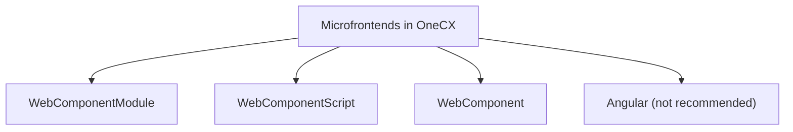

# Types of microfrontends in OneCX

In OneCX, there are four types of microfrontends for bootstrapping different technologies:

**WebComponent** technology is used for microfrontends bootstrapping webcomponents, with different loading options:

* **WebComponentModule** \- loads microfrontend as type 'module'
* **WebComponentScript** \- loads microfrontend as type 'script'
* **WebComponent** \- generic webcomponent type

**Angular** technology is used for microfrontends bootstrapping angular module/component (not recommended).

## WebComponentModule

Technology-based option for bootstrapping webcomponents loaded as type `module`.

* Exposed content is loaded as `ES module`
* Registers the defined HTML element tag in the **CustomContainersRegistry**
* Utilities take care of rendering the WebComponent
* Remote content is rendered as **WebComponent** in the application

## WebComponentScript / WebComponent

Technology-based option for bootstrapping webcomponents loaded as type `script`.

* Exposed content is loaded as `script`
* Remote content is added as global variable once exposed content name matches with global variable name
* Utilities take care of rendering the WebComponent
* Remote content is rendered as **WebComponent** in the application

## Angular (not recommended)

Used for microfrontends bootstrapping Angular module/component.

* Exposed content which is **angular module** is loaded as `ES module`
* This exposed module is loaded and rendered as Angular module in the application

| |  It is **NOT recommended** to use the Angular expose method. Doing so restrains the platform from using many frameworks with different versions, which means that all Microfrontends would need to use the same technology and version. |
| ----------------------------------------------------------------------------------------------------------------------------------------------------------------------------------------------------------------------------------------- |
