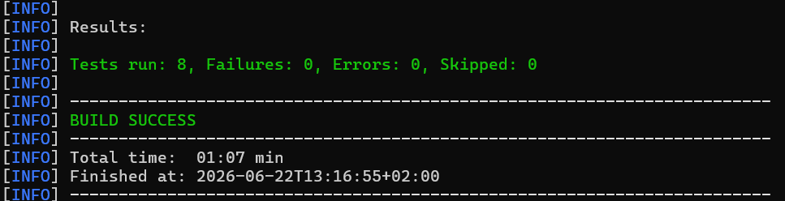
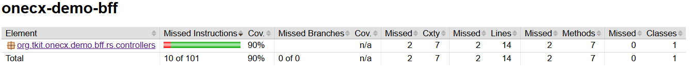

# OneCX Backend for Frontend (BFF) Generator

The OneCX Backend for Frontend Generator is a tool that simplifies the development of Backend for Frontend applications within the OneCX framework. It automates the creation of a basic BFF project structure from frontend and backend OpenAPI definitions, ensuring consistency and adherence to OneCX best practices.

The `onecx-bff-generator` creates BFF projects from two OpenAPI specifications: a frontend API and a backend API. The generated project contains Quarkus configuration, REST controllers, mapper classes, test scaffolding, Helm charts and GitHub Actions workflow files.

What is a Backend for Frontend?

A Backend for Frontend (BFF) is a backend service tailored to the needs of a specific frontend application. It acts as an API layer between the frontend and one or more backend services, adapting backend APIs to frontend requirements.

**In addition to generation,** significant parts may still need to be created or modified manually by the user. Such parts are highlighted in the documentation as **ACTION**. These actions indicate where and what adjustments are necessary to complete the generated code.

**To clearly explain** how the generator works and the necessary adjustments, this guide uses a practical example: an **application named demo**. The **onecx-demo-bff** application exposes a frontend-oriented API and delegates requests to a backend service API.

Repository of onecx-bff-generator:

<https://github.com/onecx/onecx-bff-generator>

Releases of onecx-bff-generator:

<https://github.com/onecx/onecx-bff-generator/releases>

## [](#prerequisites)Prerequisites

### [](#environment-setup)Environment Setup

Make sure your development environment is set up correctly before using the OneCX BFF Generator.  
The following tools must be installed and versions verified:

* **java** version should be 21 or higher
* **maven** version should be >= 3.9.x

Check versions

```bash
java --version
mvn --version
```

## [](#generation-by-example)Generation by Example

Let’s explore the capabilities of the OneCX BFF Generator through a practical example, the **Demo BFF**. We will create a simple Backend for Frontend project that exposes a frontend API and consumes a backend API.

The generator creates a BFF project from two OpenAPI specifications:

Frontend OpenAPI

Defines the API exposed by the generated BFF to the frontend application.

Backend OpenAPI

Defines the backend API consumed by the generated BFF.

The generator creates the basic BFF structure, including project configuration, REST controllers, mapper classes, OpenAPI integration setup and test scaffolding.

| |  The generator does not implement complete business logic. You will need to review and adapt generated controllers and mappers to match the concrete frontend and backend API contracts. |
| ------------------------------------------------------------------------------------------------------------------------------------------------------------------------------------------ |

### [](#start-generation)Start Generation

Here is an overview of the application parts that can be generated and reviewed using the OneCX BFF Generator. Start from top to bottom, i.e. first generate the BFF project, then review and customize the generated API mappings and controller implementation.

* [OneCX BFF](generator/create-bff.html) ⇐ **start here**
* [API Mappings and Controller Implementation](generator/review-api-mappings.html)

| |  Build the application step by step, roughly following the suggested order above. This iterative approach allows you to understand the structure of the generated code and make necessary adjustments along the way.After generating the BFF project, review the generated code, run the application, and verify that the generated API mappings and controller implementation match your requirements before adding additional business logic. |
| ------------------------------------------------------------------------------------------------------------------------------------------------------------------------------------------------------------------------------------------------------------------------------------------------------------------------------------------------------------------------------------------------------------------------------------------------- |

### [](#build-the-app)Build the App

After generating the OneCX BFF you can build the application manually or use the `--autobuild` flag during generation.  
Use the following command to build the application manually:

Build the application

```bash
mvn clean package -DskipTests
```

### [](#test-the-app)Test the App

After generating the application, it’s crucial to run the tests to ensure that everything is working as expected. The generator creates basic test scaffolding for the generated components, but you may need to add more tests or adjust the existing ones based on your specific requirements and API contracts.  
Use the following command to run the tests:

Test the application

```bash
mvn test
```

 

Figure 1\. Excerpt of the test result exemplary for **demo** BFF application

 

Figure 2\. Excerpt of the test coverage exemplary for **demo** BFF application

Backend for Frontend Generator Structure

```text
onecx-bff-generator/
├─ .github/
│  └─ workflows/
│     └─ release.yml
├─ src/
│  ├─ main/
│  │  ├─ java/
│  │  │  └─ org/tkit/onecx/onecxbffgen/
│  │  │     ├─ Main.java
│  │  │     ├─ commands/
│  │  │     │  └─ CreateBffCommand.java
│  │  │     ├─ model/
│  │  │     │  ├─ DependencyProfile.java
│  │  │     │  ├─ GenerateRequest.java
│  │  │     │  ├─ OperationModel.java
│  │  │     │  └─ SchemaModel.java
│  │  │     └─ service/
│  │  │        ├─ ApiSourceResolver.java
│  │  │        ├─ GeneratorService.java
│  │  │        ├─ GitHubActionsService.java
│  │  │        ├─ OpenApiAnalyzer.java
│  │  │        ├─ ParentVersionResolver.java
│  │  │        ├─ ProjectWriter.java
│  │  │        └─ TemplateService.java
│  │  └─ resources/
│  │     ├─ application.properties
│  │     └─ templates/
│  │        ├─ bff-project/
│  │        │  ├─ Chart.yaml.tpl
│  │        │  ├─ Dockerfile.jvm.tpl
│  │        │  ├─ Dockerfile.native.tpl
│  │        │  ├─ README.md.tpl
│  │        │  ├─ application.properties.tpl
│  │        │  ├─ gitignore.tpl
│  │        │  ├─ pom.xml.tpl
│  │        │  └─ values.yaml.tpl
│  │        ├─ entity/
│  │        │  ├─ Controller.java.tpl
│  │        │  ├─ ExceptionMapper.java.tpl
│  │        │  └─ Mapper.java.tpl
│  │        ├─ github/
│  │        │  ├─ dependabot.yml.tpl
│  │        │  └─ workflows/
│  │        │     ├─ build.yml.tpl
│  │        │     ├─ build-branch.yml.tpl
│  │        │     ├─ build-pr.yml.tpl
│  │        │     ├─ build-pr-merge.yml.tpl
│  │        │     ├─ build-release.yml.tpl
│  │        │     ├─ create-fix-branch.yml.tpl
│  │        │     ├─ create-new-build.yml.tpl
│  │        │     ├─ create-release.yml.tpl
│  │        │     ├─ documentation.yml.tpl
│  │        │     ├─ security.yml.tpl
│  │        │     └─ sonar-pr.yml.tpl
│  │        └─ test/
│  │           ├─ AbstractTest.java.tpl
│  │           ├─ ControllerIT.java.tpl
│  │           ├─ ControllerTest.java.tpl
│  │           ├─ mockserver-permissions.json.tpl
│  │           └─ mockserver.properties.tpl
├─ .gitignore
├─ LICENSE
├─ pom.xml
└─ README.md
```

If you need to customize the generated code, you can modify the templates located in `src/main/resources/templates/`. These templates are used by the generator to create the necessary files for your BFF application.  

For example, if you want to change the structure of the generated controllers, you can edit the `Controller.java.tpl` template file. After making changes to the templates, you can re-run the generator to apply your customizations to the generated code.  

This allows you to tailor the generated BFF code to better fit your specific requirements and coding standards while still benefiting from the automation provided by the generator.
