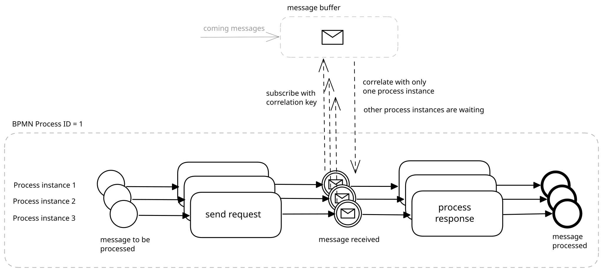
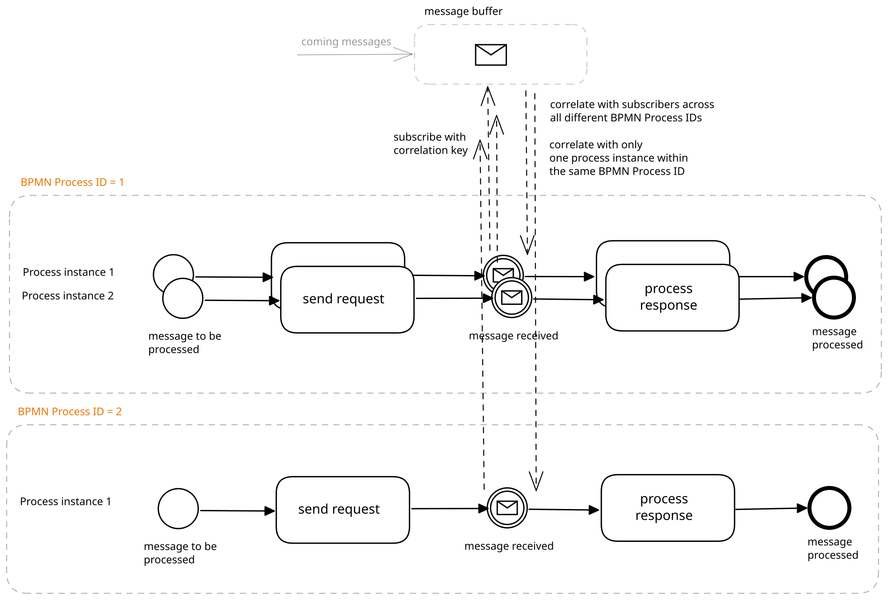
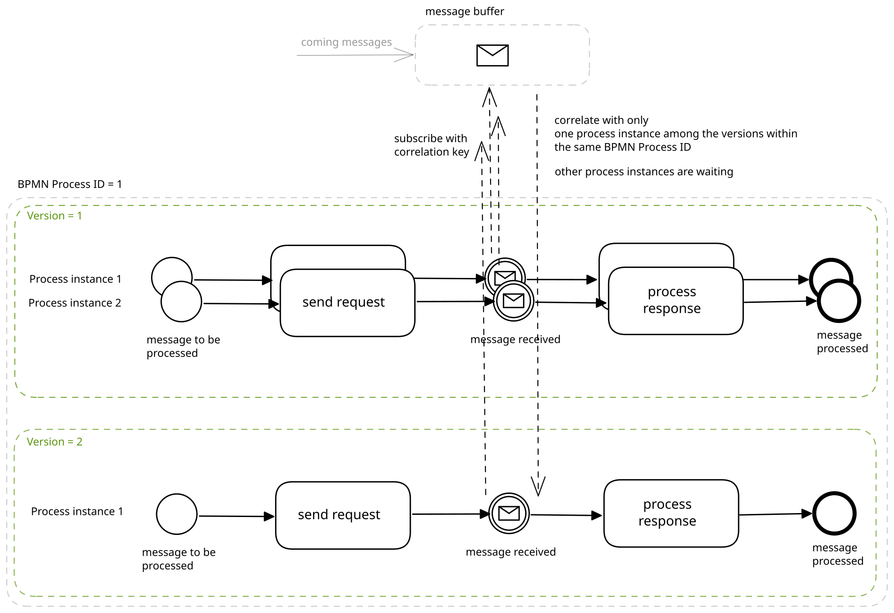

# BPMN: Messages

Camunda 8 uses [message buffering](https://docs.camunda.io/docs/components/concepts/messages/#message-buffering), so the process instance doesn’t have to be ready to receive the message event at exactly the moment it occurs (use message attribute TTL - time to live instead of time events or retry workarounds). Buffered message is mapped to a process instance based on the correlation key. Here the best practices on creating of correlation key taken from ([book Practical process automation](https://camunda.com/blog/2021/03/publishing-practical-process-automation/)

* use UUID for correlation ID
* don’t use process instance ID
* avoid using business data that are not unique within the cluster

The correlation key have to be unique within the cluster to assure that the message is catched by the right process. The following situations show how the matching of message and process instance is done when the correlation key is the same.

## Identify the process instance waiting for the response

### Several instances within a process

When several process instances within a one process are running and subscribe for a message, the message is correlated only once to one of them.

 

Other instances remain waiting (unless not handled in a process differently). See [process instance modification](https://docs.camunda.io/docs/components/concepts/process-instance-modification/) for possibilities to repair a running process instance.

### Processes with different BPMN IDs

Processes with different BPMN Process IDs are independend different processes. By creation of multiple subscriptions with the same correlation key from different processes, a message is correlated within each process (once within one BPMN process ID) to only one process instance from all existing ones.

 

### Processes with the same BPMN ID but different versions

When a process is deployed, it receives a version number. After making changes to the process and re-deployment, the process version is increased, the BPMN Process ID remains the same as before. Instances can be created for any of these versions. There might be two process instances of the same process but with different versions created when:

* one version of a process is deployed and an instance is created
* the process was changed and deployed again
* the process with the same BPMN Process ID but different version is created
* an instance is created

 

A message is correlated only once to a process (once within one BPMN process ID), across all versions of this process. If multiple subscriptions for the same process are opened (by multiple process instances or within one instance), the message is correlated only to one of the subscriptions.
