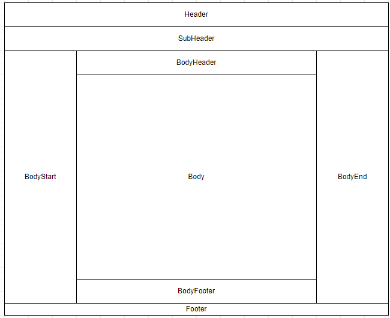

# Migrate OneCX Shell from v2 to v3

## [](#overview)Overview

This document provides changes that need to be done to migrate from OneCX Shell v2 to v3\. The main changes include updates to the slot component layout and naming conventions, changes in the module federation approach and exposing the mf-manifest.json file.

## [](#supported-angular-versions)Supported Angular Versions

Version 3 of the OneCX Shell introduces support for Angular 21 in addition to previous supported Angular 18 to 20 versions. Further information on Angular version support and compatibility for OneCX Shell can be found in the [Shell Version Documentation](../../onecx-shell-ui/onecx-shell-ui-docs.html#shell-version-information).

## [](#migration-steps)Migration Steps for v3

### [](#slot-component-changes)1\. New Slot Component Layout and Namings

Shell v3 introduces a new structured slot naming convention based on layout regions (header, sub-header, body-start, body-header, body-footer, body-end, footer), each with `start`, `center`, and `end` sub-regions. The old slot names are deprecated in favor of this new structure. Below is a visual representation of the new shell layout with the area names:

 

The deprecated slot names continue to work via automatic remapping to the new equivalents, but **it is recommended to migrate to the new slot names** shown in the table below.

__Table 1\. Slot name migration mapping__
| Old Slot Name (deprecated)  | New Slot Name                  |
| --------------------------- | ------------------------------ |
| onecx-shell-vertical-menu   | onecx-shell-body-start.start   |
| onecx-shell-horizontal-menu | onecx-shell-header.center      |
| onecx-shell-header-left     | onecx-shell-header.start       |
| onecx-shell-header-right    | onecx-shell-header.end         |
| onecx-shell-sub-header      | onecx-shell-body-header.center |
| onecx-shell-footer          | onecx-shell-body-footer.start  |
| onecx-page-footer           | onecx-shell-body-footer.start  |

Additionally, shell v3 introduces **new slots for enhanced layout flexibility**. These new slots allow for more granular content placement across different regions, which provides better organization for content placement within the shell.

**Click here to view all new slots in v3** 

| Group                          | Slot Name                                                                                                           | Description                                                                                                                  |
| ------------------------------ | ------------------------------------------------------------------------------------------------------------------- | ---------------------------------------------------------------------------------------------------------------------------- |
| Header                         | onecx-shell-header.start                                                                                            | Start region of the shell header (e.g. logo)                                                                                 |
| onecx-shell-header.center      | Center region of the shell header (e.g. horizontal menu, search bar)                                                |                                                                                                                              |
| onecx-shell-header.end         | End region of the shell header (e.g. user profile)                                                                  |                                                                                                                              |
| Sub-Header                     | onecx-shell-sub-header.start                                                                                        | Start region of the shell sub header (e.g. bookmarks)                                                                        |
| onecx-shell-sub-header.center  | Center region of the shell sub header (e.g. banner bar)                                                             |                                                                                                                              |
| onecx-shell-sub-header.end     | End region of the shell sub header (e.g. action buttons)                                                            |                                                                                                                              |
| Body Start                     | onecx-shell-body-start.start                                                                                        | Start region of the shell body start (e.g. quick links)                                                                      |
| onecx-shell-body-start.center  | Center region of the shell body start (e.g. sidebar navigation)                                                     |                                                                                                                              |
| onecx-shell-body-start.end     | End region of the shell body start (e.g. action buttons)                                                            |                                                                                                                              |
| Body Header                    | onecx-shell-body-header.start                                                                                       | Start region of the shell body header (e.g. breadcrumbs)                                                                     |
| onecx-shell-body-header.center | Center region of the shell body header (e.g. title)                                                                 |                                                                                                                              |
| onecx-shell-body-header.end    | End region of the shell body header (e.g. action buttons)                                                           |                                                                                                                              |
| Body Footer                    | onecx-shell-body-footer.start                                                                                       | Start region of the shell body footer (e.g. info)                                                                            |
| onecx-shell-body-footer.center | Center region of the shell body footer (e.g. comment section)                                                       |                                                                                                                              |
| onecx-shell-body-footer.end    | End region of the shell body footer (e.g. action buttons)                                                           |                                                                                                                              |
| Body End                       | onecx-shell-body-end.start                                                                                          | Start region of the shell body end (e.g. quick links)                                                                        |
| onecx-shell-body-end.center    | Center region of the shell body end (e.g. sidebar navigation)                                                       |                                                                                                                              |
| onecx-shell-body-end.end       | End region of the shell body end (e.g. action buttons)                                                              |                                                                                                                              |
| Footer                         | onecx-shell-footer.start                                                                                            | Start region of the shell footer (e.g. logo)                                                                                 |
| onecx-shell-footer.center      | Center region of the shell footer (e.g. footer menu)                                                                |                                                                                                                              |
| onecx-shell-footer.end         | End region of the shell footer (e.g. version info)                                                                  |                                                                                                                              |
| Extensions                     | onecx-shell-extensions                                                                                              | For providing additional functions that will not be displayed inside the slot (e.g. toast messages, cookie banner)           |
| Additional                     | onecx-search-config                                                                                                 | Manage search configurations on search pages via assigned remote components. Defined in shell — do not redefine in products. |
| onecx-column-group-selection   | Manage table column group selection via assigned remote components. Defined in shell — do not redefine in products. |                                                                                                                              |

### [](#module-federation-approach)2\. New Module Federation Approach

Compared to v2, Shell v3 introduces these module federation changes:

* Runtime loading uses [@module-federation/enhanced](https://www.npmjs.com/package/@module-federation/enhanced) instead of the previous `@angular-architects/module-federation` runtime approach.
* Nx workspaces use Nx module federation files (`module-federation.config.ts` \+ `webpack.config.ts`) instead of legacy plugin-only `webpack.config.js` setup.
* Shell integration is share-scope aware (routes and preloaders).

#### [](#recommended-mf-approach)Recommended approach for shell v3

Shell v3 is built on [@module-federation/enhanced](https://www.npmjs.com/package/@module-federation/enhanced). It is recommended to use build tools that base on `@module-federation/enhanced` from shell v3.

Use this decision guide for the module federation approach selection:

* Nx applications: use [@nx/angular/module-federation](https://www.npmjs.com/package/@nx/angular/module-federation) (see [Example 1](#example-nx-mf))
* Non-Nx applications: use direct [@module-federation/enhanced](https://www.npmjs.com/package/@module-federation/enhanced) (recommended, see [Example 2](#example-enhanced-mf))
* Legacy approach: [@angular-architects/module-federation](https://www.npmjs.com/package/@angular-architects/module-federation) with explicit share-scope handling (see [Example 3](#example-legacy-mf))

| |  Required shareScope mapping (Angular 21) Use explicit share scopes: Angular 18/19/20 remotes: default Angular 21 remotes: angular\_21 This mapping is required so the shell resolves shared packages from the correct scope. |
| ------------------------------------------------------------------------------------------------------------------------------------------------------------------------------------------------------------------------------- |

#### [](#example-nx-mf)Example 1: using [@nx/angular/module-federation](https://www.npmjs.com/package/@nx/angular/module-federation) (Nx applications only)

This approach uses `@module-federation/enhanced` under the hood via the **Nx** build integration and should be used only in Nx-based applications. The configuration is split into two files:

* `module-federation.config.ts` — declares the app name, what it exposes, and how dependencies are shared. Using `getOneCXSharedRecommendations` from `@onecx/accelerator` is recommended to automatically apply the correct sharing settings for OneCX packages.
* `webpack.config.ts` — applies the module federation config to the base webpack config and sets the `shareScope`. For Angular 21 remotes, `shareScope: 'angular_21'` is required here. Additional webpack customization (plugins, output, parser settings) can be added to the returned config object.

module-federation.config.ts

```ts
import { ModuleFederationConfig } from '@nx/module-federation'
import { getOneCXSharedRecommendations } from '@onecx/accelerator'

const config: ModuleFederationConfig = {
  name: 'my-app',
  exposes: {
    './RemoteModule': 'src/main.ts'
  },
  shared: (libraryName, sharedConfig) => {
    return getOneCXSharedRecommendations(libraryName, sharedConfig)
  }
}

export default config
```

webpack.config.ts

```ts
import { Configuration } from 'webpack'
import { withModuleFederation } from '@nx/angular/module-federation'
import config from './module-federation.config'

export default async function (baseConfig: Configuration) {
  const withMf = await withModuleFederation(config, {
    shareScope: 'angular_21' // required for Angular 21 remotes
  })

  return withMf(baseConfig) // additional custom webpack configuration can be added here
}
```

#### [](#example-enhanced-mf)Example 2: using direct [@module-federation/enhanced](https://www.npmjs.com/package/@module-federation/enhanced)

Use `@module-federation/enhanced` for runtime explicitly in shell-side loading code. This is the recommended approach for non-Nx applications:

The configuration is split into two files:

* `module-federation.config.ts` — declares the app name, what it exposes, and how dependencies are shared. Using `getOneCXSharedRecommendations` from `@onecx/accelerator` is recommended to automatically apply the correct sharing settings for OneCX packages. For Angular 21 remotes, `shareScope: 'angular_21'` is required here..
* `webpack.config.ts` — extends the base webpack configuration by registering the ModuleFederationPlugin and sets the `shareScope`. Additional webpack customization (plugins, output, parser settings) can be added to the returned config object.

module-federation.config.js

```ts
const { getOneCXSharedRecommendations } = require('@onecx/accelerator');
const { dependencies } = require('./package.json');

const sharedEntries = {};
for (const libName of Object.keys(dependencies)) {
  const result = getOneCXSharedRecommendations(libName, {
    requiredVersion: dependencies[libName],
    shareScope: 'angular_21',
  });
  if (result !== false) {
    sharedEntries[libName] = result;
  }
}

module.exports = {
  name: 'my-app',
  filename: 'remoteEntry.js',
  library: { type: 'module' },
  exposes: {
    './RemoteModule': 'src/remote-main.ts',
  },
  shared: sharedEntries,
  shareScope: 'angular_21',
};
```

webpack.config.js

```ts
const { ModuleFederationPlugin } = require('@module-federation/enhanced/webpack');
const webpack = require('webpack');
const isProduction = process.env.NODE_ENV === 'production';
const mfConfig = require('./module-federation.config');

module.exports = {
  devServer: { allowedHosts: 'all' },
  plugins: [
    new ModuleFederationPlugin(mfConfig),
    new webpack.DefinePlugin({ ngDevMode: JSON.stringify(!isProduction) }),
  ],
  output: { uniqueName: 'my-app', publicPath: 'auto' },
  module: { parser: { javascript: { importMeta: false } } },
  experiments: { topLevelAwait: true, outputModule: true },
  optimization: { runtimeChunk: false, splitChunks: false },
};
```

#### [](#example-legacy-mf)Example 3: using legacy [@angular-architects/module-federation](https://www.npmjs.com/package/@angular-architects/module-federation)

This can still be used as a legacy variant, but for Angular 21 the `shareScope` must be set in the individual shared package definitions and also at the top-level module federation configuration.

Example `webpack.config.js` fragment

```javascript
const { share, withModuleFederationPlugin } = require('@angular-architects/module-federation/webpack')

const config = withModuleFederationPlugin({
  //name, filename, exposes, etc.
  shared: share({
    '@angular/core': {
      requiredVersion: 'auto',
      includeSecondaries: true,
      shareScope: 'angular_21',
    },
    // other shared packages
  }),
  shareScope: 'angular_21',
})
```

### [](#mf-manifest)3\. Exposing mf-manifest.json file

With the migration to `@module-federation/enchanced` the build output includes a `mf-manifest.json` file that contains metadata about the exposed modules and their dependencies. It is recommended to expose this file in the deployed application to enable better integration and compatibility with the OneCX Shell v3.

For that the applications `values.yaml` should include the following configuration:

Example configuration to expose mf-manifest.json

```yaml
---
    microfrontend:
      enabled: true
      entrySuffix: ""mf-manifest.json""
      spec:
        shareScope: 'angular_21'
---
```
