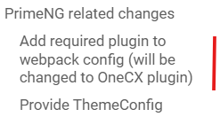
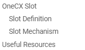

# OneCX Docs: Formatting &amp; Conventions

This guide summarizes a collection of common [AsciiDoc](https://docs.asciidoctor.org/asciidoc/latest/) features and conventions to be used in OneCX documentation. Take into account that this is a living document and will be updated over time.  
Pay attention to the [OneCX Docs: Guidelines](guidelines.html) and [OneCX Docs: Writing Style](writing%5Fstyle.html)!

| |  Familiarize yourself with [AsciiDoc](https://docs.asciidoctor.org/asciidoc/latest/) and [Antora](https://docs.antora.org/antora/latest/). |
| -------------------------------------------------------------------------------------------------------------------------------------------- |

## [](#navigation)Navigation

* Each module must have a `nav.adoc` file in the `partials/` folder.
* The `nav.adoc` defines the module navigation structure.
* Follow the structure of existing modules as reference.

| |  Each module is part of the overall documentation site. Make the module navigation fit into the overall site structure.\+ Limit the number of levels and avoid deep nesting.\+ Check this after adding new pages. |
| ------------------------------------------------------------------------------------------------------------------------------------------------------------------------------------------------------------------- |

## [](#global-attributes)Global Attributes

* Global attributes are set on the parent site. Do not redefine them in modules.  
Global Attributes, excerpt  
```asciidoc  
product: OneCX Platform  
product-version: latest  
toclevels: 2  
```

## [](#page-attributes)Page Attributes

* Page attributes can be defined on top of the page as needed.
* A good practice is to  
   * Set `:imagesdir:` to the local `images/` folder of the module.  
   * Define attributes for commonly referenced URLs.  
   Use them like this: `[AsciiDoc](https://docs.asciidoctor.org/asciidoc/latest/)`.

Example page header

```asciidoc
:idprefix:
:idseparator: -
:imagesdir: ../images

:asciidoc_doc_link:    link:https://docs.asciidoctor.org/asciidoc/latest/[AsciiDoc]
:api_guidelines_link:  xref:documentation:onecx-docs-dev:guidelines/api_guidelines.adoc[API Guidelines]
```

## [](#headings)Headings

* Use consistent heading levels (`=`, `==`, `====`) throughout the documentation.  
Start a page always with a single `=` title.
* Limit nesting to 3–4 levels for clarity.
* Use meaningful and concise headings that reflect the content of the section.
* Avoid overly long or complex headings ⇒ Check TOC for readability.

__Table 1\. Heading Examples - TOC view__
|  Figure 1\. Bad Heading Example |  Figure 2\. Good Heading Example |
| -------------------------------------------------------------------------------------- | ----------------------------------------------------------------------------------------- |

## [](#includes)Includes

* Use `include::` to reuse content.
* When embedding a page section under the current heading, apply `leveloffset`.

Example include with increase heading level using leveloffset

```asciidoc
 include::./scripts.adoc[leveloffset=+1]
```

* Place frequently reused fragments in `partials/` folder of the module.

## [](#collapsible-sections)Collapsible Sections

* Wrap long text, tables or optional sections with `[%collapsible] in ====` blocks.
* Use a meaningful caption for the section.
* Use collapsible sections to improve readability and reduce scrolling.

Example Collapsible Section (source)

```asciidoc
 .Example Collapsible Section
 [%collapsible]
 ====
 include::documentation:onecx-docs-apps:page$_core-app-table.adoc[]
 ====
```

Example Collapsible Section (rendered) 

| Application                                             | Description                                                                                    |
| ------------------------------------------------------- | ---------------------------------------------------------------------------------------------- |
| [Identity Access Management](../onecx-iam/index.html)   | Handles user authentication, authorization, and identity management within the OneCX platform. |
| [Parameter Management](../onecx-parameter/index.html)   | Used by some applications                                                                      |
| [Permission Management](../onecx-permission/index.html) | Declared and used in applications.                                                             |
| [Application Store](../onecx-product-store/index.html)  | Application data (components, slots etc.)                                                      |
| [Shell](../onecx-shell/index.html)                      | The main user interface framework for OneCX applications.                                      |
| [Tenant Management](../onecx-tenant/index.html)         | Represents a customer or organizational unit using OneCX                                       |
| [Theme Management](../onecx-theme/index.html)           | Customizing the look and feel of OneCX for a tenant                                            |
| [User Profile](../onecx-theme/index.html)               | Managing user-specific settings and preferences                                                |
| [Workspace Management](../onecx-workspace/index.html)   | Customizing the working areas for users                                                        |

## [](#cross-references)Cross-References

* Use `xref:` for links within OneCX documentation.
* Do not use hard coded URLs on the final docs site.
* Keep links relative within the module if possible.

Example module-internal links

```asciidoc
xref:./setup.adoc[Setting up]
xref:./scripts/start.adoc[start-onecx.sh]
```

* For cross-module references, use the full path:

Example module-2-module link

```asciidoc
xref:documentation:onecx-docs-dev:guidelines/api_guidelines.adoc[API Guidelines]
```

## [](#external-links)External Links

* Use concise inline links:

```asciidoc
https://www.keycloak.org/[Keycloak]
```

* Define attributes for commonly referenced URLs and reuse them.

## [](#anchors)Anchors

* Use anchors for deep-links to specific sections

```asciidoc
[#available-flags]
= Available Flags
```

## [](#admonitions)Admonitions

* Use AsciiDoc admonitions for clarity.
* Standard types: `NOTE`, `IMPORTANT`, `CAUTION`, `TIP`, `WARNING`

Example Admonition

```asciidoc
[IMPORTANT]
====
Critical guidance, e.g. WSL2 setup on Windows.
====
```

| |  Critical guidance, e.g. WSL2 setup on Windows. |
| ------------------------------------------------- |

## [](#code-blocks)Code Blocks

* Use `[source,<lang>]` with fenced blocks.
* Use a meaningful caption for the section.
* Language examples: `bash`, `javascript`, `json`, `yaml`, `sql`, `text`.

Example Source Block (source)

```asciidoc
 .Example Source Block
 [source,bash]
 ----
 ./start-onecx.sh -p all
 ----
```

Example Source Block (rendered)

```bash
./start-onecx.sh -p all
```

## [](#images)Images

* Set `:imagesdir:` at top of the page and reference images with meaningful captions.

```asciidoc
.Successful start
image::scripts/script_start-onecx.sh.png[]
```

## [](#lists)Lists

* Common list types: unordered (`*`), ordered (`.`) and description lists.
* Use nested lists for sub-items.
* Description lists are great for compact option docs.
* Add the `horizontal` role for side-by-side rendering and specify labelwidth in percent if needed.

Example Description List (source)

```asciidoc
-s::
Enables secure mode, which enforces authentication/authorization and taken into account the tenant ID of the user. (Default: disabled)
```

\-s

Enables secure mode, which enforces authentication/authorization and taken into account the tenant ID of the user. (Default: disabled)

Example Description List, horizontal (source)

```asciidoc
[horizontal,labelwidth=10]
-s::
Enables secure mode, which enforces authentication/authorization and taken into account the tenant ID of the user. (Default: disabled)
```

| \-s | Enables secure mode, which enforces authentication/authorization and taken into account the tenant ID of the user. (Default: disabled) |
| --- | -------------------------------------------------------------------------------------------------------------------------------------- |

## [](#tables)Tables

* Use role-based striped tables and column definitions.
* Use a meaningful caption for the section.
* The first line is the header, followed by a blank line, or define with `h|`.
* Keep tables small and concise for readability.

Example Table (source)

```asciidoc
.Example Table
[.stripes-even,cols="20,~"]
|===
| Service  | Description

| Keycloak | IAM service used by OneCX
| pgAdmin  | Manage Postgres databases
|===
```

__Table 2\. Example Table (rendered)__
| Service  | Description               |
| -------- | ------------------------- |
| Keycloak | IAM service used by OneCX |
| pgAdmin  | Manage Postgres databases |

For large tables, consider breaking them into smaller, more focused tables or using collapsible sections.

### [](#multi-line-tables)Multi-line Tables

If the table is to contain multi-line text, it is recommended to use the column style identifier `**m**` to allow multi-line cells. This improves readability and avoids layout problems.  
For **source code** blocks, use the column style identifier `**a**` in a same way.

Example multi-line table (source)

```asciidoc
.Example multi-line table
[.stripes-even,cols="20m,~"]
|===
h| Service
h| Description
| Keycloak | IAM service used by OneCX. +
It provides identity and access management.
| pgAdmin  | Manage Postgres databases. +
It offers a graphical interface for database administration.
|===
```

__Table 3\. Example multi-line table (rendered)__
| Service  | Description                                                                            |
| -------- | -------------------------------------------------------------------------------------- |
| Keycloak | IAM service used by OneCX.It provides identity and access management.                  |
| pgAdmin  | Manage Postgres databases.It offers a graphical interface for database administration. |
