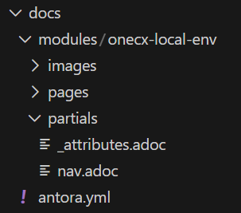

# OneCX Docs: Module Setup

Usually, a project within OneCX like a product/application has its own documentation which needs to be integrated into the overall OneCX Docs site. To achieve this, set up a Docs module for the project.  
This guide explains how to set up such a Docs module.

## [](#module-structure)Module Structure

A Docs module has the following structure which is located within the root directory of a OneCX project repository:

__Table 1\. Structure__
| docs   modules     <your-project>       images/       pages/         index.adoc         ...       partials/         \_attributes.adoc         nav.adoc   antora.yml |  Figure 1\. Example |
| ------------------------------------------------------------------------------------------------------------------------------------------------------------------- | ----------------------------------------------------------------------------------------- |

* The module name `your-project` should match your project name. It should be unique within the OneCX Docs site because after the integration, it will be part of the overall documentation.
* Directories and files:  
   * `images/` ⇒ Store module-specific images here.  
   * `pages/` ⇒ Contains the documentation pages in AsciiDoc format.  
   * `partials/` ⇒ Contains partial files  
         * `_attributes.adoc` ⇒ module-specific attributes  
         * `nav.adoc` ⇒ navigation structure, to be included in the overall site navigation  
   * `antora.yml` ⇒ The Antora module descriptor file. This file has a fixed content, see below.

## [](#navigation-setup)Navigation Setup

To integrate your module into the OneCX Docs site, set up the navigation in `nav.adoc` located in the `partials/` folder of your module.

* Follow the structure of existing modules as reference.
* Ensure your module navigation fits into the overall site structure.

Navigation example

```asciidoc
* xref:your-project:index.adoc[Your Project]
** xref:your-project:guidelines.adoc[Guidelines]
** xref:your-project:setup.adoc[Setup Instructions]
```

### [](#integration-into-overall-site)Integration into Overall Site

To include your module navigation into the overall OneCX Docs site navigation, ask for help from the documentation maintainers. They will include your module’s `nav.adoc` file in the appropriate place in the main navigation structure.

| |  The main navigation file is located in the parent documentation project at docs/modules/ROOT/nav.adoc.This file includes the navigation files of the main modules which includes the navigation files of sub-modules. |
| ------------------------------------------------------------------------------------------------------------------------------------------------------------------------------------------------------------------------ |

## [](#module-descriptor)Module Descriptor

The `antora.yml` file in your module’s root directory defines the module metadata.  

| |  Because the module will be part of the OneCX Docs site, use the following **fixed** content. |
| ----------------------------------------------------------------------------------------------- |

antora.yml

```yaml
# Define the same name space as used in antory.yml
name: documentation
version: latest
# Do not add any further properties here. This will affect the parent documentation project.
```

All the properties/attributes are inherited from the parent documentation project.

| |  If you want to define **module-specific attributes**, do this in the \_attributes.adoc file located in the partials/ folder of your module.Check first the existing attributes in the parent documentation project to avoid conflicts: [OneCX Docs Default Settings](https://github.com/onecx/docs/blob/main/antora.yml) |
| --------------------------------------------------------------------------------------------------------------------------------------------------------------------------------------------------------------------------------------------------------------------------------------------------------------------------- |
