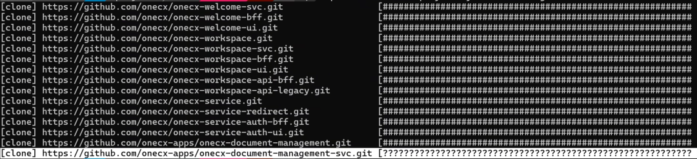

# OneCX Docs: Set up Local Environment

To preview and test your documentation changes locally, set up the documentation environment as following:

## [](#get-and-build-the-docs)Get and Build the Docs

1. Clone the [OneCX Docs](https://github.com/onecx/docs) repository  
```bash  
git clone git@github.com:onecx/docs.git  
```
2. Go to `**docs**` directory.
3. Install Node modules  
```bash  
npm install  
```
4. Install Antora CLI if it is not already installed  
```bash  
npm install --global @antora/cli @antora/site-generator-default  
```
5. Create Docs site initially  
```bash  
npx antora --fetch antora-playbook.yml 2> site.log  
```  
`site.log` contains the log output of the build process. Check it for errors.
6. Open build result in Browser  
```bash  
./build/site/index.html  
```

## [](#integrate-a-local-module)Integrate a local Module

1. Create a local copy of Antora Playbook  
```bash  
cp antora-playbook.yml antora-playbook.local.yml  
```
2. Use the local module path in the local Antora Playbook  
In this example, the local path `/home/henry/onecx/docs/docs-guides-ui` is used instead of the remote URL for the `docs-guides-ui` module.  
```yaml  
#- url: https://github.com/onecx/docs-guides-ui.git  
- url: /home/henry/onecx/docs/docs-guides-ui  
  branches: [HEAD]  
  start_path: docs  
```
3. Create Docs site with local Module (without fetching remote modules)  
```bash  
npx antora antora-playbook.local.yml 2> site.log  
```

## [](#check-for-errors)Check for Errors

Make sure to check the `site.log` file for errors during the build process.

* Search for entries related to your local module.  
If there are issues with the local module, look for error messages such as "module not found" or "invalid content".
* Ignore entries about Quarkus and BFF if not relevant.

If you add new modules, verify the navigation structure in the built site.

## [](#development-support)Development Support

* Use AsciiDoc plugin in your IDE for syntax highlighting and preview.
* Check the log output after building the website to identify issues.

## [](#troubleshooting)Troubleshooting

### [](#local-generation-issue)Local Generation Issue

In case the local generation of the site fails (see picture below), reduce the number of remote modules in the local playbook.

 

Figure 1\. Local generation fails
