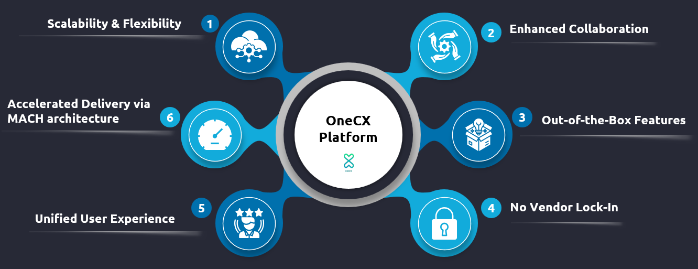

# OneCX Platform Overview

OneCX is a platform that allows projects to easily build systems with Microservice and Microfrontend architecture and utilize the advantage of those architectures in regards of scales agile development.

 

Figure 1\. OneCX Platform Aspects

The platform offers various assets which can be leveraged to have a quick project ramp-up and a high speed of development without losing the flexibility of a custom developed solution.

## Assets to Build Upon

OneCX provides a variety of assets to help you build your system faster and more efficiently.

Some of these assets are:

* Development guidelines for the teams
* Build in security and multitenancy
* Build in client-side integration of Microfrontends which support all major SPA frameworks e.g. Angular, React
* Reference implementation of cross-cutting system features including administrative UIs (e.g. user and permission management) which can be used to quickly ramp up a system and can be exchanged later if needed

## Technical Documentation

To get familiar with OneCX technical information, refer to the following content:

* [Architecture & Components](architecture/index.html)  
   * [Frontend](architecture/frontend.html)  
   * [Backend for Frontend](architecture/bff.html)  
   * [Backend](architecture/backend.html)  
   * [Continuous Integration](architecture/ci.html)  
   * [Continuous Delivery/Deployment](architecture/cd.html)
