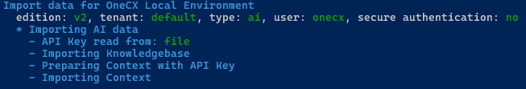
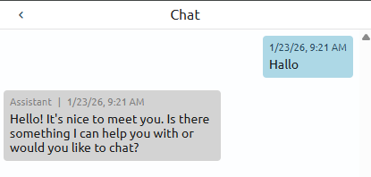

# Use AI in OneCX Local Environment

The OneCX Local Environment supports AI Chat functionalities, allowing users to interact with AI-powered features for enhanced user experiences.  
This document provides an overview of how to enable and use AI Chat.

## [](#prerequisites)Prerequisites

Before using AI Chat, ensure you have the following prerequisites in place:

Environment Set up

A working OneCX Local Environment set up.  
If you haven’t done this yet, follow the instructions in the [Setting up](setup.html) documentation.

AI Provider SSL Certificate (optional)

Depends on your IT landscape, you need a valid certificate for the AI service.  
Follow the instructions in the documentation [Custom Certificates](internal/custom-certificates.html).

Provider API Key

This key is required to access AI functionalities within OneCX. You can obtain an API Key from your AI service provider.  
Per default, only this AI provider is used: [ollama.one-cx.org](https://ollama.one-cx.org).

MCP Server SSL Certificate (optional)

Depends on your IT landscape, you need a valid certificate for the MCP Server.  
Follow the instructions in the documentation [Custom Certificates](internal/custom-certificates.html).

MCP Server API Key (optional)

This key is optional to access MCP Server functionalities within OneCX.  
Per default, only this MCP Server is configured: [onecx-docs-ai-dev.dev.one-cx.org/mcp](https://onecx-docs-ai-dev.dev.one-cx.org/mcp).  
This is the OneCX Documentation MCP Server, whereby no API Key is required for this server.

Start Environment

A started OneCX Local Environment with the **all** profile enabled.  
Refer to the [Start OneCX with all profile](scripts/start.html#start-all-services) documentation for instructions on starting the environment with the appropriate profile.

## [](#set-up-ai-functionalities)Set up AI Functionalities

To prepare the AI Functionalities, follow these steps:

1. Prepare trust store  
Set up the trust store with the necessary certificates for secure communication with the AI service:  
```bash  
./setup-truststore.sh  
```
2. Start OneCX with **all** profile  
During the startup process, the necessary AI services will be started.  
```bash  
./start-onecx.sh -p all  
```
3. Import AI data using the following script with options, **\-s** is mandatory.  
You will be prompted to enter your **API Key** (see TIP below):  
```bash  
./import-onecx.sh -d ai -x -s  
```  
  
Figure 1\. Import AI data
4. Verify that the AI services are running correctly by checking the logs of the relevant Docker containers.

| |  To avoid entering values interactively on every import, you can provide a file named **ai-config** within the root directory of onecx-local-env.It uses a simple key=value format and supports the following properties: apiKey=your-api-key llmUrl=https://your-llm-url type=ANTHROPIC modelIdentifier=your-model-id Valid values for type are: ANTHROPIC, OPENAI, OLLAMA.Any value not present in the file will be prompted interactively. The legacy **api-key** file (containing only the API Key) is still supported for backwards compatibility, but **ai-config** is preferred. |
| ----------------------------------------------------------------------------------------------------------------------------------------------------------------------------------------------------------------------------------------------------------------------------------------------------------------------------------------------------------------------------------------------------------------------------------------------------------------------------------------------------------------------------------------------------------------------------------------- |

## [](#using-ai-chat)Using AI Chat

Once AI Functionalities are prepared, you can start using AI Chat within your OneCX applications.  

Click on the **Open AI Chat** button in the top bar to open the AI Chat panel.

 

Figure 2\. Open AI Chat

You can then start interacting with the AI by typing your queries or messages in the chat panel.

 

Figure 3\. First AI Contact
