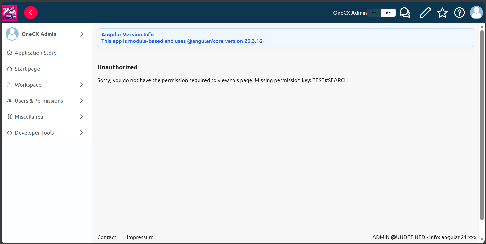
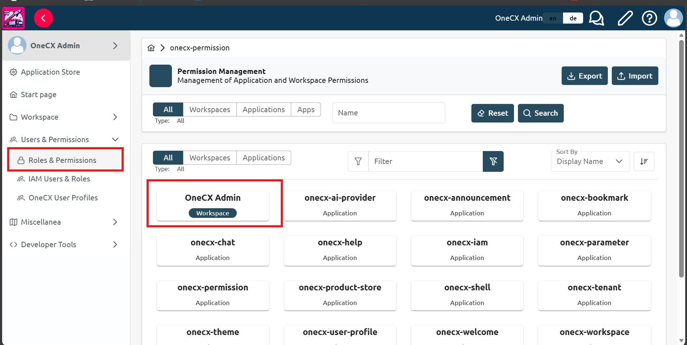
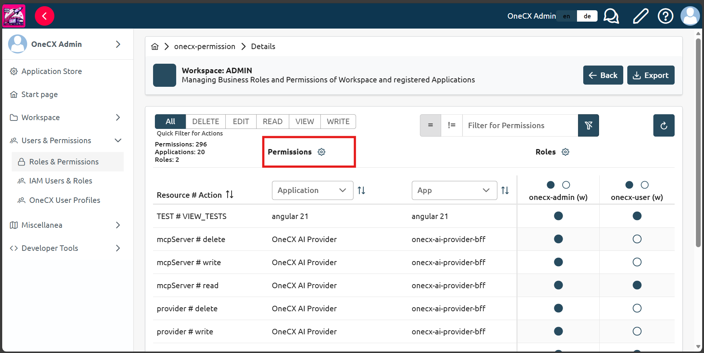
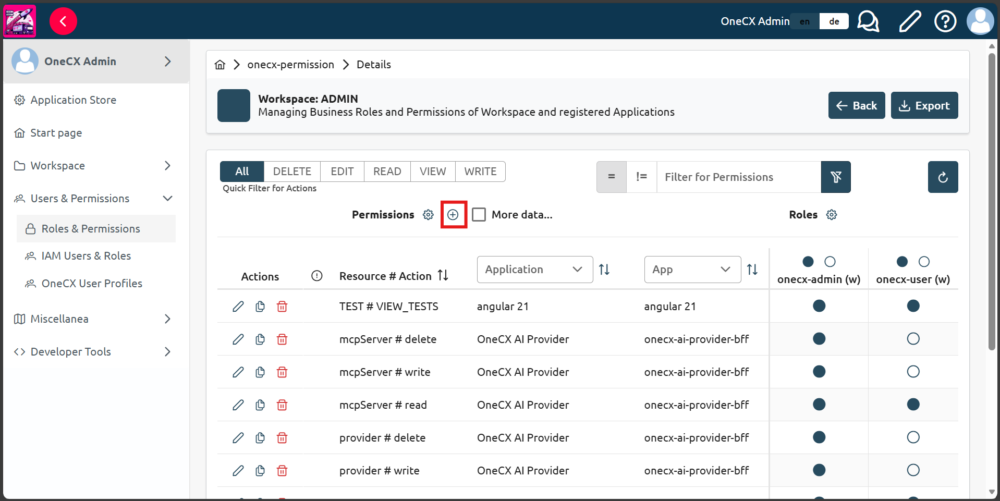
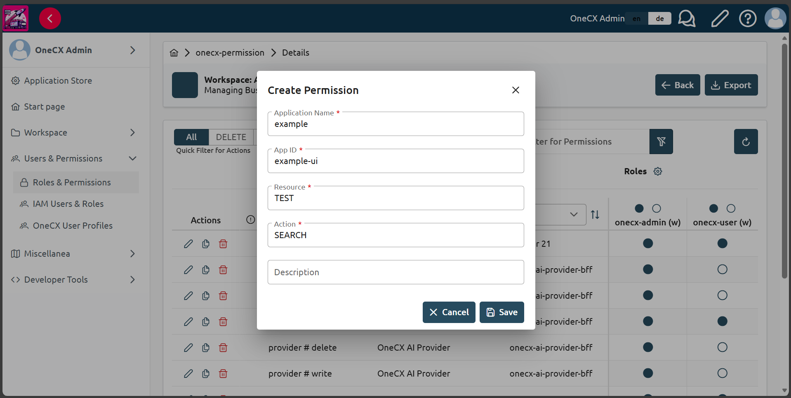
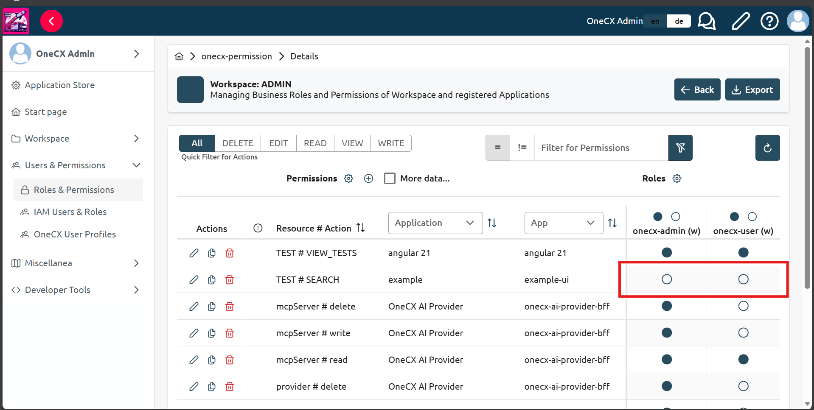

# Assign permissions and roles (Optional)

After adding the application to the workspace, you may want to assign permissions and roles for accessing the application. Permissions are set by using the following component in the application HTML:

```html
<ocx-portal-page permission="TEST#SEARCH">
    <!-- Application page content goes here -->
</ocx-portal-page>
```

If you see the following warning when you enter the page of your application, it means that you need to assign the permissions:

 

Figure 1\. Permission missing warning

This guide will show how to add `TEST#SEARCH` permission to the application and assign it to a role. See the [Permissions and Roles](../../../onecx-permission/index.html) documentation for details on how the permissions work in OneCX.

## [](#create-a-permission)Create a permission

* In OneCX, choose `Users and Permissions` from the left side panel, then choose `Roles and Permissions` subitem.
* Find the required workspace (e.g. `Onecx Admin`) and click on it. (This can also be done for applications)

 

Figure 2\. Navigate to the workspace or application for which you want to create the permission

| |  If the permissions page doesnt load make sure you have started the onecx local environment with all services by running ./start-onecx.sh -p all See [Start OneCX Local Environment](../../scripts/start.html) for more details. |
| ---------------------------------------------------------------------------------------------------------------------------------------------------------------------------------------------------------------------------------- |

* Click `settings` icon, next to `Permissions` title.

 

Figure 3\. Click the settings icon to manage permissions

* Click `+` icon, next to `Permissions` title, to create a new permission.

 

Figure 4\. Click the "+" icon to create a new permission

* Fill in the form with the following details:

__Table 1\. Required Permission Details (example)__
| Field            | Example Value | Notes                                                                                    |
| ---------------- | ------------- | ---------------------------------------------------------------------------------------- |
| Application Name | example       | Name of the application in Application Store for which you want to create the permission |
| App ID           | example-ui    | Application module name defined in the webpack module federation configuration           |
| Resource         | TEST          | Unique name of the resource that comes before the # symbol.                              |
| Action           | SEARCH        | Unique name of the action that comes after the # symbol.                                 |

 

Figure 5\. Example permission details

* Click `Save` to create the permission.

## [](#assign-the-permission-to-a-role)Assign the permission to a role

* Locate the permission you just created in the list of permissions.
* Click on the circle to make it filled, which means that the permission is assigned to the selected role.

 

Figure 6\. Assign the permission to the role
