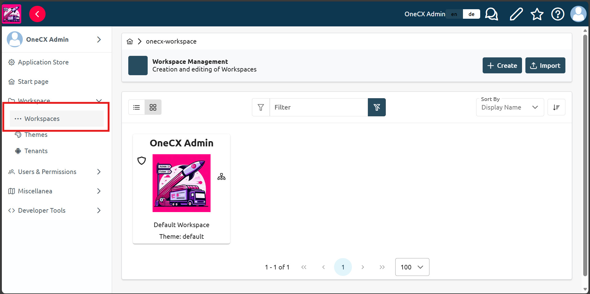
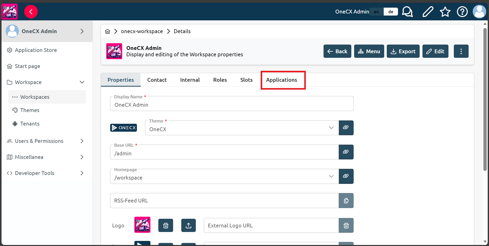
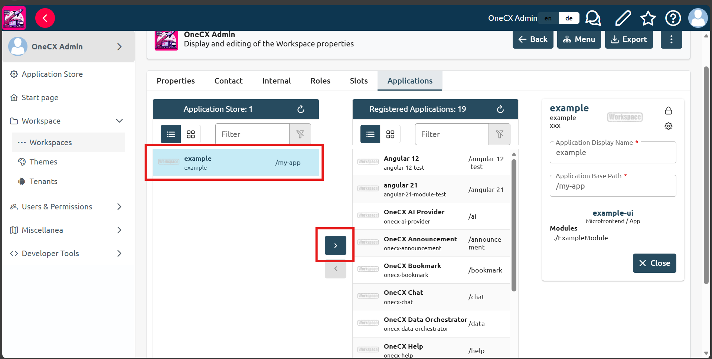

# Add the application to the workspace

* In OneCX on the left side panel, choose `Workspace`, then choose `Workspaces` subitem.
* Click on the workspace you want to add the application to (e.g. `Onecx Admin`). See [OneCX Workspace](../../../onecx-workspace/index.html) documentation for more details on workspaces.

 

Figure 1\. Navigate to the workspace

* Click `Applications` tab in the workspace view, your application should be visible in the list of available applications.

 

Figure 2\. Applications tab in the workspace

* Click on the application you want to add to the workspace, then click `>` button in the middle of the view.

 

Figure 3\. Add the application to the workspace

* You can access the application in the workspace now by entering the following link:

```bash
onecx.localhost/onecx-shell/{workspace-base-url}/{application-base-path}
```

Where `{workspace-base-url}` is the base URL of the workspace (e.g. `admin`) and `{application-base-path}` is the base path of the application defined in the product store (e.g. `my-app`).

| |  Make sure to replace {workspace-base-url} and {application-base-path} with the actual values for your workspace and application. |
| ----------------------------------------------------------------------------------------------------------------------------------- |
