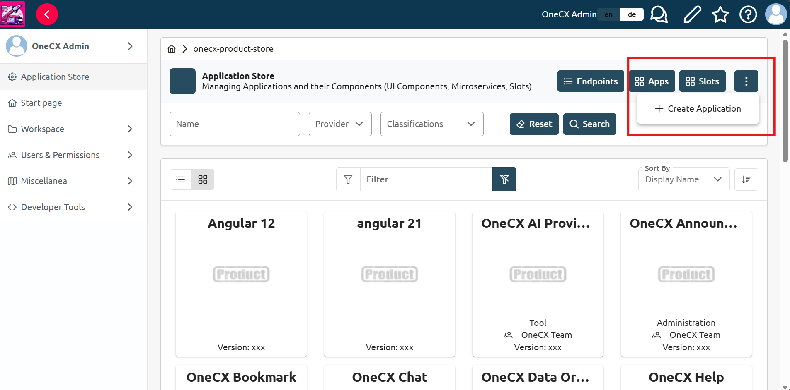
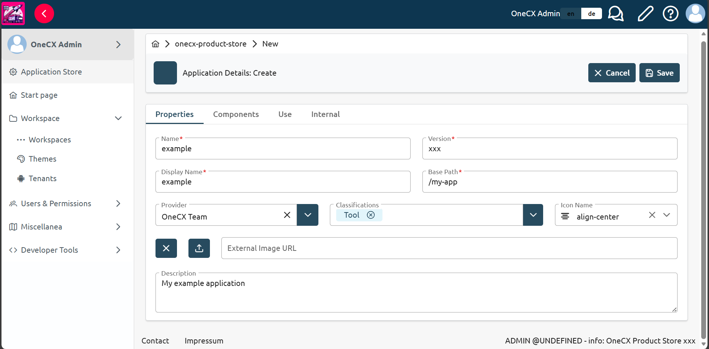
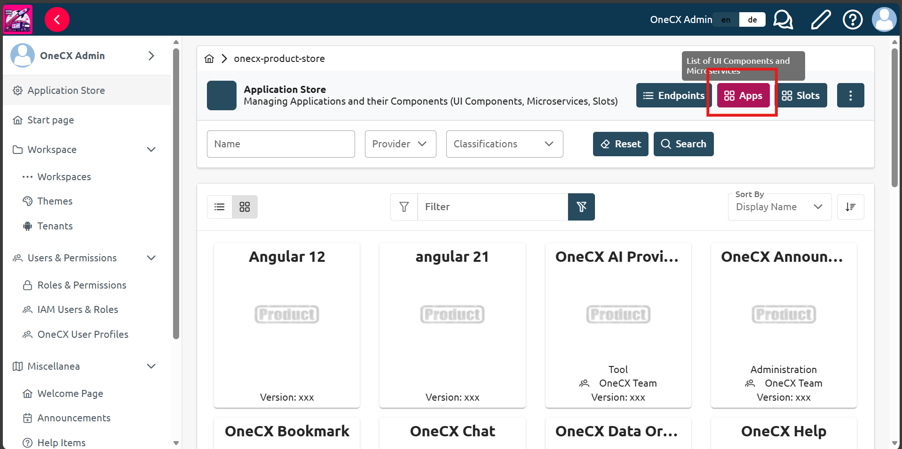
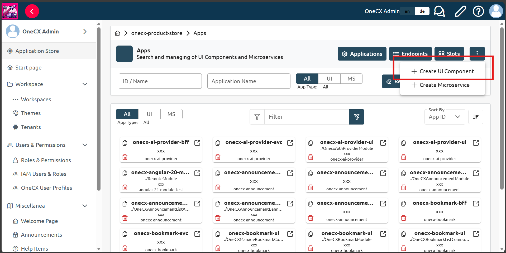
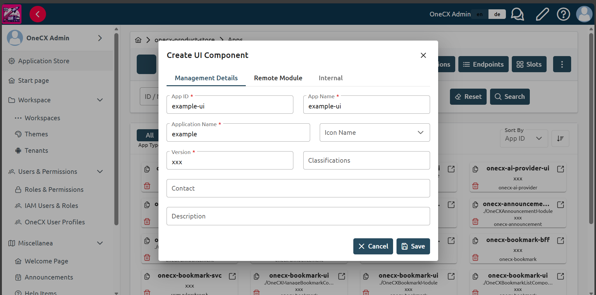
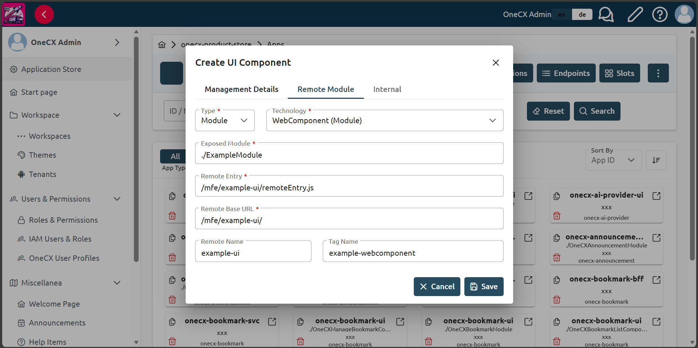
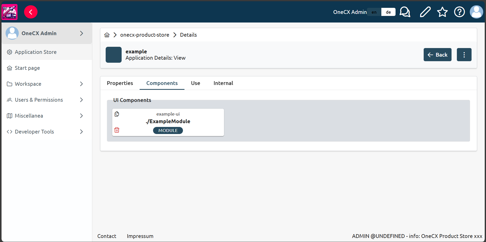

# Add the App to the product store

## Add the application to the product store

* Choose application store on the left side pannel of the OneCX.
* Click three dots in the top right corner of the application store and select `Add Application` from the dropdown menu.

 

Figure 1\. Locate the "Add Application" button

* Fill in the form with the following details:

__Table 1\. Required Application Details (example)__
| Field        | Example Value | Notes                                             |
| ------------ | ------------- | ------------------------------------------------- |
| Name         | example       | Unique name of the application used as identifier |
| Version      | xxx           | Application version                               |
| Display Name | example       | Name of the application displayed in the UI       |
| Base Path    | /my-app       | Base path for the application                     |

* Click `Save` to add the application to the product store.

 

Figure 2\. Example application details

## Add a UI component for the application

* Return to the `Application Store` and click the `Apps` button in the top right corner to change the view.

 

Figure 3\. Apps button in the application store

* Click three dots in the top right corner of the application store and select `Create UI Component` from the dropdown menu.

 

Figure 4\. Locate the "Create UI Component" button

* Fill in the `management details` with the following information:

| |  let’s use [Important Elements of Webpack Configuration](../../../onecx-docs-overview/module-federation/webpack.html#important-elements-of-webpack-configuration) as a reference for webpack.config.js values and [Bootstrap Application](../../../onecx-docs-overview/module-federation/bootstrapping.html#module-bootstrapping-and-configuration) for module.ts bootstrapping details |
| ----------------------------------------------------------------------------------------------------------------------------------------------------------------------------------------------------------------------------------------------------------------------------------------------------------------------------------------------------------------------------------------- |

__Table 2\. Required Management Details (example)__
| Field            | Example Value                                                                                                                                                                      | Notes                                                                                 |
| ---------------- | ---------------------------------------------------------------------------------------------------------------------------------------------------------------------------------- | ------------------------------------------------------------------------------------- |
| App ID           | example-ui from the [Important Elements of Webpack Configuration](../../../onecx-docs-overview/module-federation/webpack.html#important-elements-of-webpack-configuration) example | Unique name of the app used as identifier (module name in webpack.config.js config).  |
| App Name         | example-ui                                                                                                                                                                         | Name of the application displayed in the UI                                           |
| Application Name | example                                                                                                                                                                            | Name of the application in the product store to which the UI component will be added. |
| Version          | xxx                                                                                                                                                                                | Application version                                                                   |

 

Figure 5\. Example management details

* Click `Remote Module` tab in the top of the card
* Fill in the `Remote Module` details with the following information:

__Table 3\. Remote Module Details (example)__
| Field                  | Example Value                                                                                                                                                                                                                                                                    | Notes                                                                                                                                                                                                                |
| ---------------------- | -------------------------------------------------------------------------------------------------------------------------------------------------------------------------------------------------------------------------------------------------------------------------------- | -------------------------------------------------------------------------------------------------------------------------------------------------------------------------------------------------------------------- |
| Type                   | Module. See [Microfrontend Content Loading](../../../onecx-docs-overview/module-federation/microfrontend-content-loading.html) for more details.                                                                                                                                 | Type of the module federation application.                                                                                                                                                                           |
| Technology             | WebComponent (Module). See [Microfrontend Content Loading](../../../onecx-docs-overview/module-federation/microfrontend-content-loading.html) for more details (for webpack module applications created with Angular under version 13, choose WebComponent (Script) technology). | Technology used for the application.                                                                                                                                                                                 |
| Exposed Module         | ./ExampleApp from the [Important Elements of Webpack Configuration](../../../onecx-docs-overview/module-federation/webpack.html#important-elements-of-webpack-configuration) example                                                                                             | The name of the exposed module in the webpack.config.js file                                                                                                                                                         |
| Remote Entry           | /mfe/example/remoteEntry.js.                                                                                                                                                                                                                                                     | The URL to the remoteEntry.js file of the application, where app-name depends on local app integration with ./toggle-mfe.sh script. See [Local MFE Integration](../local-mfe.html). The URL should start from /mfe/. |
| Remote Base URL        | /mfe/example/                                                                                                                                                                                                                                                                    | The base URL for the remote module, where app-name depends on local app integration. The URL should start from /mfe/.                                                                                                |
| Remote Name (Optional) | example-ui from the [Important Elements of Webpack Configuration](../../../onecx-docs-overview/module-federation/webpack.html#important-elements-of-webpack-configuration) example.                                                                                              | The uniqueName of the remote module as defined in the webpack.config.js file. This is optional and only needed if the remote module has a specific name or for WebComponent (Script) technology.                     |
| Tag Name (Optional)    | example-webcomponent from the [Bootstrap Application](../../../onecx-docs-overview/module-federation/bootstrapping.html#module-bootstrapping-and-configuration) example.                                                                                                         | The name of the custom element tag added in ngDoBootstrap method of the module.ts file.                                                                                                                              |

 

Figure 6\. Example remote module details

* Click `Save` to add the UI component for the application.
* Check that the UI component is added to the application created in the previous step. You can click on the application in the application store and click the `Components` tab to see the list of UI components added for the application.

 

Figure 7\. Successfully added UI component

| |  If you do not see the added UI component in the list, make sure to check that the Application Name in the management details of the UI component matches the Name field value of the application. |
| ---------------------------------------------------------------------------------------------------------------------------------------------------------------------------------------------------- |
