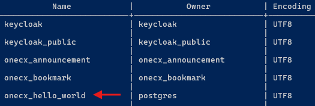
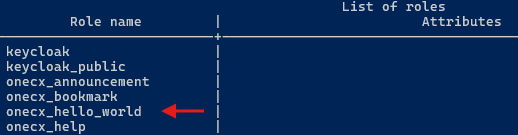

# Integrate Docker Images

If you need to extend this environment with your own containers or import additional data, please taken the following guidelines into account.

The following sections describe the necessary steps to integrate your own Docker images into the OneCX Local Environment. We will use a simple **Hello World** application as an example, consisting of a backend service, a backend-for-frontend (BFF) and a UI component.

Steps to integrate your own Docker images

* Prepare hosts file entries to access your services via the local proxy.
* Create the required database and user in the Postgres container.
* Prepare your Docker images for the services you want to add.
* Prepare a Docker Compose file to define your services.
* Starting your services

## [](#add-entries-in-hosts-file)Add entries in hosts file

To access your **Hello World** service via the local proxy, add the following entries to your system’s hosts file:

```text
127.0.0.1   onecx-hello-world-svc
127.0.0.1   onecx-hello-world-bff
```

## [](#create-database-and-user)Create Database and User

Before starting your service, create the necessary database and user in the PostgreSQL container (if they haven’t already been created).  
You can do this either by connecting to the PostgreSQL container and executing the required SQL commands, or by using an SQL script, which is preferable for reproducibility.

1. Prepare SQL script  
```sql  
CREATE USER onecx_hello_world WITH ENCRYPTED PASSWORD 'onecx_hello_world';  
CREATE DATABASE onecx_hello_world with owner onecx_hello_world;  
GRANT ALL PRIVILEGES ON DATABASE onecx_hello_world TO onecx_hello_world;  
GRANT ALL PRIVILEGES ON SCHEMA public TO onecx_hello_world;  
```  
As example the script is saved as `hello-world.sql` in the root of the OneCX Local Environment directory.
2. Execute the SQL script  
```bash  
docker exec -i postgresdb psql -U postgres -d postgres < ./hello-world.sql  
```
3. Verify the database and user creation  
```bash  
docker exec -it postgresdb psql -U postgres -c "\l"  
docker exec -it postgresdb psql -U postgres -c "\du"  
```  
  
Figure 1\. Database Verification  
  
Figure 2\. User/Role Verification

## [](#prepare-docker-images)Prepare Docker Images

* Build and tag your Docker images according to your versioning strategy. You can either use a local registry or build them locally for direct use.
* Push your images to your Docker registry if necessary.

## [](#prepare-docker-compose-file)Prepare Docker Compose File

* Create the file (e.g. `hello-world.compose.yaml`), define your services with image references and tags, environment variables and health checks.
* Ensure that your file uses the same Compose project name as defined in the OneCX environment file to maintain network and volume consistency.  
Compose Project Name  
```yaml  
name: onecx-local-env  
```
* Add the OneCX Compose file that you want to use as the basis for inheriting existing service definitions and configurations. The easiest way is to use the file in the root directory of your local OneCX environment (compose.yaml).  
Alternatively, you can reference the version-specific Docker Compose file (e.g. `versions/v2/compose.yaml`).  
Include OneCX Local Environment root compose file  
```yaml  
include:  
  - compose.yaml  
```
* Place the file in the root of the OneCX Local Environment directory.

Here is an example of a Docker Compose file for the **Hello World** services 

Docker Compose file for Hello World Services

```yaml
########################################
############## GENERAL #################
########################################
# IMPORTANT: use the same project name as the subsequent compose files using same network/volumes
name: onecx-local-env

# Align with the OneCX version-specific compose file
# ...so all OneCX services are known here
# ...this is not the case for environment variables!
include:
  - compose.yaml

########################################
####### ENVIRONMENT PRESETS ############
########################################
# Define common environment variable sets for services
# Requires corresponding variables to be defined in .env file
#
x-bff-variables: &bff_environment
  ONECX_PERMISSIONS_ENABLED: ${ONECX_PERMISSIONS_ENABLED}
  ONECX_PERMISSIONS_CACHE_ENABLED: ${ONECX_PERMISSIONS_CACHE_ENABLED}
  QUARKUS_OIDC_CLIENT_CLIENT_ID: ${ONECX_OIDC_CLIENT_CLIENT_ID}
  QUARKUS_OIDC_CLIENT_CREDENTIALS_SECRET: ${ONECX_OIDC_CLIENT_S_E_C_R_E_T}
  QUARKUS_OIDC_CLIENT_AUTH_SERVER_URL: ${ONECX_AUTH_SERVER_URL}
  QUARKUS_OIDC_AUTH_SERVER_URL: ${ONECX_AUTH_SERVER_URL}
  TKIT_LOG_JSON_ENABLED: ${JSON_LOGGER_ENABLED}
  TKIT_SECURITY_AUTH_ENABLED: ${ONECX_SECURITY_AUTH_ENABLED}

x-svc-variables: &svc_single_tenancy
  QUARKUS_LOG_LEVEL: ${ONECX_LOG_LEVEL}
  QUARKUS_OIDC_AUTH_SERVER_URL: ${ONECX_AUTH_SERVER_URL}
  QUARKUS_OIDC_CLIENT_CLIENT_ID: ${ONECX_OIDC_CLIENT_CLIENT_ID}
  QUARKUS_OIDC_CLIENT_CREDENTIALS_SECRET: ${ONECX_OIDC_CLIENT_S_E_C_R_E_T}
  QUARKUS_OIDC_CLIENT_AUTH_SERVER_URL: ${ONECX_AUTH_SERVER_URL}
  QUARKUS_DATASOURCE_JDBC_MIN_SIZE: ${ONECX_DATASOURCE_JDBC_MIN_SIZE}
  QUARKUS_DATASOURCE_JDBC_MAX_SIZE: ${ONECX_DATASOURCE_JDBC_MAX_SIZE}
  QUARKUS_DATASOURCE_JDBC_IDLE_REMOVAL_INTERVAL: ${ONECX_DATASOURCE_JDBC_IDLE_REMOVAL_INTERVAL}
  TKIT_LOG_JSON_ENABLED: ${JSON_LOGGER_ENABLED}
  TKIT_SECURITY_AUTH_ENABLED: ${ONECX_SECURITY_AUTH_ENABLED}

x-svc-multi_tenancy: &svc_multi_tenancy
  <<: *svc_single_tenancy
  QUARKUS_REST_CLIENT_ONECX_TENANT_URL: ${ONECX_REST_CLIENT_ONECX_TENANT_URL}
  ONECX_TENANT_CACHE_ENABLED: ${ONECX_TENANT_CACHE_ENABLED}
  TKIT_RS_CONTEXT_TENANT_ID_ENABLED: ${ONECX_RS_CONTEXT_TENANT_ID_ENABLED}
  TKIT_RS_CONTEXT_TENANT_ID_MOCK_ENABLED: ${ONECX_RS_CONTEXT_TENANT_ID_MOCK_ENABLED}

########################################
#############   Services   #############
########################################

services:
  ########## ONECX HELLOWORLD
  onecx-hello-world-svc:
    image: ${DOCKER_REPO}/onecx-hello-world-svc:main-native
    container_name: onecx-hello-world-svc
    environment:
      ## Common OneCX environment variables
      <<: *svc_multi_tenancy
      ## Hello World SVC specific environment variables
      QUARKUS_DATASOURCE_USERNAME: onecx_hello_world
      QUARKUS_DATASOURCE_PASSWORD: onecx_hello_world
      QUARKUS_DATASOURCE_JDBC_URL: jdbc:postgresql://postgresdb:5432/onecx_hello_world?sslmode=disable
    healthcheck:
      test: curl --head -fsS http://localhost:8080/q/health
      interval: 10s
      timeout: 5s
      retries: 3
    depends_on:
      keycloak-app:
        condition: service_healthy
    labels:
      - "traefik.http.services.onecx-hello-world-svc.loadbalancer.server.port=8080"
      - "traefik.http.routers.onecx-hello-world-svc.rule=Host(`onecx-hello-world-svc`)"
    networks:
      - onecx
    profiles:
      - all

  onecx-hello-world-bff:
    image: ${DOCKER_REPO}/onecx-hello-world-bff:main-native
    container_name: onecx-hello-world-bff
    environment:
      ## Common OneCX environment variables
      <<: *bff_environment
      ## Hello World BFF specific environment variables
      ONECX_PERMISSIONS_PRODUCT_NAME: "onecx-hello-world"
    healthcheck:
      test: curl --head -fsS http://localhost:8080/q/health
      interval: 10s
      timeout: 5s
      retries: 3
    depends_on:
      onecx-hello-world-svc:
        condition: service_healthy
    labels:
      - "traefik.http.services.onecx-hello-world-bff.loadbalancer.server.port=8080"
      - "traefik.http.routers.onecx-hello-world-bff.rule=Host(`onecx-hello-world-bff`)"
    networks:
      - onecx
    profiles:
      - all
```

## [](#prepare-environment-settings)Prepare Environment Settings

To keep the example simple, all necessary environment variables are either taken from the base Compose project (OneCX Local Environment) or defined directly in the Compose file (e.g. database username/password for backend services).

If you need to define additional environment variables (e.g. for image tags or database connection details), you can do so in a separate environment file.  
If so then this file must be specified when starting the OneCX Local Environment using the `--env-file` option with Docker Compose.

## [](#start-services)Start Services

The relationship of the **Hello World** services to each other is defined wih the "depends on" settings in the Docker Compose file. Therefore, it is sufficient to start only the UI service, which will automatically start the backend services as well.

Start **Hello World** Services

```bash
docker compose --env-file ./versions/v2/.env -f hello-world.compose.yaml up -d onecx-hello-world-ui
```

Or if you have defined additional environment variables in a separate file (e.g. `hello-world.env`), you can start the services as follows:

Start **Hello World** Services with extra env file

```bash
docker compose --env-file ./versions/v2/.env --env-file ./hello-world.env -f hello-world.compose.yaml up -d onecx-hello-world-ui
```

Verify that the services are running

```bash
./list-containers.sh
```
