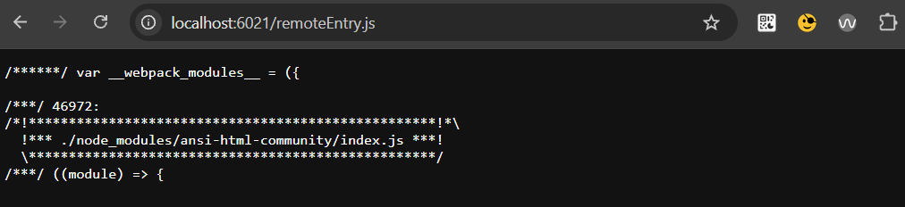
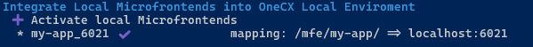

# Integrate a local Microfrontend

This approach enables **hot-reloading** of your locally running micro-frontend: changes you make there are automatically visible in OneCX after the rebuild. The best way for fast frontend development.

## [](#start-the-local-microfrontend)Start the local Microfrontend

Use one of the following command to start the Microfrontend. It depends on type of the Angular application. In the following examples, 6021 is used as the port where the microfrontend is running locally. Adjust the port as needed.

Start Angular "ng" Microfrontend on port 6021

```bash
npm run start -- --port 6021 --host 0.0.0.0 --disable-host-check --public-host=http://localhost:6021
```

Start Angular "nx" Microfrontend on port 6021

```bash
npm run start -- --port=6021 --host 0.0.0.0 --disableHostCheck --publicHost=http://localhost:6021
```

CheckPoint

Please check the microfrontend is up and running by accessing the **public host URL** (see start command) in Browser. The **remoteEntry.js** should be loaded.

 

Figure 1\. Local running Microfrontend

## [](#integrate-the-local-microfrontend-into-onecx)Integrate the local Microfrontend into OneCX

The integration can be easily accomplished through routing and path rewriting by [Traefik](../utilities.html#traefik). This is necessary because the Docker Compose project’s network for OneCX is isolated from the outside world. And the meaning of "localhost" within the OneCX network (Docker uses "host.docker.internal" internally) differs from "localhost" outside of it. Therefore, requests from the Docker environment must be routed to the outside world and mapped to the localhost address.

This step is done with the script **toggle-mfes.sh**. It creates a configuration file with routing and path rewrite instructions that are read by Traefik. See also the documentation for [toggle-mfes.sh](../scripts/toggle-mfes.html).

Command for integrating the local app running on <http://localhost:6021>

```bash
./toggle-mfes.sh -a my-app:6021
```

 

Figure 2\. Successful Integration

Check if the locally running app can be accessed via the integration path.

```text
http://onecx.localhost/mfe/my-app/remoteEntry.js
```

Traefik Configuration located in `init_data/traefik/active` 

```yaml
####################################################
# Integrate a local running Microfrontend into OneCX
####################################################
# Microfrontend: "my-app-ui"
http:
  routers:
    local_my-app:
      # path prefix as used for MFE registration in product store
      rule: "Host(`onecx.localhost`) && PathPrefix(`/mfe/my-app/`)"
      service: local_my-app-ui
      # higher prio than calculated based on rule length (traefik standard)
      priority: 323
      middlewares:
        - strip_my-app-ui

  # Remove the used mfe path so that it maps directly to localhost:port
  middlewares:
    strip_my-app-ui:
      stripPrefix:
        prefixes:
          - "/mfe/my-app"

  services:
    local_my-app-ui:
      loadBalancer:
        servers:
        - url: "http://onecx.localhost:6021/"   # Microfrontend started outside Docker with this port
```

| |  If the microfrontend requires its own backend functionality, then these backend services must also be started and presumably integrated into OneCX. The **./toggle-mfes.sh** script does not check this. See [Integrate Local Docker Images](local-images.html) for details on how to integrate additional backend services. The method described here is for all microfrontends except the OneCX Shell. The OneCX Shell has a special role in OneCX and must be started with a specific command. See [Integrate OneCX Shell](../scripts/toggle-mfes.html#integrate-onecx-shell) for details. |
| ------------------------------------------------------------------------------------------------------------------------------------------------------------------------------------------------------------------------------------------------------------------------------------------------------------------------------------------------------------------------------------------------------------------------------------------------------------------------------------------------------------------------------------------------------------------------------------------------ |
