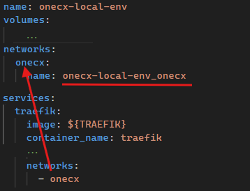

# Networking in OneCX Local Environment

This document explains how networking is configured and managed in the OneCX Local Environment.

## [](#docker-resource-names)Docker Resource Names

To isolate the local OneCX environment from the host system and other Docker environments, Docker uses the project name **onecx-local-env**. This project name serves as a prefix for all created Docker resources (containers, networks, volumes), ensuring seamless communication between all services while minimizing disruptions and conflicts.

The following Docker resource names and prefixes are used in the OneCX Local Environment:

| Project Name     | onecx-local-env        |
| ---------------- | ---------------------- |
| Network Name     | onecx-local-env\_onecx |
| Container Prefix | onecx-local-env\_      |

## [](#network-actors-and-components)Network Actors and Components

The OneCX Local Environment uses a sophisticated networking setup that combines:

* Traefik
* Service Discovery and Routing
* Docker Compose Network
* Host file Configuration
* Environment Configuration

### [](#traefik)Traefik

Traefik serves as the central entry point for all HTTP traffic in the OneCX environment. It acts as:

| Reverse Proxy     | Routes incoming requests to appropriate backend services |
| ----------------- | -------------------------------------------------------- |
| Load Balancer     | Distributes traffic across service instances             |
| Service Discovery | Automatically detects new services through Docker labels |
| API Gateway       | Provides a single entry point for all microservices      |

The Traefik configuration is split across multiple files:

* `init-data/traefik/base/traefik-conf.yml`  
Main configuration
* `init-data/traefik/base/traefik-services.yml`  
Static service definitions for local development
* `versions/<version>/compose.yaml`  
OneCX service registrations

Traefik configuration in `traefik-conf.yml` 

Excerpt from `init_data/traefik/base/traefik-conf.yaml`

```yaml
...
api:
  # http://traefik:8082/dashboard/
  dashboard: true
  insecure: true
  debug: false
  disabledashboardad: true

providers:
  docker:
    endpoint: unix:///var/run/docker.sock
    # If set to false, containers that don't have a traefik.enable=true label will be ignored from the resulting routing configuration
    # exposedByDefault: false
  file:
    # read all local microfrontend configurations automatically
    directory: /etc/traefik/active
    watch: true
...
```

Pls. aware the locations of Traefik configuration files are mapped as follows:

init-data/traefik/base/traefik-conf.yml  => /etc/traefik/traefik.yml
init-data/traefik/active                 => /etc/traefik/active

### [](#service-discovery)Service Discovery

Traefik Labels

Services register themselves with Traefik using Docker labels:

Traefik Label Patterns: SVC and BFF

```yaml
labels:
  - "traefik.http.services.<service-name>.loadbalancer.server.port=8080"
  - "traefik.http.routers.<service-name>.rule=Host(`<service-name>`)"
  - "traefik.http.routers.<service-name>.entrypoints=web"
```

Traefik Label Patterns: UI

```yaml
labels:
  - "traefik.http.services.<ui-service-name>.loadbalancer.server.port=8080"
  - "traefik.http.routers.<ui-service-name>.rule=Host(`onecx.localhost`) && PathPrefix(`/<app-path>/`)"
  - "traefik.http.routers.<ui-service-name>.entrypoints=web"
```

### [](#service-routing-rules)Service Routing Rules

Different routing patterns are used for different service types:

Backend Services (BFF/SVC) and Infrastructure Services

```yaml
Host(`service-name`)
```

Frontend Applications (UI)

```yaml
Host(`onecx.localhost`) && PathPrefix(`/app-path/`)
```

### [](#port-mapping-strategy)Port Mapping Strategy

External Ports (Host → Container)

Key external ports exposed to the host:

| Service           | Host Port | Purpose                        |
| ----------------- | --------- | ------------------------------ |
| Traefik HTTP      | 80        | Main HTTP entry point          |
| Traefik Dashboard | 8082      | Web UI for Traefik management  |
| Keycloak          | 8080      | Identity and access management |
| PostgreSQL        | 5432      | Database direct access         |

Internal Ports (Container → Container)

Services communicate internally using standard ports:  

| Web Services          | Port 8080 (Quarkus default) |
| --------------------- | --------------------------- |
| PostgreSQL            | Port 5432                   |
| Frontend Applications | Port 8080 (Nginx)           |

### [](#docker-compose-network)Docker Compose Network

Here only the v2 edition is described. The v1 edition is similar but uses the `example` network.

Central configuration of the Docker Compose network is defined in `versions/v2/compose.yaml`

 

Figure 1\. Network Configuration in Docker Compose

The network alias used by the services is **onecx**. On project level the network is named **onecx-local-env\_onecx**. This is also the name visible when executing `docker network ls`. See section at the top of this document about the [Docker resource names](#docker-resource-names).

Network Features

| Service-to-Service Communication | Services can communicate using container names as hostnames         |
| -------------------------------- | ------------------------------------------------------------------- |
| Automatic DNS Resolution         | Docker provides built-in DNS for container name resolution          |
| Network Isolation                | Traffic is isolated from the host network and other Docker networks |
| Network Communication Patterns   | Services communicate using these patterns                           |

| Communication Type  | Example                    | URL Pattern                                    |
| ------------------- | -------------------------- | ---------------------------------------------- |
| Frontend to BFF     | Shell UI → Shell BFF       | <http://onecx-shell-bff:8080>                  |
| BFF to Service      | Shell BFF → Theme Service  | <http://onecx-theme-svc:8080>                  |
| Service to Database | Theme Service → PostgreSQL | jdbc:postgresql://postgresdb:5432/onecx\_theme |
| Service to Keycloak | Any Service → Keycloak     | <http://keycloak-app:8080>                     |

### [](#host-file-configuration)Host File Configuration

Check the [hosts entries section](../setup.html#hosts) for detailed instructions.

### [](#environment-configuration)Environment Configuration

Within the Docker Compose files (`compose.yaml`), several environment variables are used to manage settings for services:

The source of the environment variables is located in the version folder: `versions/v2/.env`.  
Here the [Link to GitHub source file](https://raw.githubusercontent.com/onecx/onecx-local-env/refs/heads/main/versions/v2/.env).

Environment variables used in Docker Compose 

[Link to GitHub source file](https://raw.githubusercontent.com/onecx/onecx-local-env/refs/heads/main/versions/v2/.env)

Excerpt from `versions/v2/.env`

```yaml
########################################
############## GENERAL #################
########################################
COMPOSE_PROJECT_NAME=onecx-local-env
COMPOSE_CONVERT_WINDOWS_PATHS=1
JSON_LOGGER_ENABLED=false

########################################
############# BASE Services ############
########################################
TRAEFIK=traefik:3.6.1
POSTGRES=docker.io/library/postgres:15.5
PGADMIN=dpage/pgadmin4:latest
KEYCLOAK=quay.io/keycloak/keycloak:26.2.0

########################################
########## OneCX Variables #############
########################################
KC_REALM=onecx
KC_APP_NAME=keycloak-app
KC_URL=http://${KC_APP_NAME}
KC_CLIENT_ID=onecx-shell-ui-client    # Client ID set in shell environment
...
```

Environment variable sets defined in Docker Compose 

[Link to GitHub source file](https://raw.githubusercontent.com/onecx/onecx-local-env/refs/heads/main/versions/v2/compose.yaml)

Excerpt from `versions/v2/compose.yaml`

```yaml
...
x-bff-variables: &bff_environment
  ONECX_PERMISSIONS_ENABLED: ${ONECX_PERMISSIONS_ENABLED}
  ONECX_PERMISSIONS_CACHE_ENABLED: ${ONECX_PERMISSIONS_CACHE_ENABLED}
  QUARKUS_OIDC_CLIENT_CLIENT_ID: ${ONECX_OIDC_CLIENT_CLIENT_ID}
  QUARKUS_OIDC_CLIENT_CREDENTIALS_SECRET: ${ONECX_OIDC_CLIENT_S_E_C_R_E_T}
  QUARKUS_OIDC_CLIENT_AUTH_SERVER_URL: ${ONECX_AUTH_SERVER_URL}
  QUARKUS_OIDC_AUTH_SERVER_URL: ${ONECX_AUTH_SERVER_URL}
  TKIT_LOG_JSON_ENABLED: ${JSON_LOGGER_ENABLED}
  TKIT_SECURITY_AUTH_ENABLED: ${ONECX_SECURITY_AUTH_ENABLED}

x-svc-variables: &svc_single_tenancy
  QUARKUS_LOG_LEVEL: ${ONECX_LOG_LEVEL}
  QUARKUS_OIDC_AUTH_SERVER_URL: ${ONECX_AUTH_SERVER_URL}
  QUARKUS_OIDC_CLIENT_CLIENT_ID: ${ONECX_OIDC_CLIENT_CLIENT_ID}
  QUARKUS_OIDC_CLIENT_CREDENTIALS_SECRET: ${ONECX_OIDC_CLIENT_S_E_C_R_E_T}
  QUARKUS_OIDC_CLIENT_AUTH_SERVER_URL: ${ONECX_AUTH_SERVER_URL}
  QUARKUS_DATASOURCE_JDBC_MIN_SIZE: ${ONECX_DATASOURCE_JDBC_MIN_SIZE}
  QUARKUS_DATASOURCE_JDBC_MAX_SIZE: ${ONECX_DATASOURCE_JDBC_MAX_SIZE}
  QUARKUS_DATASOURCE_JDBC_IDLE_REMOVAL_INTERVAL: ${ONECX_DATASOURCE_JDBC_IDLE_REMOVAL_INTERVAL}
  TKIT_LOG_JSON_ENABLED: ${JSON_LOGGER_ENABLED}
  TKIT_SECURITY_AUTH_ENABLED: ${ONECX_SECURITY_AUTH_ENABLED}

x-svc-multi_tenancy: &svc_multi_tenancy
  <<: *svc_single_tenancy
  QUARKUS_REST_CLIENT_ONECX_TENANT_URL: ${ONECX_REST_CLIENT_ONECX_TENANT_URL}
  ONECX_TENANT_CACHE_ENABLED: ${ONECX_TENANT_CACHE_ENABLED}
  TKIT_RS_CONTEXT_TENANT_ID_ENABLED: ${ONECX_RS_CONTEXT_TENANT_ID_ENABLED}
  TKIT_RS_CONTEXT_TENANT_ID_MOCK_ENABLED: ${ONECX_RS_CONTEXT_TENANT_ID_MOCK_ENABLED}
...
```

Environment variable set use for BFF services 

```yaml
  onecx-announcement-bff:
    ...
    environment:
      <<: *bff_environment
      ...
```

Environment variable set use for services with `multi-tenancy` awareness 

```yaml
  onecx-announcement-svc:
    ...
    environment:
      <<: *svc_multi_tenancy
      ...
```

Environment variable set use for services with `single-tenancy` awareness 

```yaml
  onecx-iam-svc:
    ...
    environment:
      <<: *svc_single_tenancy
      ...
```

## [](#access-patterns)Access Patterns

The following access patterns illustrate how different components of the OneCX Local Environment can be accessed.

OneCX Shell

Main Entry Point

Shell UI

`<http://onecx.localhost/onecx-shell/admin>`  
All OneCX application UIs are accessed through the Shell workspace navigation

Workspace Management UI via Shell

`<http://onecx.localhost/onecx-shell/admin/workspace>`

Workspace Microfrontend

`<http://onecx.localhost/mfe/workspace/>`

Workspace BFF

`<http://onecx.localhost/mfe/workspace/bff/>`

Workspace Service

`<http://onecx-workspace-svc:8080/>`

Traefik Routing Rule

`traefik.http.routers.onecx-workspace-ui.rule=Host(onecx.localhost) && PathPrefix(/mfe/**workspace**/)`

See also the collection of utility services documented in [Utilities](../utilities.html).

### [](#microservice-communication)Microservice Communication

Services within the OneCX Local Environment communicate using standard internal URLs based on container names and ports.

| Frontend calls BFF      | <http://onecx.localhost/mfe/<app-path>/bff/<bff-resource>>; |
| ----------------------- | ----------------------------------------------------------- |
| BFF calls Service       | <http://<service-name>:8080/<svc-resource>>;                |
| Service access database | jdbc:postgresql://postgresdb:5432/db\_name                  |
| Service authentication  | <http://keycloak-app:8080>                                  |

## [](#development-support)Development Support

The [Extend OneCX](../extend/extend.html) documentation describes how local running services are integrated into the OneCX Local Environment.

## [](#security-considerations)Security Considerations

### [](#network-isolation)Network Isolation

* Services are isolated within the Docker network
* Only necessary ports are exposed to the host
* Database is not directly accessible from outside (only via port 5432)

### [](#authentication-flow)Authentication Flow

1. Browser → Traefik (onecx.localhost) → Frontend
2. Frontend → Traefik → BFF Service
3. BFF → Keycloak (authentication)
4. BFF → Backend Services (with token)
