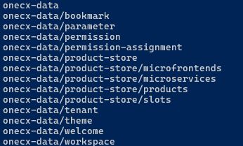

# Initial Data in OneCX Local Environment

The OneCX Local Environment contains data required for initial [startup](../scripts/start.html). This data is usually automatically [imported](../scripts/import.html) after the services have started.

This is an overview of the data and how its organized.

__Table 1\. OneCX Initial Data__
| Data Type               | Managed by                                                 | Description                                              |
| ----------------------- | ---------------------------------------------------------- | -------------------------------------------------------- |
| Assignments             | [Permission Management](../../onecx-permission/index.html) | Relationship between roles and permissions               |
| Bookmarks               | [Bookmark Management](../../onecx-bookmark/index.html)     | Bookmarks for quick access to frequently used items      |
| Parameters              | [Parameter Management](../../onecx-parameter/index.html)   | Used by some applications                                |
| Permissions             | [Permission Management](../../onecx-permission/index.html) | Declared and used in applications.                       |
| Products (Applications) | [Application Store](../../onecx-product-store/index.html)  | Application data (components, slots etc.)                |
| Tenants                 | [Tenant Management](../../onecx-tenant/index.html)         | Represents a customer or organizational unit using OneCX |
| Themes                  | [Theme Management](../../onecx-theme/index.html)           | Customizing the look and feel of OneCX for a tenant      |
| Workspaces              | [Workspace Management](../../onecx-workspace/index.html)   | Customizing the working areas for users                  |
| AI                      | AI Services                                                | Configuration and data for AI Chat functionalities       |

## How the Data are organized and imported

The directory **onecx-data** in the **onecx-local-env** repository contains all data files and scripts needed to import data into the OneCX Local Environment.

The [import-onecx.sh](../scripts/import.html) script is used to import data needed by the OneCX services. It can be run from the root directory of the **onecx-local-env** repository. It starts several scripts that import data for the different services. All data files are in JSON format and usually related to a tenant or an application.

The import scripts are using **node.js** and **jq** for reading the data, split them in batches and call the respective service APIs to import the data. Each script is responsible for importing a specific type of data, e.g. workspaces, themes, permissions, etc.

 

Figure 1\. Organization of Initial Data
