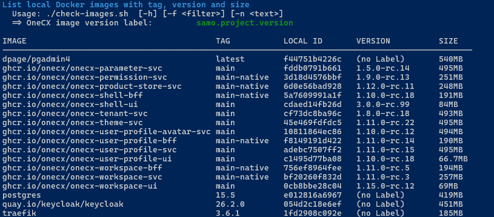
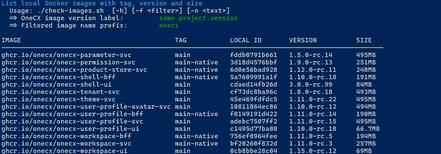

# Check local Docker images

The **check-images.sh** script is used to list local Docker images with version information. It can be run from the root directory of the **onecx-local-env** repository.

Command to list all Docker images (without any filter).

```bash
./check-images.sh
```

 

Figure 1\. List of local Docker images

| |  The local Docker images can easily be updated using the script [update-images.sh](update-images.html). |
| --------------------------------------------------------------------------------------------------------- |

## [](#available-options)Available Options

The script accepts several optional options to customize its behavior. Some options can be combined. The options are:

\-f

Image filter, see <https://docs.docker.com/reference/cli/docker/image/ls/#filter>

\-h

Displays help information about the script and its available options. If used then all other options are ignored.

\-n <text>

Name filter, find images which have <text> into image name

## [](#examples)Examples

### [](#list-images-with-onecx-in-name)List images with onecx in name

```bash
./check-images.sh   -n onecx
```

 

Figure 2\. List of local OneCX Docker images

### [](#list-images-marked-as-dangling)List images marked as dangling

List images marked as dangling, which means they are not tagged and not referenced by any container. This happens if there is a newer version of an image built or pulled. Such images can be removed without affecting any running container.

List candidates for deletion

```bash
./check-images.sh   -f "dangling=true"
```

The -f option can be combined with the -n option to filter for dangling images with a specific name pattern.

List outdated backend service images

```bash
./check-images.sh   -f "dangling=true" -n svc
```

## [](#understanding-the-listing)Understanding the Listing

### [](#onecx-version-labelling)OneCX Version Labelling

When building OneCX images, the version is set in the label **samo.project.version**. The value of this label is displayed in the listing as **VERSION**.

### [](#outdated-images)Outdated Images

Over time, local Docker images become outdated. Especially after updates, images with the tag `**<none>**` may be listed.

 

Figure 3\. List of outdated Docker images

Such images can be removed. The script [update-images.sh](update-images.html) can be used or native with

```bash
docker image rm <image-id>
```
