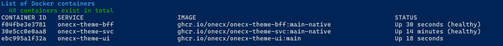
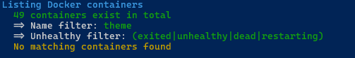

# List Docker Containers

The **list-containers.sh** script provides an overview of running Docker containers used in the OneCX Local Environment.  
It displays the container ID, service name, image name, and current status of each container. The script can be executed from the root directory of the **onecx-local-env** repository.

Command to display the available options

```bash
./list-containers.sh -h
```

## [](#available-options)Available Options

The script accepts several optional options to customize its behavior.  
The available options are:

\-a

List all containers, including those that are not part of the OneCX Local Environment.  
Other options are ignored.

\-h

Displays help information about the script and its available options.

\-n <text>

Name filter, show only containers which have <text> into container name.  
If used in combination with **\-u** then only unhealthy containers matching the name filter are shown.

\-u

Show only unhealthy containers.  
Can be used in combination with **\-n** option.

## [](#examples)Examples

### [](#list-containers-name-filter)List containers with name filter

The Docker which have **theme** in container name are shown.

```bash
./list-containers.sh  -n theme
```

 

Figure 1\. Theme Containers

### [](#list-unhealthy-containers)List unhealthy containers with name filter

The Docker which have **theme** in container name and **unhealthy** status are shown.

```bash
./list-containers.sh  -n theme -u
```

 

Figure 2\. No unhealthy Containers
