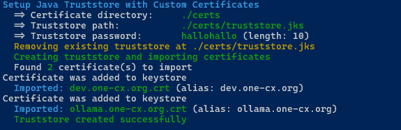

# Setup Java Truststore with Custom Certificates

The **setup-truststore.sh** script is used to create or update a Java Truststore containing custom certificates needed by Java applications running inside Docker containers in the OneCX Local Environment.

The script can be run from the root directory of the **onecx-local-env** repository:

```bash
./setup-truststore.sh
```

Instructions for preparing the Java Truststore with your certificates can be found under [Custom Certificates](../internal/custom-certificates.html).

## [](#available-options)Available Options

The script accepts several optional options to customize its behavior. Some options can be combined. The options are:

\-d <directory>

Certificate directory, default: './certs'

\-h

Displays help information about the script and its available options. If used then all other options are ignored.

\-p <password>

Truststore password, length > 5, default: 'trustjava'

## [](#examples)Examples

### [](#create-truststore-default)Create truststore with default settings

A Java Truststore is created at the default location with the default password. The script looks for certificates in the default directory `./certs` and imports all found certificates into the truststore.

```bash
./setup-truststore.sh
```

 

Figure 1\. Creating truststore with default settings
