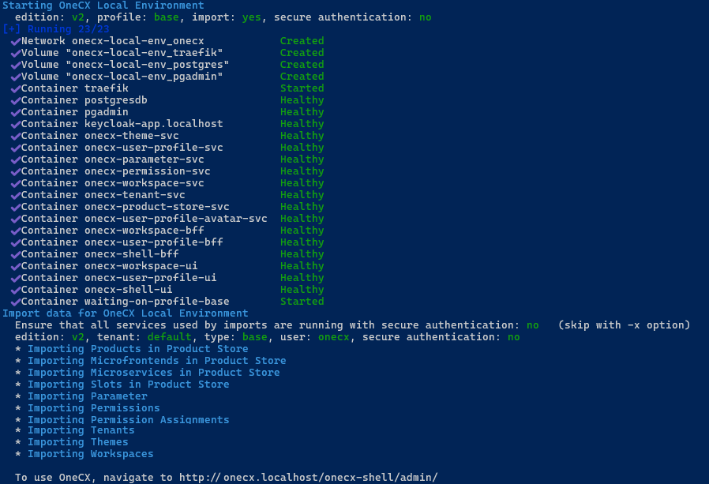
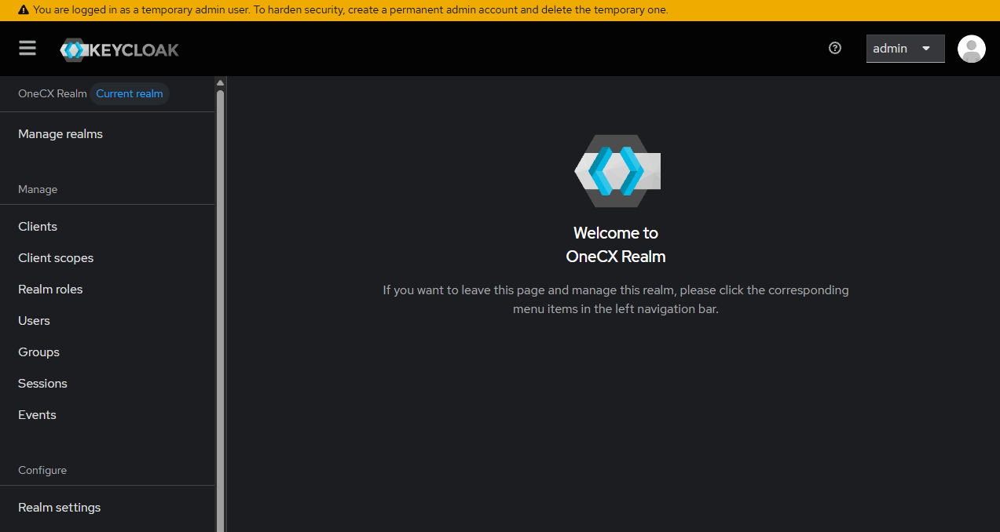
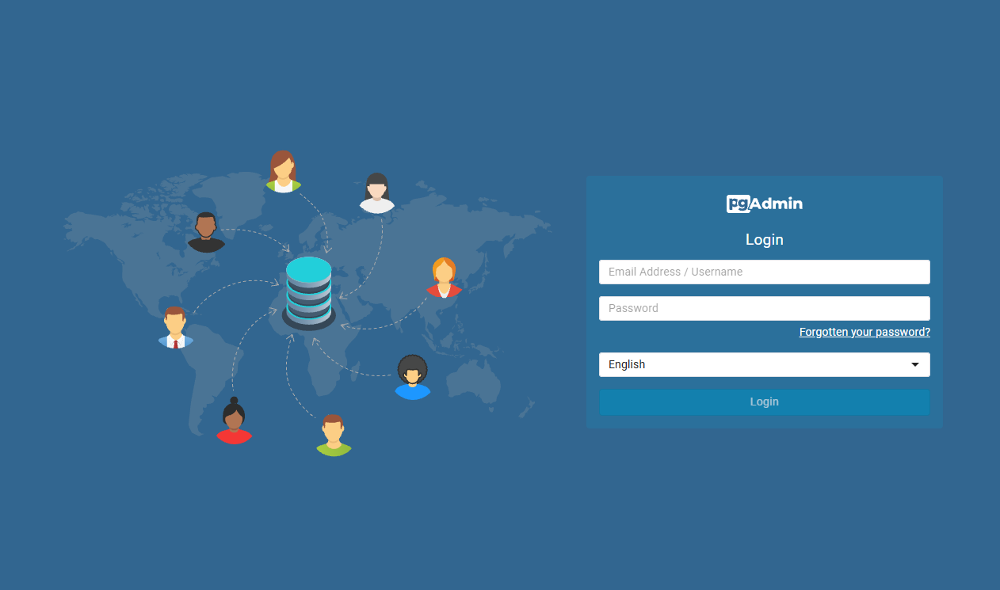
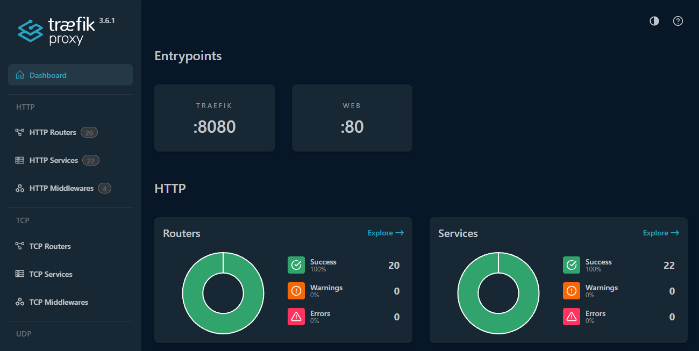

# Start local OneCX

The **start-onecx.sh** script is used to start the OneCX Local Environment. By default, it will start a minimal set of services and import initial mock data on startup. Data imports will not overwrite any custom data that may already exist in the environment and can be skipped using the appropriate option. The script can be run from the root directory of the **onecx-local-env** repository:

```bash
./start-onecx.sh
```

 

Figure 1\. Successful starting

| |  The script can be executed at any time. Docker checks the configuration of the services and restarts them if there are changes. Without changes, running services are not affected, and only missing services are started. Existing data that was imported or added by the user remains unchanged. |
| ----------------------------------------------------------------------------------------------------------------------------------------------------------------------------------------------------------------------------------------------------------------------------------------------------- |

## [](#available-options)Available Options

The script accepts several optional options to customize its behavior. Some options can be combined. The options are:

\-e

The edition of OneCX to start. Supported editions are:

* `v2`: Starts the current version of OneCX Local Environment (Default).
* `v1`: Starts the legacy version of OneCX Local Environment (Not recommended for new setups).

\-h

Displays help information about the script and its available options.

\-p <profile-name>

The profile to use when starting the environment. The supported profiles are:

* `base`: Starts a minimal version of OneCX Local Environment with only essential services. (Default)
* `all`: Starts all available services defined in the Docker Compose file.

\-s

Enables secure mode, which enforces authentication/authorization and taken into account the tenant ID of the user. (Default: disabled)

| |  When used, the services are started in such a way that they always require authentication AND taken into account the tenant ID, i.e. during import and login on UI! Consequently, the login takes place in the correct tenant. |
| --------------------------------------------------------------------------------------------------------------------------------------------------------------------------------------------------------------------------------- |

\-x

Skips the import of initial data after starting the services. (Default: import data according to the used profile)

## [](#examples)Examples

### [](#start-essential-services)Start essential Services

The Docker services **essential** for OneCX are started. The necessary Docker volumes are created and required data are imported. Technically, these services are labelled with the **base** profile in the Docker Compose file used.

There is no security context defined, so authentication/authorization on services is disabled.

* All data are owned by **default** tenant.
* All logins are using the **default** tenant!

```bash
./start-onecx.sh
```

### [](#start-all-services)Start ALL Services

**All** Docker services for OneCX are started. The necessary Docker volumes are created and required data are imported. Technically, the relevant services are marked with the **all** profile in the Docker Compose file used.

```bash
./start-onecx.sh -p all
```

### [](#start-with-security)Start with Security, skipping Import

The Docker services **essential** for OneCX are started with enabled secure authentication and also the tenant id is taken into account. This is the main precondition for tenant-compliant logins.

The necessary Docker volumes are created but no data are imported.

```bash
./start-onecx.sh -s -x
```

| |  If data needs to be imported in a tenant-specific manner, then use the script [import-onecx.sh](import.html) with the appropriate options after starting the services. |
| ------------------------------------------------------------------------------------------------------------------------------------------------------------------------- |

## [](#additional-started-services)Additional Started Services

In addition to the original OneCX products, some open-source tools are also used and launched.

### [](#keycloak)Keycloak

[Keycloak](https://www.keycloak.org/) is an open-source software for Identity and Access Management (IAM) that provides features like single sign-on (SSO), user authentication, and authorization for modern applications and services.

There is an OneCX realm which contains all configurations needed by OneCX like users, roles, clients etc.

* <http://keycloak-app/admin/master/console/#/onecx>
* Username: **admin**
* Password: **admin**

 

Figure 2\. Keycloak running on localhost

### [](#pgadmin)pgAdmin

[pgAdmin](https://www.pgadmin.org/) is a popular, open-source administration and development platform for [PostgreSQL](https://www.postgresql.org/) databases.

| |  This service is optional, as it is not strictly necessary for OneCX to function. For a better user experience, use a native client directly on your computer. |
| ---------------------------------------------------------------------------------------------------------------------------------------------------------------- |

* <http://pgadmin/>
* Username: **user@1000kit.org**
* Password: **admin**

 

Figure 3\. pgAdmin running on localhost

### [](#traefik)Traefik

Traefik is required for routing within Docker Compose networks as well as to and from networks outside this network.

* [Use Traefik for routing Microfrontends](toggle-mfes.html#routing-and-prioritize)
* <http://traefik:8082/dashboard/>

 

Figure 4\. Traefik Dashboard
