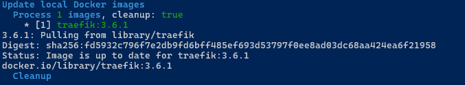
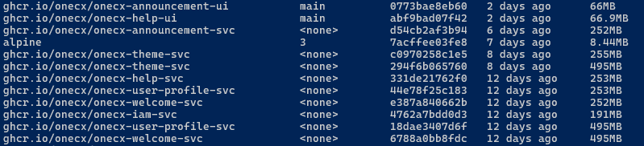
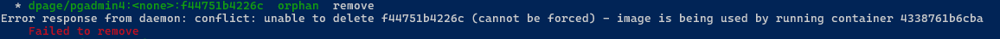
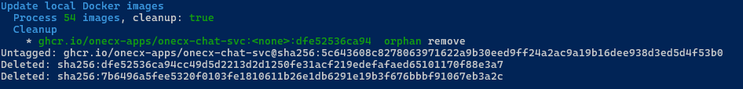

# Update local Docker images

To run a local OneCX instance, Docker images with the latest version are downloaded and used. Over time, these images become outdated, meaning that even if a newer version is available, the old version is still being used locally. Check versions with script [check-images.sh](check-images.html).

The **update-images.sh** script is used to renew local Docker images and removing orphaned images. It can be run from the root directory of the **onecx-local-env** repository.

Command to display the available options:

```bash
./update-images.sh -h
```

| |  Before updating the images, it is recommended to check the current versions of the local Docker images using the script [check-images.sh](check-images.html) and stopping the local OneCX instance using [stop-onecx.sh](stop.html) to prevent potential issues with running containers during the update process.Run the script with the parameter **\-c** to clean up orphaned images - can be done in combination with updating. |
| -------------------------------------------------------------------------------------------------------------------------------------------------------------------------------------------------------------------------------------------------------------------------------------------------------------------------------------------------------------------------------------------------------------------------------------- |

## [](#available-options)Available Options

The script accepts several optional options to customize its behavior. Some options can be combined.

The available options are:

\-a

Update all images, ignoring name filter (if option **\-n** is also used).  
If used in combination with **\-c** then all orphaned images and stopped containers are removed.

\-c

Cleaned up orphaned images which are tagged with **<none>** or with status **Exited**.  
Can be used in combination with **\-a** (all images are affected) or with **\-n** (only images matching the name filter are affected).  
Basically, the deletion is only possible if the image is not in use. If so then stop the appropriate container first and try again.

\-h

Displays help information about the script and its available options. If used then all other options are ignored.

\-n <text>

Name filter, update images which have <text> into image name

## [](#examples)Examples

### [](#update-traefik-image)Update Traefik Image

The Docker which have **traefik** in image name are pulled from remote registry and updated locally. In case some orphaned images are found then these are removed too.

```bash
./update-images.sh  -n traefik -c
```

 

Figure 1\. Successful update with name filter and cleanup

### [](#cleanup-only)Cleanup only

Started without any name filter will remove all orphaned images. No additional confirmation is required.

 

Figure 2\. Excerpt from the list of orphaned images

```bash
./update-images.sh  -c
```

The deletion is only possible if the image is not in use. If so then stop the appropriate container first and try again.

 

Figure 3\. Image deletion failed

 

Figure 4\. Image deletion successful after stopping the container

### [](#update-all-images-and-cleanup)Update all images and cleanup

With option **\-a** all images are updated, ignoring name filter. With option **\-c** all orphaned images are removed. No additional confirmation is required.

```bash
./update-images.sh  -a -c
```
