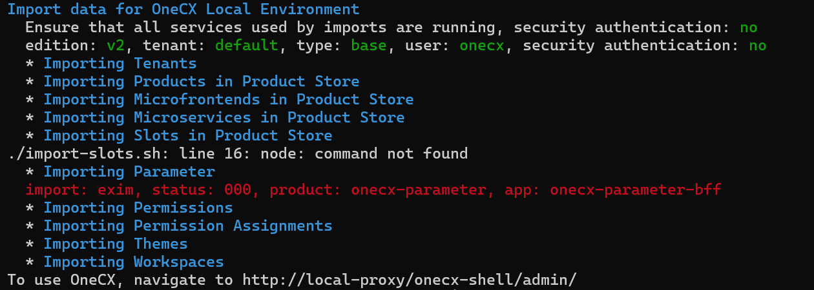
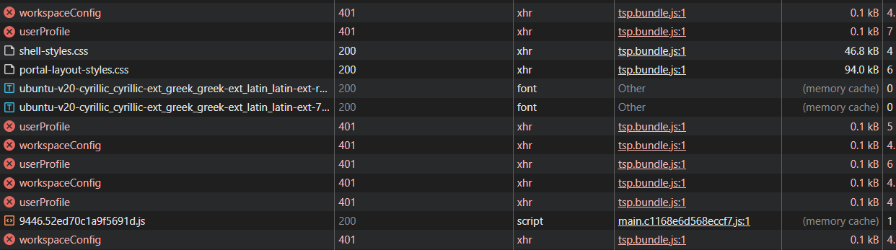
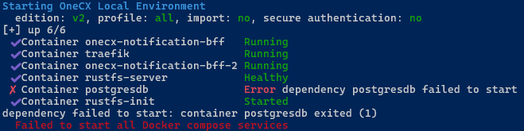
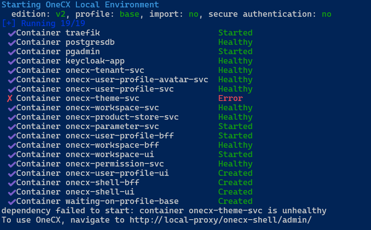
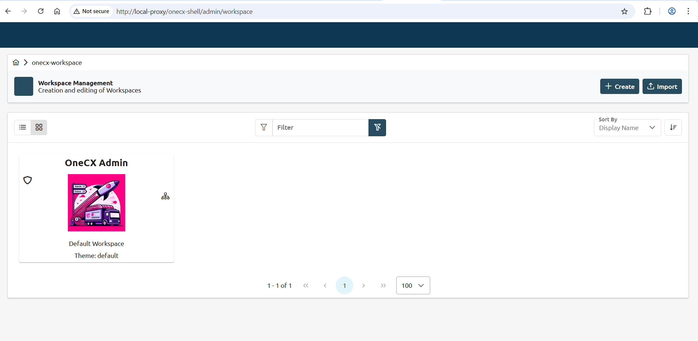
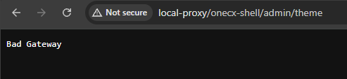
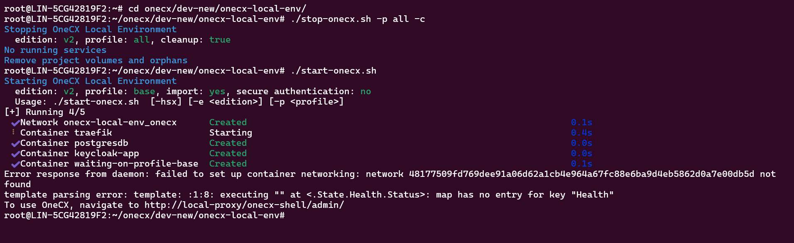
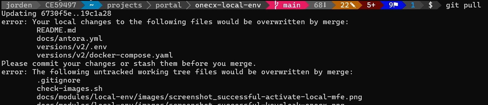
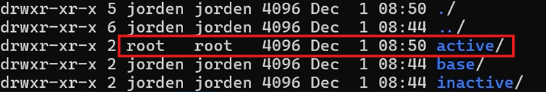

# Troubleshooting Common Errors

This page provides information for how to troubleshoot common problems and errors.

## [](#general-advice)General Advice

* Make sure you are using the latest version of **onecx-local-env**.
* Make sure your system meets the [prerequisites](setup.html#prerequisites) for running **onecx-local-env**.
* If you encounter an error, carefully read the error message and any accompanying logs. They often provide valuable clues about the root cause of the issue.
* Check the official OneCX documentation and community forums for similar issues and solutions.
* If the problem persists, consider reaching out to OneCX support or community forums for assistance.
* When reporting an issue, provide detailed information about your environment, the steps to reproduce the problem, and any relevant logs or error messages.

## [](#common-pitfalls)Common Pitfalls

* Insufficient System Resources: Ensure your system has enough CPU, memory, and disk space to run the OneCX Local Environment smoothly.
* Network Issues: Verify that your network connection is stable and that there are no firewall or proxy settings blocking necessary connections.
* Incorrect Configuration: Double-check your configuration files for any typos or incorrect settings.
* Outdated Software: Ensure that all required software dependencies are up-to-date.
* Are you working within WSL on Windows? Please see the [prerequisites](setup.html#prerequisites) for important notes on using WSL.

## [](#known-docker-issues)Known Docker Issues

Docker is not perfect and sometimes issues may arise that are related to Docker itself rather than **onecx-local-env**. Here are some common Docker-related issues and their solutions:

* Docker Daemon Not Running: Ensure that the Docker daemon is running before starting the OneCX Local Environment.
* Port Conflicts: Check for any port conflicts with other applications running on your system.
* Network Issues: Docker networking can sometimes be problematic. Cleanup Docker networks if you encounter networking issues.

### [](#cleanup-docker-resources)Cleanup Docker Resources

If you encounter persistent issues, it may be helpful to clean up Docker resources used by OneCX Local Environment.  
Remove unused Docker resources with the following commands:

```bash
docker system prune -a
docker volume prune
docker network prune
```

| |  Be cautious when using these commands, as they will remove all unused Docker resources, which may affect other Docker containers and applications on your system. |
| -------------------------------------------------------------------------------------------------------------------------------------------------------------------- |

In case OneCX is already running, you can stop it with cleanup of volumes by executing:

```bash
./stop-onecx.sh -c
```

This will remove all volumes used by OneCX Local Environment, which can help resolve issues related to corrupted or inconsistent data.

| |  Please note that this will delete all data stored in the volumes, so use this option with caution. |
| ----------------------------------------------------------------------------------------------------- |

Now you can cleanup any remaining Docker resources as described above and start OneCX again.

## [](#specific-issues)Specific Issues

### [](#status-code-000-on-imports)Status Code "000" on Imports

The issue occurs when the script [import-onecx.sh](scripts/import.html) is executed (importing OneCX data)

 

Figure 1\. Status code 000 on Imports

Solution 

* Check if the hosts file is up-to-date. See [Setup hosts](setup.html#hosts) instructions. Add missing entries if necessary.
* Restart import with  
```bash  
./import-onecx.sh -x  
```

### [](#status-code-401-on-starting)Status Code "401" on Starting

The problem occurs after logging into OneCX, although the start and import itself were successful.

 

Figure 2\. Status code 401 on Starting

Solution 

* Stop the services with cleanup (remove volumes)
* Cleanup Docker resources as described above
* Start again

### [](#postgresdb-container-fails-on-start-up)PostgresDB Container fails on Start up

The problem occurs when the version of the PostgreSQL database was changed without renew the affected database volumes.

 

Figure 3\. Message: Failed postgresdb service on Start up

Solution 

* Stop the services with cleanup (remove volumes)
* Start again

### [](#failed-services-on-start-up)Failed Services on Start up

The problem occurs when some services cannot be started successfully even after several attempts and timeouts.

 

Figure 4\. Message: Failed Services on Start up

Solution 

* Start again

### [](#missing-menu-in-browser)Missing Menu in Browser

The problem occurs sometimes after succesful starting the services

 

Figure 5\. Message: Missing Menu in Browser

Solution 

* Remove Browser Cache & Cookies
* Refresh browser

### [](#bad-gateway-in-browser)Bad gateway in Browser

The problem occurs sometimes after succesful starting the services

 

Figure 6\. Message: Bad gateway in Browser

Solution 

* Start again
* Refresh browser

### [](#failed-to-set-up-networking)Failed to set up Networking

The problem occurs when during start up there are collisions between Docker networks.  
`Error response from daemon: failed to set up container networking`

 

Figure 7\. Message: Failed to set up container networking

Solution 

* Remove all Docker networks with  
```bash  
docker network prune  
```
* Start again

### [](#cannot-successful-pull)Cannot successful pull

The issue occurs if the repository is updated with `git pull` (get latest version of onecx-local-env)

 

Figure 8\. Message: Untracked local files on pulling

 

Figure 9\. The directory init\_data/traefik/active was created by root

Solution 

* Remove the active directory of Traefik manually by execution of  
```bash  
sudo rm -rf init_data/traefik/active  
```
* Reset the local repo (all other changes will be lost)  
```bash  
git reset --hard origin/main  
```
