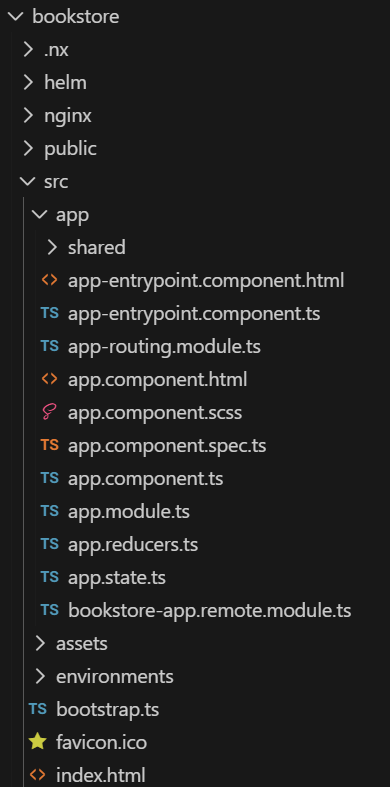

# Create a UI App

What is a UI App?

A UI App is a microfrontend application built using modern web technologies such as [Angular](https://angular.de/) or [React](https://reactjs.org/). Such application is designed to seamlessly integrate with the OneCX platform, providing a consistent user experience across different modules and features.  
Within the OneCX ecosystem, a UI App typically serves as the **front-end interface** for users to interact with various functionalities offered by OneCX. It can be a standalone application or part of a larger suite of applications, and it communicates with backend services to fetch and display data, handle user inputs, and perform various operations.

| |  The UI App created with the OneCX App Generator is only the base of a functional UI application. You will need to further develop and customize the application to meet your specific requirements and business logic. |
| ------------------------------------------------------------------------------------------------------------------------------------------------------------------------------------------------------------------------- |

## [](#generate-a-ui-app)Generate a UI App

The generator supports three flavors of projects: **angular**, **with NgRx** and **without NgRx**.  
It is **recommended to use the NgRx** flavor, because it leads to better structured projects and the state management is already in place.  
The creation of a new workspace takes a while, as the generator sets up a complete Angular application with all necessary dependencies and configurations.

Generate the UI App with following commands

```bash
npx <namespace>/create-workspace <flavor> <product>
cd <product>
npm install
```

with:

| _<namespace>_ | The base namespace of the project where the application is part of.For the OneCX, use @onecx.                                          |
| ------------- | -------------------------------------------------------------------------------------------------------------------------------------- |
| _<flavor>_    | ngrx (or angular).                                                                                                                     |
| _<product>_   | The technical base name of the application (product) for a certain business case.E.g. bookstore for an application named "Book Store". |

The generator creates a new directory with the specified product name and sets up the OneCX UI App according to the chosen flavor.  
Please note that the product name from your command is used as base of some essential application parts as following:

### [](#key-naming-conventions)Key Naming Conventions

* `onecx-<product>-ui`  
Project name  
Remote name for module federation  
Helm chart name for deployment and microservice registration in OneCX
* `OneCX<product>Module`  
Module name
* `ocx-<product>-component`  
Tag name for integration the web component into the DOM
* `onecx-apps/onecx-<product>-ui`  
Repository name for docker image repository
* `/mfe/<product>/`  
Base path for the microfrontend application, used within OneCX for integration purposes

Next step may [create a feature module](create-feature.html).

| |  The generated app contains the dependency for the OneCX Angular Generator (@onecx/angular-generator).This allows you to easily add new features, components, and services within your app’s user interface using the OneCX Angular Generator functions.(This package was named @onecx/nx-plugin prior to version 9.) |
| ----------------------------------------------------------------------------------------------------------------------------------------------------------------------------------------------------------------------------------------------------------------------------------------------------------------------- |

## [](#integrate-ui-app-into-onecx)Integrate UI App into OneCX

After the generation, you need to integrate the generated App into the local running OneCX. This involves adding the search component to the routing configuration of the feature module and ensuring that it is properly linked to the rest of the application.

| |  It is recommended to use the mechanism of OneCX Local environment to integrate the generated UI App into the running OneCX environment. Follow the guide in [Extend OneCX](../../onecx-local-env/extend/extend.html). |
| ------------------------------------------------------------------------------------------------------------------------------------------------------------------------------------------------------------------------ |

Steps for integration:

* Start the application with a dedicated port  
```bash  
npm run start -- --port=6023 --publicHost=http://localhost:6023  
```
* Integrate the application into running OneCX environment with this port  
```bash  
./toggle-mfes.sh -a bookstore:6023  
```
* Add necessary data to the backend to be able to call the search component  
(product, permissions, workspace registration, menu entry, etc.)
* After making these changes, reload the OneCX UI and navigate to the search component route

## [](#example)Example

The following commands create a new workspace directory named "bookstore" with the necessary structure and configurations for a OneCX UI App using [NgRx](https://ngrx.io/). This can take a while, as the generator sets up a complete [Angular](https://angular.de/) application with all necessary dependencies and configurations.

Create a UI App named "bookstore" (product) with NgRx support

```bash
npx @onecx/create-workspace ngrx bookstore
cd bookstore
npm install
```

 

Figure 1\. Excerpt of generated files and directories for the NgRx **bookstore** UI App
