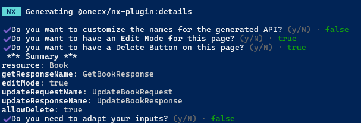
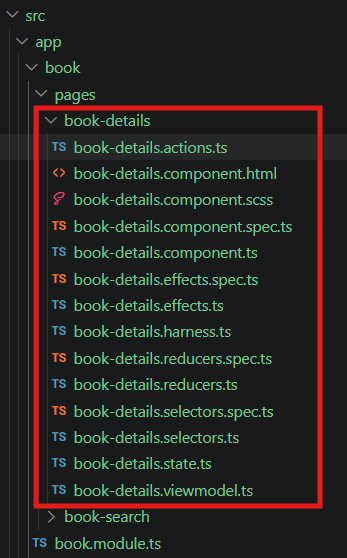
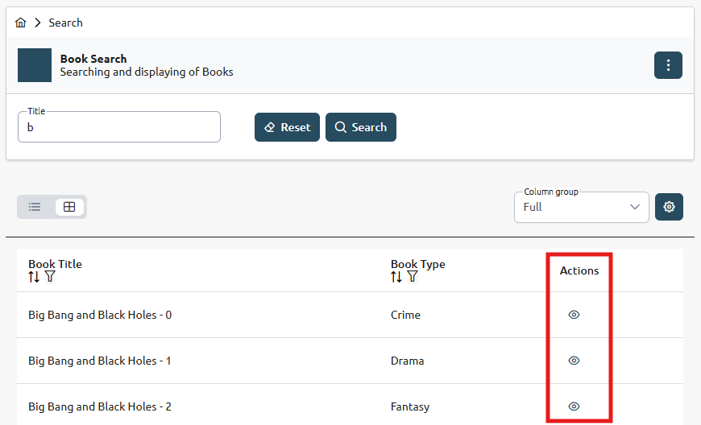
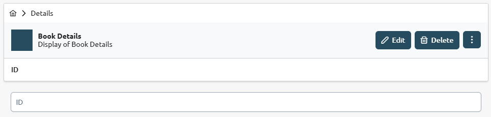
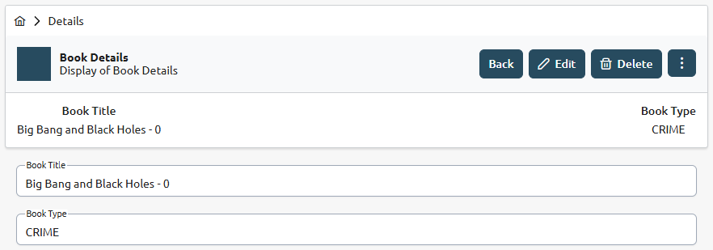

# Create a Detail Component

What is a Component?

A Component is a reusable building block of the user interface in a UI Application. It encapsulates the structure, behavior, and presentation of a specific part of the UI, allowing developers to create modular and maintainable applications.  
Components can represent anything from a simple button or form field to complex data-driven views.

Detail Component and Entity/Resource

The Detail Component is a specific type of component that provides a user interface for displaying detailed information about a certain entity or resource.  
The entity or resource represents the data model that the detail component interacts with. Therefore, the resource is the base parameter for the generation of a detail component.

## [](#generate-a-detail-component)Generate a Detail Component

The current working directory must be the root of an existing OneCX UI Application.

When a resource name is specified with the `--resource` option, the generator will preset the API service name to `<Resource>APIService` used by the generated detail component. This should correspond to the created schema in OpenAPI file, see step before.

Create a detail component with the following command, preset resource/entity name

```bash
nx generate <namespace>/angular-generator:details <feature> --resource=<resource>
```

with:

| _<namespace>_ | The base namespace of the project where the application is part of.For the OneCX, use @onecx.                                                                                                                            |
| ------------- | ------------------------------------------------------------------------------------------------------------------------------------------------------------------------------------------------------------------------ |
| _<feature>_   | The name of the generated feature module.E.g. book for a feature module named "Book".                                                                                                                                    |
| _<resource>_  | Optional. The name of the resource entity for which the feature module is generated.E.g. book for a resource entity named "Book". If not specified, the generator will use the feature name as resource name by default. |

Next, **you will be asked** if you would like to adapt the names for the generation.  

| NO  | If you answer **No**, the generator will use the preset resource name (if specified) or derive the name from feature name. This is the fastest way.         |
| --- | ----------------------------------------------------------------------------------------------------------------------------------------------------------- |
| YES | If you answer **Yes**, you can specify a name for the resource/entity and the API components. This can be helpful if you want to customize an existing API. |

Next questions will be about the use of actions within the search result page to manipulate the data. We recommend to answer **Yes** to at least the question about the edit action, as this will generate an edit button in the detail view which is a common use case for detail pages.  
The generator creates a new detail component within the specified feature module and set up the necessary structure and configurations.

 

Figure 1\. Example: Detail component for books - answering "Yes" to specify adjustments

### [](#key-naming-conventions)Key Naming Conventions

* `src/app/<feature>/pages/<resource>-detail`  
Directory for the detail component and its related files
* `<resource>DetailComponent`  
Name for the detail component class
* ''  
Default route path (empty) for the detail component, see `src/app/<feature>/<feature>.routes.ts`.

## [](#post-generation-steps)Post-Generation Steps

The next steps involve adapting the detail component to your specific requirements and integrating it into other parts of the application. All parts that need to be adapted after the generation are described in the following sections.

1. [Configure Detail Properties](details/detail-properties.html)
2. [Configure Detail Tests](details/detail-tests.html)

All places that need to be adapted are marked with an action box like this one

```javascript
ACTION D<NUMBER>: <Short Description>
```

| |  Search in your IDE for the string **ACTION D** to quickly find all places that need to be adapted. |
| ----------------------------------------------------------------------------------------------------- |

| |  The generator uses the following Extension Marker in the detail component spec file <<SPEC-EXTENSIONS-MARKER-!!!-DO-NOT-REMOVE-!!!>> This marker is used as a placeholder for future extensions by newly generated components. Do not remove the marker from the code, as doing so will prevent these future generated functions and tests from being added to the Detail Page Spec File. |
| -------------------------------------------------------------------------------------------------------------------------------------------------------------------------------------------------------------------------------------------------------------------------------------------------------------------------------------------------------------------------------------------- |

## [](#example)Example

### [](#create-a-detail-component)Create a Detail Component

Create a detail component for books inside the **book** feature module.  
Execute the following command with the **bookstore** application as current working directory.

Create a Detail Component for a Book, preset resource/entity name

```bash
nx generate @onecx/angular-generator:details book --resource=Book
```

This command will generate a new detail component **book-detail** within the specified feature module with the necessary structure and configurations. With the presetted resource/entity name **Book**, the generator will also preset the API service name to **BookAPIService** used by the generated detail component. This should correspond to the created schema in OpenAPI file, see step before.

 

Figure 2\. Excerpt of generated files and directories

### [](#configure-the-detail)Configure the Detail

The generated detail component provides a basic structure for displaying and managing the details of the specified resource/entity.  
You can further configure the detail view, form controls, and actions according to your specific requirements, following the [Post Generation Steps](#post-generation-steps).

### [](#preview)Preview

In the following image, the search result view was extended with a VIEW action.

 

Figure 3\. Search UI after creation of detail component with VIEW action

The detail component is displayed when clicking on the VIEW button in the search result view.  
The detail component is generated with a basic layout and structure, which can be further customized and enhanced based on the specific requirements of your application. The generated component includes a detail view for displaying the details of the resource/entity and form controls for editing the details, which can be adapted to fit the data structure and user interface needs of your application.

 

Figure 4\. Detail UI after generation

After adaptations to the detail view and form controls, the detail component can look like this:

 

Figure 5\. Detail UI with adapted detail view
