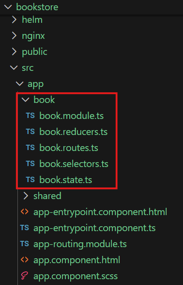
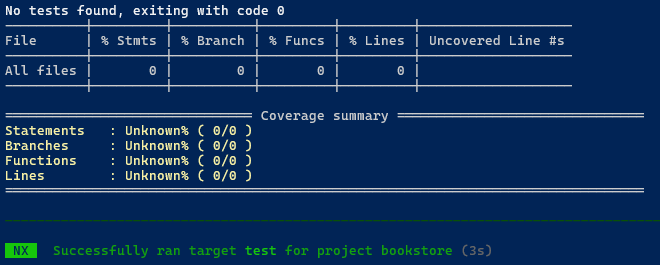

# Create a Feature Module

What is a Feature Module?

A feature Module is a modular unit of functionality that encapsulates a specific feature or set of related features within an UI Application. It is designed to promote code reusability, maintainability, and separation of concerns by grouping related components, services, and state management logic together.  
In [Angular](https://angular.de/), feature modules are **NgModules** for the purpose of organizing code.

| |  The Feature Module created with the OneCX App Generator is only the base of a functional module.You will need to further develop and customize the module to meet your specific requirements and business logic. |
| ------------------------------------------------------------------------------------------------------------------------------------------------------------------------------------------------------------------- |

## [](#generate-a-feature-module)Generate a Feature Module

The current working directory must be the root of an existing OneCX UI Application.

| Directory | <root-of-ui-app> |
| --------- | ---------------- |

Create a feature module with the following command, preset resource/entity name

```bash
nx generate <namespace>/angular-generator:feature <feature> --resource=<resource>
```

with:

| _<namespace>_ | The base namespace of the project where the application is part of.For the OneCX, use @onecx.                                                                                                                            |
| ------------- | ------------------------------------------------------------------------------------------------------------------------------------------------------------------------------------------------------------------------ |
| _<feature>_   | The name of the generated feature module.E.g. book for a feature module named "Book".                                                                                                                                    |
| _<resource>_  | Optional. The name of the resource entity for which the feature module is generated.E.g. book for a resource entity named "Book". If not specified, the generator will use the feature name as resource name by default. |

Next, **you will be asked** if you would like to adapt the names for the generation.  
If you answer **No**, the generator will use the preset resource name to derive the names for the feature module and other generated parts.  
If you answer **Yes**, you can specify a name for the API in the following questions. This can be helpful if you want to customize an existing API.

The generator will create a new feature module with the specified name and set up the necessary structure and configurations.  
Next steps may create components, services, and state management logic within the feature module as needed, e.g. [create a search component](create-search.html).

### [](#key-naming-conventions)Key Naming Conventions

* `src/app/<feature>/`  
Directory for the feature module and its related files
* `<feature>Module`  
Name for the feature module
* `/<feature>/`  
Default **route path** for the application feature, see `app-routing.module.ts`.

### [](#routing-configuration)Routing Configuration

The generator will automatically configure the routing for the generated feature module.  
It will add a new route to the application’s main routing module (e.g. `app-routing.module.ts`) to lazy load the feature module when the specified route is accessed.  
The route path will be derived from the feature name, e.g. `/book/` for a feature module named "book".  
You can further customize the routing configuration as needed after the generation.

## [](#example)Example

### [](#create-a-feature-module)Create a Feature Module

Create a feature module **book** inside the application named **bookstore** to manage book data.  
Execute the following command with the **bookstore** application as current working directory. Define the resource name as **Book** to generate a feature module for managing the entity **Book**.

Create a Feature Module named "book"

```bash
nx generate @onecx/angular-generator:feature book --resource=Book
```

This command will generate a new feature module named **book** with the necessary structure and configurations. The preset resource name **Book** will be used to derive the names for the generated components and services related to managing book data.

 

Figure 1\. Excerpt of generated files and directories

### [](#routing)Routing

The generator will add a new route to the application’s main routing module (e.g. `app-routing.module.ts`) to lazy load the **book** feature module when the `/book/` route is accessed.  
You can further customize the routing configuration as needed after the generation, e.g., to add child routes for different components within the **book** feature module.

Routing Configuration in app-routing.module.ts

```javascript
export const routes: Routes = [
  {
    // Adjust the matcher to match the feature route.
    // If you only have one feature, you can use '' for simplification.
    matcher: startsWith('book'),
    loadChildren: () =>
      import('./book/book.module').then((mod) => mod.BookModule),
  },
];
```

### [](#testing)Testing

The generator does not create test cases for the feature module itself, but it neverthless it is a good practice to run the tests after generating the feature module to ensure that the existing functionality of the application is not broken and everything is working as expected.  
Use the following command to run the tests:

```bash
npm run test
```

 

Figure 2\. Test result of the generated feature module
