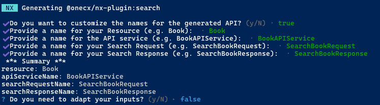
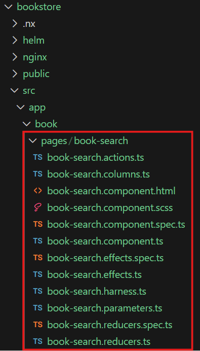
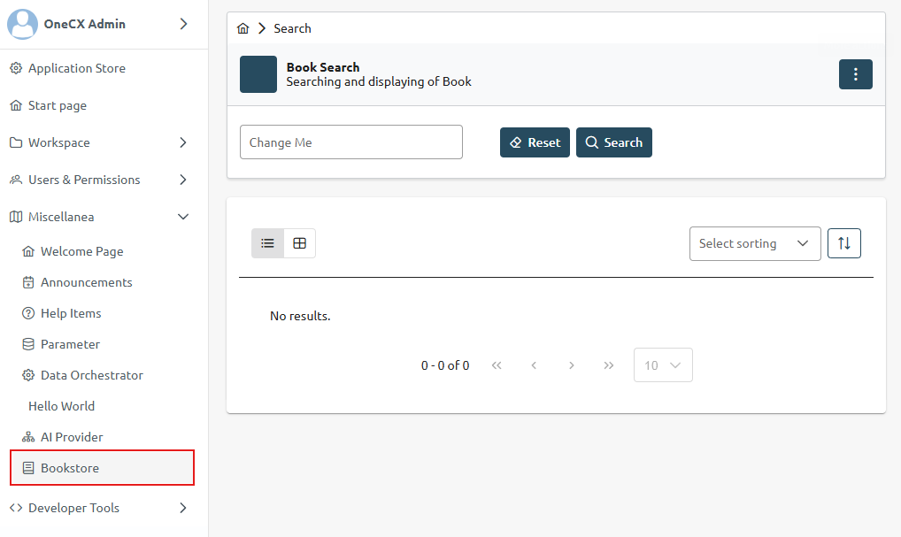
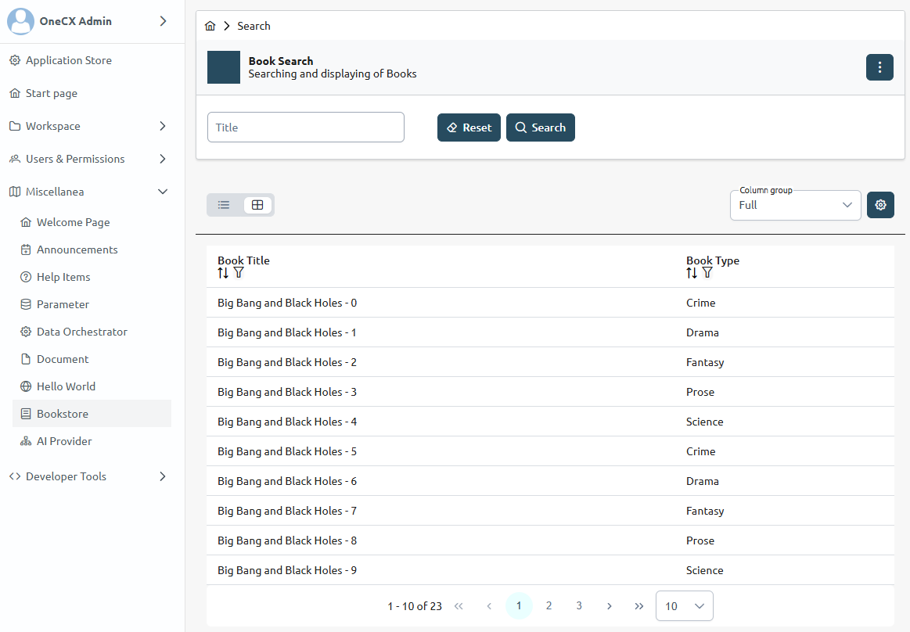

# Create a Search Component

What is a Component?

A Component is a reusable building block of the user interface in a UI Application. It encapsulates the structure, behavior, and presentation of a specific part of the UI, allowing developers to create modular and maintainable applications.  
Components can represent anything from a simple button or form field to complex data-driven views.

Search Component and Entity/Resource

The Search Component is a specific type of component that provides a user interface for searching and displaying results based on a certain entity or resource.  
The entity or resource represents the data model that the search component interacts with. Therefore, the resource is the base parameter for the generation of a search component.

## [](#generate-a-search-component)Generate a Search Component

The current working directory must be the root of an existing OneCX UI Application.

When a resource name is specified with the `--resource` option, the generator will preset the API service name to `<Resource>APIService` used by the generated search component. This should correspond to the created schema in OpenAPI file, see step before.

Create a search component with the following command, preset resource/entity name

```bash
nx generate <namespace>/angular-generator:search <feature> --resource=<resource>
```

with:

| _<namespace>_ | The base namespace of the project where the application is part of.For the OneCX, use @onecx.                                                                                                                            |
| ------------- | ------------------------------------------------------------------------------------------------------------------------------------------------------------------------------------------------------------------------ |
| _<feature>_   | The name of the generated feature module.E.g. book for a feature module named "Book".                                                                                                                                    |
| _<resource>_  | Optional. The name of the resource entity for which the feature module is generated.E.g. book for a resource entity named "Book". If not specified, the generator will use the feature name as resource name by default. |

Next, **you will be asked** if you would like to adapt the names for the generation.  
If you answer **No**, the generator will use the preset resource name (if specified) or derive the name from feature name. This is the fastest way.  
If you answer **Yes**, you can specify a name for the resource/entity and the API components. This can be helpful if you want to customize an existing API.

The generator creates a new search component within the specified feature module and set up the necessary structure and configurations.

 

Figure 1\. Example: Search component for books - answering "Yes" to specify adjustments

### [](#key-naming-conventions)Key Naming Conventions

* `src/app/<feature>/pages/<resource>-search`  
Directory for the search component and its related files
* `<resource>SearchComponent`  
Name for the search component class
* ''  
Default route path (empty) for the search component, see `src/app/<feature>/<feature>.routes.ts`.

## [](#post-generation-steps)Post-Generation Steps

The next steps involve adapting the search component to your specific requirements and integrating it into other parts of the application. All parts that need to be adapted after the generation are described in the following sections.

1. [Configure Search Criteria](search/search-criteria.html)
2. [Configure Search Results](search/search-results.html)
3. [Configure Search Add-ons](search/search-add-ons.html)
4. [Configure Search Tests](search/search-tests.html)
5. [Prepare Mock Data](search/mock-api.html)

All places that need to be adapted are marked with an action box like this one

```javascript
ACTION S<NUMBER>: <Short Description>
```

| |  Search in your IDE for the string **ACTION S** to quickly find all places that need to be adapted. |
| ----------------------------------------------------------------------------------------------------- |

| |  The generator uses the following Extension Marker in the search component spec file <<SPEC-EXTENSIONS-MARKER-!!!-DO-NOT-REMOVE-!!!>> This marker is used as a placeholder for future extensions by newly generated components. Do not remove the marker from the code, as doing so will prevent these future generated functions and tests from being added to the Search Page Spec File. |
| -------------------------------------------------------------------------------------------------------------------------------------------------------------------------------------------------------------------------------------------------------------------------------------------------------------------------------------------------------------------------------------------- |

## [](#example)Example

### [](#create-a-search-component)Create a Search Component

Create a search component for books inside the **book** feature module.  
Execute the following command with the **bookstore** application as current working directory.

Create a Search Component for Books, preset resource/entity name

```bash
nx generate @onecx/angular-generator:search book --resource=Book
```

This command will generate a new search component **book-search** within the specified feature module with the necessary structure and configurations. With the presetted resource/entity name **Book**, the generator will also preset the API service name to **BookAPIService** used by the generated search component. This should correspond to the created schema in OpenAPI file, see step before.

 

Figure 2\. Excerpt of generated files and directories

### [](#configure-the-search)Configure the Search

The generated search component provides a basic structure for searching and displaying results based on the specified resource/entity.  
You can further configure the search criteria, search results, result diagram, and header actions according to your specific requirements, following the [Post Generation Steps](#post-generation-steps).

### [](#integrate-ui-app-into-onecx)Integrate UI App into OneCX

After the generation, you need to integrate the generated App into the local running OneCX. This involves adding the search component to the routing configuration of the feature module and ensuring that it is properly linked to the rest of the application.

| |  It is recommended to use the mechanism of OneCX Local environment to integrate the generated UI App into the running OneCX environment. Follow the guide in [Extend OneCX](../../onecx-local-env/extend/extend.html). |
| ------------------------------------------------------------------------------------------------------------------------------------------------------------------------------------------------------------------------ |

Steps for integration:

* Start the application with a dedicated port  
```bash  
npm run start -- --port=6023 --publicHost=http://localhost:6023  
```
* Integrate the application into running OneCX environment with this port  
```bash  
./toggle-mfes.sh -a bookstore:6023  
```
* Add necessary data to the backend to be able to call the search component  
(product, permissions, workspace registration, menu entry, etc.)
* After making these changes, reload the OneCX UI and navigate to the search component route

### [](#start-backend-service)Start Backend Service

To have the search component working, you need to have a backend service running that provides the necessary API endpoints for the search functionality.  
Make sure to start the backend service that corresponds to the generated search component.  
In case you don’t have a real backend service available, you can prepare mock data and use it with the generated search component, see [Prepare Mock Data and Use It](search/mock-api.html).

### [](#preview)Preview

In the following image, the search component (as generated including the post-generation steps) is integrated into the application unchanged, exactly as it was generated.

 

Figure 3\. Search UI after integration into the application

After adjusting the search criteria and search results for the bookstore example and starting the backend service, the search component can look like this:

 

Figure 4\. Search UI with adapted search and example data
