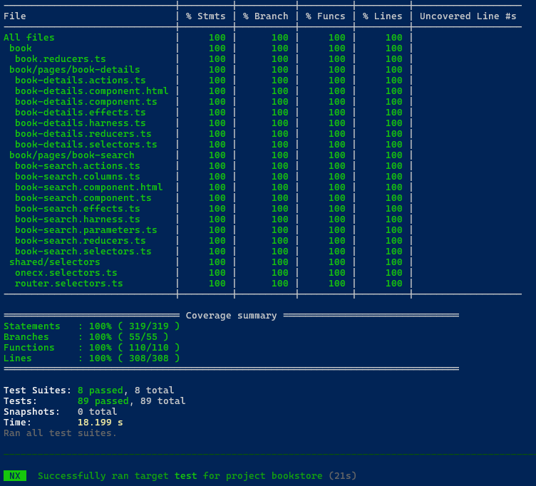

# Configure Detail Tests

## [](#action-d11)ACTION D11

Configure Detail Tests

In alignment to the adaptations made in the detail component, you will also need to adapt the generated tests for the detail component. This includes updating the test data and expected results in the spec files to reflect the changes made to the detail component, such as the property definitions and the structure of the detail view.  
This ensures that the tests accurately validate the functionality of the detail component based on the customized implementation.

---

### [](#detail-component)Detail Component

#### [](#location-of-detail-component-tests)Location of Detail Component Tests

| Directory | <root-of-ui-app>/src/app/<feature>/pages/<resource>-details |
| --------- | ----------------------------------------------------------- |
| File      | <resource>-details.component.spec.ts                        |

#### [](#tests-for-the-book)Tests for the book

| Directory | bookstore/src/app/book/pages/book-details |
| --------- | ----------------------------------------- |
| File      | book-details.component.spec.ts            |

Update the test data in the spec file to reflect the expected structure and values based on the customized detail component implementation.

ACTION D11 in `<resource>-details.component.spec.ts` 

```javascript
...
import { BookType } from 'src/app/shared/generated'
...
  it('should dispatch saveButtonClicked action on edit button click', async () => {
    jest.spyOn(store, 'dispatch')
    // ACTION D11: Adjust form field names and values according to your implementation
    const book =  { id: '123', bookTitle: 'test title', bookType: BookType.Drama }
    const bookForm = { bookTitle: 'new title', bookType: BookType.Science }
...
  it('should mark as pristine and disable form when editMode is false', async () => {
    const markAsPristineSpy = jest.spyOn(component.formGroup, 'markAsPristine')
    const disableSpy = jest.spyOn(component.formGroup, 'disable')

    // ACTION D11: Adjust form field names and values according to your implementation
    const bookForm = { bookTitle: 'test title', bookType: BookType.Drama }
    const book =  { id: '123', ...bookForm }
```

---

## [](#execute-tests)Execute Tests

After adapting the tests, you can execute them to ensure that they are working correctly and validating the functionality of the detail component as expected.  
Use the following command to run all tests:

```bash
npm run test
```

This will execute the test suite and provide feedback on the success or failure of the tests based on the adapted test cases and expected results.  
Make sure to review the test results and address any issues that may arise to ensure that your detail component is functioning correctly and meets the desired requirements.

 

Figure 1\. Test results
