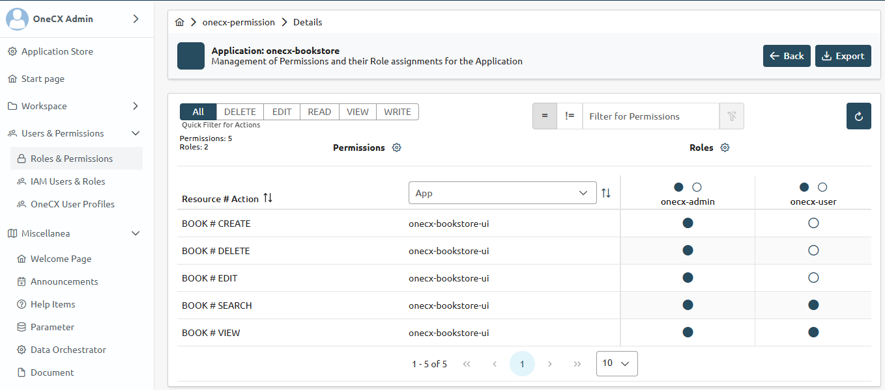

# Configure Permissions

What are permissions?

Permissions are a way **to control access** to certain features or actions within an application. They allow you to define who can perform specific actions based on their roles or other criteria. By configuring **permissions**, you can ensure that only authorized users can access sensitive data or perform critical operations, enhancing the security and integrity of your application.  
The **permissions** are defined in the `values.yaml` file of the [Helm](https://helm.sh/) chart. This file contains a section for permissions where you can specify the actions that users can perform on different entities.  
The `values.yaml` file is used by the OneCX permission operator during deployment to create the necessary permissions in the [Permission Management](../../onecx-permission/index.html).

Predefined Permissions for the Entity/Resource

The generator creates a set of predefined permissions for the entity/resource on feature generation:  
CREATE, EDIT, DELETE, SEARCH, VIEW, IMPORT, EXPORT, and BACK

Refer to [permissions in Angular](../../docs-guides-ui/angular/permissions/permissions.html) for more information.

## [](#action-p)ACTION P

Configure permissions

Adapt the preset permissions in the `helm/values.yaml` file.

### Example

Configure permissions for the `Book` entity by adding the following snippet to the `values.yaml` file.

| Directory | bookstore/helm/ |
| --------- | --------------- |
| File      | values.yaml     |

ACTION P in `values.yaml` with preset permissions for the `Book` entity 

```yaml
    permission:
      enabled: true
      spec:
        permissions:
          BOOK:
            CREATE: Create Book item
            EDIT: Edit Book item
            DELETE: Delete Book item
            SEARCH: Search Book items
            VIEW: View Book item details
            IMPORT: Import Book items
            EXPORT: Export Book items
            BACK: Navigate back in details of Book item
```

After adding the permissions into the local environment, you can use them within your application to control access to certain features or actions based on the user’s roles and permissions.

 

Figure 1\. Bookstore permissions within the Permission UI
