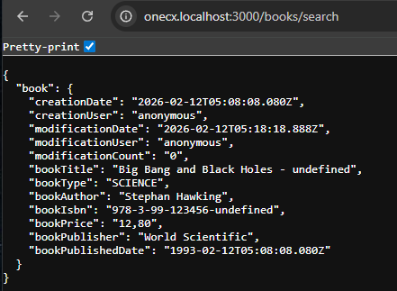

# Mock API

What is a Mock API?

A Mock API is a simulated version of a real API that allows developers to test and develop their applications without needing access to a live backend. It provides predefined responses to API requests, enabling frontend teams to work independently of backend systems, enabling faster load times, predictable responses, and controlled performance testing.

Using a Mock API provides a more realistic testing environment, as it simulates the actual API interactions that your app will have with a backend service. There are different ways to prepare Mock APIs.  
Here we use [Node.js](https://nodejs.org/en).

## [](#mock-server-with-node-js)Mock Server with Node.js

Copy the following code snippet to your project to create a simple in-memory data service that provides simulated data for your UI app. This example assumes you have an entity called "**Book**" and you want to provide simulated data for it. Save the file e.g. as `bookstore-mock-server.js`.

Simulated data example via node mock server 

```javascript
const bodyParser = require("body-parser");
const express = require("express");
const { v4 } = require("uuid");
const app = express();
app.use(express.json());
const data = {
  books: [],
};
const bookTypes = ["CRIME", "DRAMA", "FANTASY", "PROSE", "SCIENCE"];
const apiNames = ["books"];

const generateBooks = (count) => {
  let results = [];
  for (let i = 0; i < count; i++) {
    results.push({
      creationDate: "2024-04-12T06:08:27.806Z",
      creationUser: "anonymous",
      modificationDate: "2024-04-12T06:08:40.312Z",
      modificationUser: "anonymous",
      modificationCount: "0",
      id: i,
      bookTitle: "Big Bang and Black Holes - " + i,
      bookType: bookTypes[i % bookTypes.length],
      bookAuthor: "Stephan Hawking",
      bookIsbn: "978-3-99-123456-" + i,
      bookPrice: "12,80",
      bookPublisher: 'World Scientific',
      bookPublishedDate: new Date(Date.now() + 2 * 24 * 60 * 60 * 1000).toISOString()
    });
  }
  data.books = results;
  return { number: 0, size: 100, totalElements: results.length, totalPages: 1, stream: results };
};

// Book Endpoints
app.post("/books/search", (req, res) => {
  const bookTitle = req.body.bookTitle;

  res.send(
    generateBooks(23)
  );
});


app.get(`/books/:id`, (req, res) => {
  res.send({
    resource: {
      creationDate: "2026-02-12T05:08:08.080Z",
      creationUser: "anonymous",
      modificationDate: "2026-02-12T05:18:18.888Z",
      modificationUser: "anonymous",
      modificationCount: "0",
      id: req.params.id,
      bookTitle: "Big Bang and Black Holes - " + req.params.id,
      bookType: bookTypes[req.params.id % bookTypes.length],
      bookAuthor: "Stephan Hawking",
      bookIsbn: "978-3-99-123456-" + req.params.id,
      bookPrice: "12,80",
      bookPublisher: 'World Scientific',
      bookPublishedDate: "1993-02-12T05:08:08.080Z",
    },
  });
});

// Generic Endpoints
for (const apiname of apiNames) {
  app.post(`/${apiname}/search`, (req, res) => {
    res.send({
      results: data[apiname],
      totalNumberOfResults: data[apiname].length,
    });
  });

  app.delete(`/${apiname}/:id`, (req, res) => {
    data[apiname] = data[apiname].filter((i) => i.id != req.params.id);
    res.status(204).send("Item deleted");
  });

  app.post(`/${apiname}/`, (req, res) => {
    let item = {
      id: v4(),
      ...req.body.resource,
    };
    data[apiname] = [...data[apiname], item];
    res.send({ resource: item });
  });

  app.put(`/${apiname}/:id`, (req, res) => {
    console.log(`data[${apiname}] length: `, data[apiname].length);
    console.log('req.params.id: ', req.params.id);

    let item = data[apiname].find((i) => i.id == req.params.id);

    if(!item) {
      res.status(404).send("Item not found");
      return;
    }
    console.log('current item: ', item);
    console.log('request item: ', req.body.resource);

    // update item
    item = {
      ...item,
      ...req.body.resource,
      ...{ modificationCount: (parseInt(item.modificationCount) + 1).toString() },
    };

    data[apiname] = data[apiname].map((_item) => {
      if (_item.id == item.id) {
        return item;
      } else {
        return _item;
      }
    });

    res.send({ resource: item });
  });

  app.get(`/${apiname}/:id`, (req, res) => {
    const result = {
      resource: data[apiname].find((i) => i.id == req.params.id),
    };
    res.send(result);
  });
}

app.listen(3000, () => console.log("Bookstore app is listening on port 3000."));
```

Start the server with the following command

```bash
node bookstore-mock-server.js
```

The server will start and listen for incoming requests on port 3000.

 

Figure 1\. Example output when the server is running and a request is made to the /book/search endpoint

## [](#using-the-mock-api)Using the Mock API

To use the Mock API for your generated UI app, you need to configure your app to point to the mock server’s URL (e.g. http://localhost:3000) instead of a real backend URL. Due to the generated UI app is a Webpack application, the generator has also created a `proxy.conf.js` file that configures the mapping of API paths to backend URLs. This file is located in the root directory of your Angular project.

| Directory | <root-of-ui-app> |
| --------- | ---------------- |
| File      | proxy.conf       |

Excerpt of the generated `proxy.conf` with the BFF URL

```javascript
...
const PROXY_CONFIG = {
  '/bff': {
    target: 'http://bookstore-bff',
    secure: false,
    pathRewrite: { '^.*/bff': '' },
    changeOrigin: true,
    logLevel: 'debug',
    onProxyRes: onProxyRes
  }
}
```

Replace the real BFF URL `http://bookstore-bff` with the Mock server URL `http://localhost:3000`.

Use the mock server URL as target URL of the BFF

```javascript
...
const PROXY_CONFIG = {
  '/bff': {
    target: 'http://localhost:3000',
    secure: false,
    pathRewrite: { '^.*/bff': '' },
    changeOrigin: true,
    logLevel: 'debug',
    onProxyRes: onProxyRes
  }
}
```
