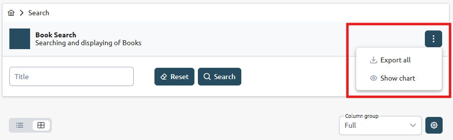
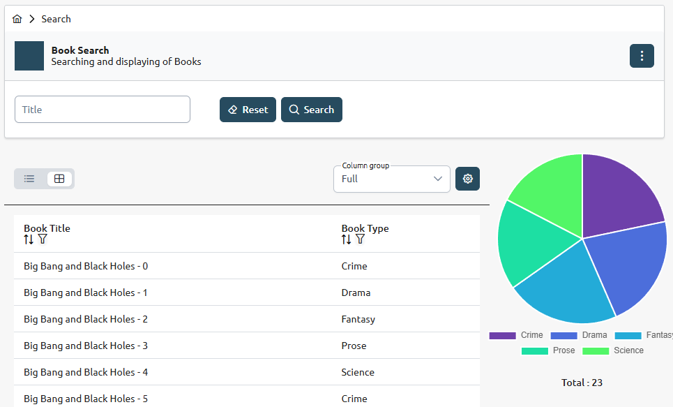

# Configure Search Add-Ons

Search Add-Ons are additional features that can be added to the search page to enhance its functionality and provide a better user experience. These add-ons can include features such as search result diagrams, header actions, and more.

 

Figure 1\. Default search page header actions

## [](#action-9)ACTION S9

Configure the Search Page Result Diagram

By default, a diagram component is added to display the value distribution of a certain column in the search results. This component is called `GroupByCountDiagram` and it groups the values of a column and counts how many times each value appears in the search results. The result is displayed as a diagram, which can be either a bar chart or a pie chart, depending on the configuration.

 

Figure 2\. Search Page Result Diagram for the Example App

Select the column to be displayed

The `columnId` is the key of the column to use for the result diagram. You can select any column you defined in the search results.

### Template: Column Selection for Diagram

| Directory | <root-of-ui-app>/src/app/<feature>/pages/<resource>-search |
| --------- | ---------------------------------------------------------- |
| File      | <resource>-search.component.ts                             |

ACTION S9 in `<resource>-search.component.ts` 

```javascript
  // ACTION S9: Select the column to be displayed in the diagram
  this.diagramColumnId = 'id';
  this.diagramColumn$ = this.viewModel$.pipe(map((vm) =>vm.columns.find((e) => e.id === this.diagramColumnId) as DataTableColumn));
```

Please refer to the [GroupByCountDiagram Component](../../../onecx-portal-ui-libs/components/group-by-count-diagram.html) for more adaptations.

---

### Example: Book Type Diagram

| Directory | bookstore/src/app/book/pages/book-search |
| --------- | ---------------------------------------- |
| File      | book-search.component.ts                 |

ACTION S9 in `book-search.component.ts` 

```javascript
  // ACTION S9: Select the column to be displayed in the diagram
  this.diagramColumnId = 'bookType';
  this.diagramColumn$ = this.viewModel$.pipe(map((vm) =>vm.columns.find((e) => e.id === this.diagramColumnId) as DataTableColumn));
```

## [](#action-10)ACTION S10

Configure Search Header Actions

The header of the search page contains action buttons that allow users to perform various operations related to the search functionality. These actions can be customized to fit the specific needs of your application.

### Template: Search Header Actions

| Directory | <root-of-ui-app>/src/app/<feature>/pages/<resource>-search |
| --------- | ---------------------------------------------------------- |
| File      | <resource>-search.component.ts                             |

ACTION S10 in `<resource>-search.component.ts` 

```javascript
  // ACTION S10: Update header actions
  headerActions$: Observable<Action[]> = this.viewModel$.pipe(map((vm) => {
      const actions: Action[] = [
        {
          labelKey: '<%= resourceConstantName %>_SEARCH.HEADER_ACTIONS.EXPORT_ALL',
          icon: PrimeIcons.DOWNLOAD,
          titleKey: '<%= resourceConstantName %>_SEARCH.HEADER_ACTIONS.EXPORT_ALL',
          show: 'asOverflow',
          actionCallback: () => this.exportItems(),
        },
        ...
```

Please refer to the [GroupByCountDiagram Component](../../../onecx-portal-ui-libs/components/group-by-count-diagram.html) for more adaptations.

---

### Example: Book Search Header Actions

| Directory | bookstore/src/app/book/pages/book-search |
| --------- | ---------------------------------------- |
| File      | book-search.component.ts                 |

ACTION S10 in `book-search.component.ts` 

```javascript
  // ACTION S10: Update header actions
  headerActions$: Observable<Action[]> = this.viewModel$.pipe(map((vm) => {
      const actions: Action[] = [
        {
          labelKey: 'BOOK_SEARCH.HEADER_ACTIONS.EXPORT_ALL',
          icon: PrimeIcons.DOWNLOAD,
          titleKey: 'BOOK_SEARCH.HEADER_ACTIONS.EXPORT_ALL',
          show: 'asOverflow',
          actionCallback: () => this.exportItems(),
        },
        ...
```
