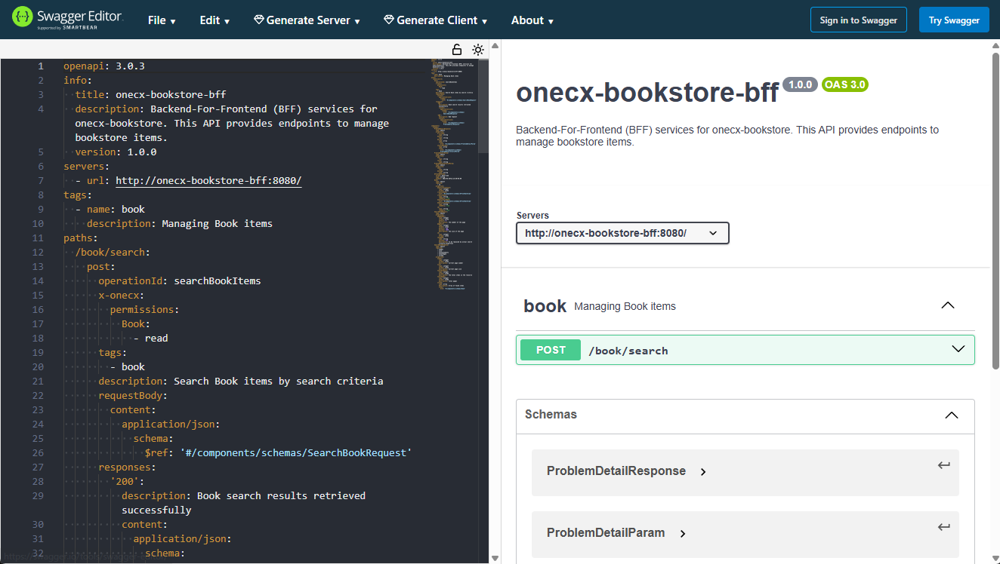
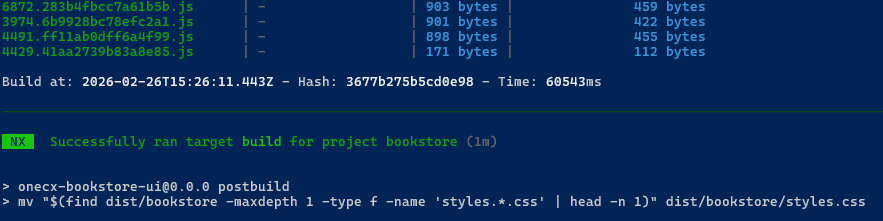
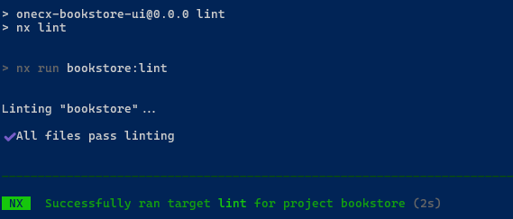
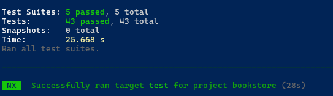

# OneCX UI App Generator

The OneCX UI App Generator is a powerful tool that simplifies the development of UI applications within the OneCX framework. It automates the creation of key UI components, ensuring consistency and adherence to best practices.

**In addition to generation,** significant parts still need to be created or modified manually by the user. Such parts are highlighted in the documentation as **ACTION**. These actions indicate where and what adjustments are necessary to complete the generated code.

**To clearly explain** how the generator works and the necessary adjustments, this guide uses a practical example: an **application to manage Books**. The **Bookstore** application allows users to search for books, view details about them, and manage their properties.

In case you want to take part of the development of the generator or want to use it locally without installing it globally from npm, see the [Development Guide](generator/development.html) for instructions on how to get the generator and set up the development environment.

| |  **Package renamed in version 9.**Starting with version **9.0.0-rc.2**, the Angular generator package has been renamed from @onecx/nx-plugin to @onecx/angular-generator.Update your generator commands accordingly, e.g. use nx generate @onecx/angular-generator:feature …​ instead of nx generate @onecx/nx-plugin:feature …​.Older versions (v8 and below) continue to use the @onecx/nx-plugin package name. |
| ------------------------------------------------------------------------------------------------------------------------------------------------------------------------------------------------------------------------------------------------------------------------------------------------------------------------------------------------------------------------------------------------------------------- |

## [](#prerequisites)Prerequisites

### [](#environment-setup)Environment Setup

Make sure your development environment is set up correctly before using the OneCX UI App Generator.  
The following tools must be installed and versions verified:

* **npm** version should be >= 10.2.4
* **node** version should be 20.11.0
* **nx** \- Local: v19.6.4
* **nx** \- Global: v20.0.6

Check versions

```bash
node --version
npm --version
nx --version
```

Install the Nx CLI globally

```bash
npm install -g nx@latest
```

In case of issues during **Nx** installation, try the following steps:

Nx CLI installation issue resolution

```bash
rm -rf node_modules
npm cache verify
npm install -g @nrwl/cli
npm install
```

### [](#basic-knowledge-helps)Basic Knowledge helps

Angular and Nx

The OneCX UI App Generator is built on top of [Angular](https://angular.de/) and [Nx](https://nx.dev/), so a basic understanding of these technologies is essential to effectively use the generator and customize the generated code.

Familiarity with [Angular](https://angular.de/) concepts such as components, modules, services, and state management (e.g., [NgRx](https://ngrx.io/)) will help you understand the structure of the generated code and how to extend it.

Local App Integration

The easiest way to integrate the generated App into local running OneCX is to follow the [OneCX Local Environment](../onecx-local-env/index.html) guidelines in [Extend OneCX](../onecx-local-env/extend/extend.html). This ensures that the components are correctly registered and accessible within the application.

OpenAPI Specification

The generator relies on the OpenAPI specification to define the API endpoints and data models. Understanding how to read and modify OpenAPI YAML files is crucial for customizing the API interactions of the generated components.  
Use the [Swagger Editor](https://editor.swagger.io/) to validate the syntax and structure of the OpenAPI file (openapi-bff.yaml) against the [OpenAPI Specification](https://spec.openapis.org/oas/).

Use of Swagger Editor with example OpenAPI file 

 

## [](#generation-by-example)Generation by Example

Let’s explore the capabilities of the OneCX App Generator through a practical example, the **Bookstore**. We will create a simple application **to manage books**, which includes features such as searching for books, viewing details, and managing their properties.  
We also provide a simple mock solution to simulate the backend services for the generated components, allowing you to see the generator’s output in action without needing a fully functional backend.

The generator offers a range of commands to gradually create various UI components such as applications, function modules, and pages. During the generation of some parts, you will be prompted to specify parameters that determine the structure and naming of the generated components. Occasionally, code adjustments will be necessary to implement business requirements.

| |  Make the adjustments carefully and in accordance with the specifications and naming conventions of your project to ensure consistency and maintainability of the codebase. |
| ----------------------------------------------------------------------------------------------------------------------------------------------------------------------------- |

### [](#start-generation)Start Generation

Here is an overview of the application parts that can be generated using the OneCX App Generator. Start from top to bottom, i.e. first generate the application, then the feature module, and then the pages. The generator will guide you through the necessary steps and parameters for each part.

* [OneCX UI App](generator/create-app.html) ⇐ **start here**  
   * [Feature Module](generator/create-feature.html)  
         * [Entity Schema and OpenAPI](generator/create-schema.html)  
         * [Search Component](generator/create-search.html)  
         * [Details Component](generator/create-details.html)  
         * Create/Update Dialog  
         * Delete Dialog  
         * [Simple NgRx Page](generator/create-ngrx-page.html)

| |  Build the application step by step, roughly following the suggested order above. This iterative approach allows you to understand the structure of the generated code and make necessary adjustments along the way.After generating each part, take the time to review the generated code, run the application, and ensure that everything is working as expected before moving on to the next part (see below for build, lint, test the App). This iterative approach helps in identifying and fixing issues early in the development process, leading to a more robust and maintainable application. |
| --------------------------------------------------------------------------------------------------------------------------------------------------------------------------------------------------------------------------------------------------------------------------------------------------------------------------------------------------------------------------------------------------------------------------------------------------------------------------------------------------------------------------------------------------------------------------------------------------------- |

### [](#build-the-app)Build the App

After generating the UI App and its components, you can build the application.  
Use the following command to build the application:

Build the application

```bash
npm run build
```

 

Figure 1\. Excerpt of the build output (exemplary for **bookstore** application)

### [](#lint-the-app)Lint the App

The generator creates code that adheres to standard linting rules, but it’s always a good practice to run the linter after generation to catch any potential issues or inconsistencies.  
Use the following command to lint the application:

Static code analyzing of the application

```bash
npm run lint
```

 

Figure 2\. Excerpt of the lint output (exemplary for **bookstore** application)

### [](#test-the-app)Test the App

After generating the application and its components, it’s crucial to run the tests to ensure that everything is working as expected. The generator creates basic test cases for the generated components, but you may need to add more tests or adjust the existing ones based on your specific requirements and business logic.  
Use the following command to run the tests:

Test the application

```bash
npm run test
```

 

Figure 3\. Excerpt of the test output (exemplary for **bookstore** application)

## [](#react-generators)React Generators

In addition to the Angular generators, the OneCX App Generator provides generators for **React** UI applications. They follow the same iterative approach: generate a part, then adapt the places marked with **ACTION**.

* [Create a Feature Module (React)](#generator/create-react-feature.adoc)  
Generates a feature entry page and registers feature-level routing.
* [Create a React Search Page](#generator/create-react-search.adoc)  
A data-driven search page with criteria, results table, header actions and API integration.
* [Create a Detail Component (React)](#generator/create-react-details.adoc)  
Generates details page, hook/store, and related UI components for a resource.
* [Create a React Page](#generator/create-react-page.adoc)  
A minimal, ready-to-use page with header and content area.
