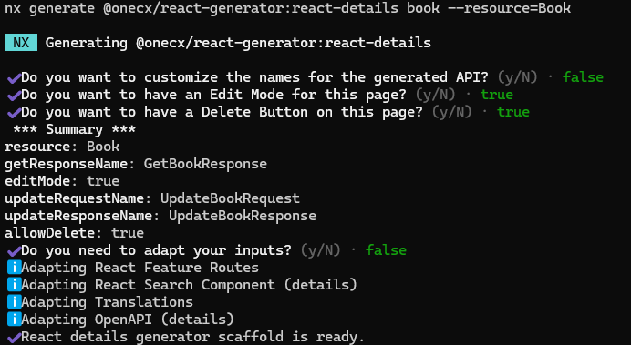
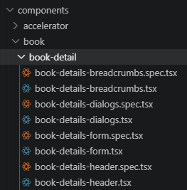
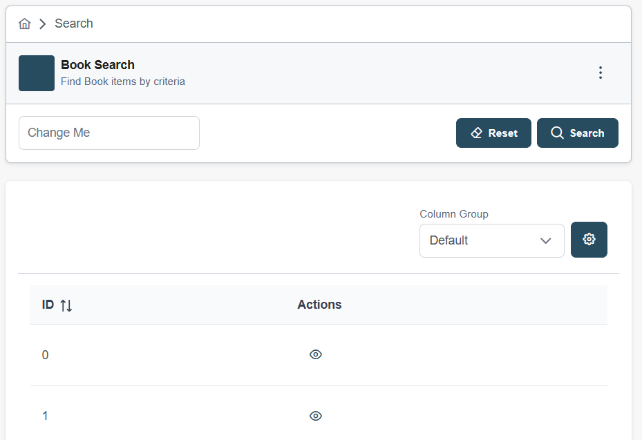
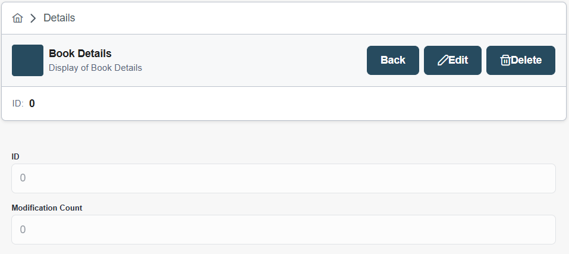

# Create a Detail Page (React)

| |  This page documents the React detail generator.For Angular, see [Create a Detail Component](../generator/create-details.html). |
| --------------------------------------------------------------------------------------------------------------------------------- |

## [](#generate-a-detail-component)Generate a Detail Component

The current working directory must be the root of an existing OneCX UI Application.

When a resource name is specified with the `--resource` option, the generator will preset the API class name to `<Resource>Api` used by the generated detail page. This should correspond to the created schema in OpenAPI file, see step before.

Create a detail page with the following command, preset resource/entity name

```bash
nx generate @onecx/react-generator:react-details <feature> --resource=<resource>
```

with:

| _<namespace>_ | The base namespace of the project where the application is part of.For the OneCX, use @onecx.                                                                                                                            |
| ------------- | ------------------------------------------------------------------------------------------------------------------------------------------------------------------------------------------------------------------------ |
| _<feature>_   | The name of the generated feature module.E.g. book for a feature module named "Book".                                                                                                                                    |
| _<resource>_  | Optional. The name of the resource entity for which the feature module is generated.E.g. book for a resource entity named "Book". If not specified, the generator will use the feature name as resource name by default. |

Next, **you will be asked** if you would like to adapt the names for the generation.  

| NO  | If you answer **No**, the generator will use the preset resource name (if specified) or derive the name from feature name. This is the fastest way.         |
| --- | ----------------------------------------------------------------------------------------------------------------------------------------------------------- |
| YES | If you answer **Yes**, you can specify a name for the resource/entity and the API components. This can be helpful if you want to customize an existing API. |

Next questions will be about the use of actions within the search result page to manipulate the data. We recommend to answer **Yes** to at least the question about the edit action, as this will generate an edit button in the detail view which is a common use case for detail pages.  
The generator creates a new detail page for the specified feature and set up the necessary structure and configurations.

 

Figure 1\. Example: Detail page for books - answering "Yes" to specify adjustments

### [](#key-naming-conventions)Key Naming Conventions

* `src/pages/<feature>/<resource>-details`  
Directory for the detail page and its hook/store files
* `src/components/<feature>/<feature>-detail`  
Directory for reusable UI components (header, form, dialogs, breadcrumbs) for the detail page
* `<Resource>DetailsPage`  
Name for the detail page page
* `/:id`  
Default route path with ID parameter for the detail page, see routing configuration

## [](#post-generation-steps)Post-Generation Steps

The next steps involve adapting the detail page to your specific requirements and integrating it into other parts of the application. All parts that need to be adapted after the generation are described in the following sections.

* [Configure Detail Properties (React)](react-details/detail-properties-react.html)
* [Configure Detail Tests (React)](react-details/detail-tests-react.html)

All places that need to be adapted are marked with an action box like this one

```javascript
ACTION D<NUMBER>: <Short Description>
```

| |  Search in your IDE for the string **ACTION D** to quickly find all places that need to be adapted. |
| ----------------------------------------------------------------------------------------------------- |

## [](#example)Example

### [](#create-a-detail-page)Create a Detail Page

Create a detail page for the feature **book**.  
Execute the following command with the **bookstore** application as current working directory.

Create a Detail Page for a Book, preset resource/entity name

```bash
nx generate @onecx/react-generator:react-details book --resource=Book
```

This command will generate a new detail page **book-details** for the specified feature with the necessary structure and configurations. With the presetted resource/entity name **Book**, the generator will also preset the API class name to **BookApi** used by the generated detail component. This should correspond to the created schema in OpenAPI file, see step before.

 

Figure 2\. Excerpt of generated files and directories

### [](#configure-the-detail)Configure the Detail

The generated detail page and components provide a basic structure for displaying and managing the details of the specified resource/entity.  
You can further configure the detail view, form controls, and actions according to your specific requirements, following the [Post Generation Steps](#post-generation-steps).

### [](#preview)Preview

In the following image, the search result view was extended with a VIEW action.

 

Figure 3\. Search UI after creation of detail component with VIEW action

The detail page is displayed when clicking on the VIEW button in the search result view.  
The detail page is generated with a basic layout and structure, which can be further customized and enhanced based on the specific requirements of your application. The generated component includes a detail view for displaying the details of the resource/entity and form controls for editing the details, which can be adapted to fit the data structure and user interface needs of your application.

 

Figure 4\. Detail UI after generation
