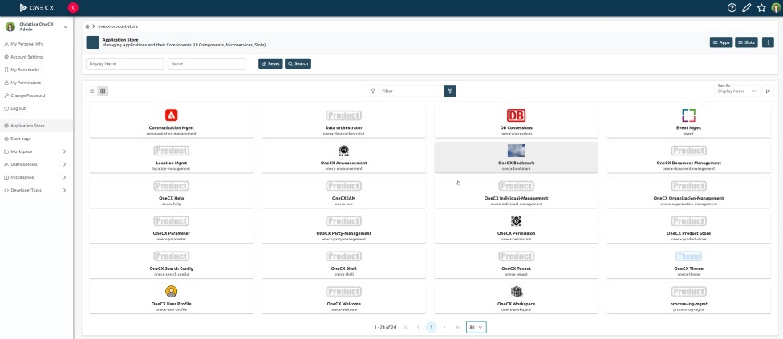
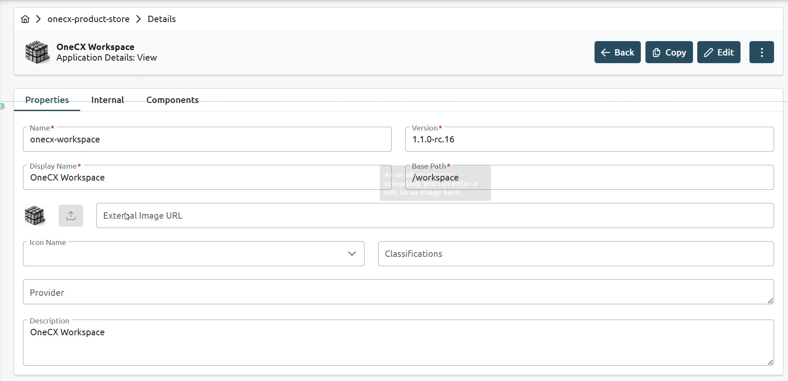
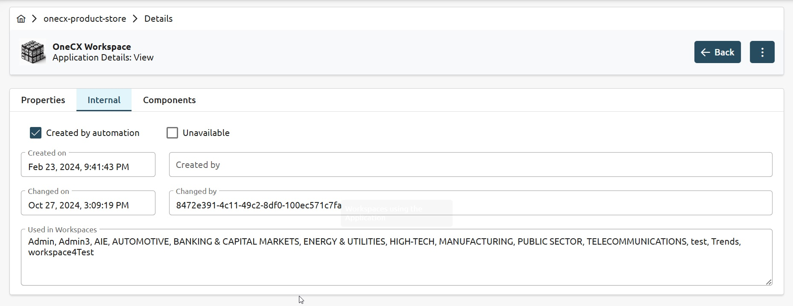
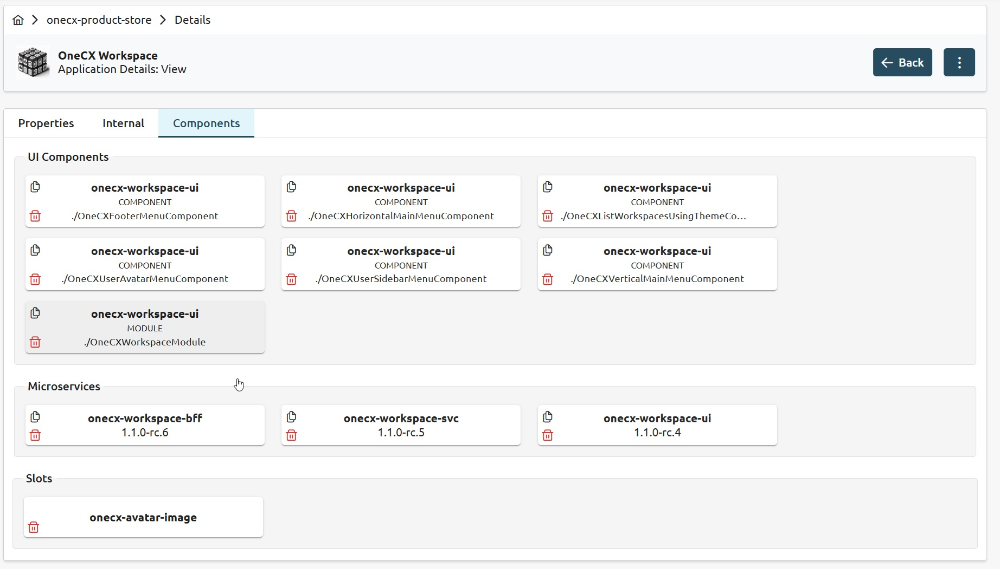

# OneCX Application Store

 

Figure 1\. Application Store UI

## Overview

The OneCX Enterprise Application Store is a comprehensive repository designed to streamline the discovery, integration, and management of both custom-built and third-party software solutions. It serves as a marketplace where enterprises can find and deploy a wide range of applications and services to enhance their operational efficiency and innovation. Key features include:

* **Repository of Solutions**:  
   * **Custom-Built Solutions**: Offers a variety of enterprise-specific applications developed to meet unique business needs.  
   * **Third-Party Software**: Includes a diverse selection of third-party applications, providing additional functionality and integration options.
* **Out-of-the-Box Accelerator Solutions**:  
   * **Pre-Built Accelerators**: Provides ready-to-use solutions that can be quickly deployed to accelerate business processes and initiatives.  
   * **Ease of Integration**: Designed for seamless integration with existing systems, reducing the time and effort required for implementation.
* **Marketplace Functionality**:  
   * **Discover and Integrate**: Functions like a marketplace, allowing users to easily discover and integrate third-party applications and services.  
   * **User-Friendly Interface**: Features an intuitive interface that simplifies the search, evaluation, and deployment of applications.
* **Enterprise Customization**:  
   * **Tailored Solutions**: Supports the customization of applications to fit specific enterprise requirements.  
   * **Scalability**: Ensures that solutions can scale with the growth and evolving needs of the business.

## Benefits

* **Enhanced Efficiency**: Streamlines the process of finding and deploying software solutions, saving time and resources.
* **Increased Innovation**: Provides access to a wide range of applications that can drive innovation and improve business processes.
* **Flexibility**: Offers both out-of-the-box and customizable solutions to meet diverse business needs.
* **Seamless Integration**: Ensures that new applications can be easily integrated with existing systems, minimizing disruption.

## UI Examples

 

Figure 2\. Application basic information

 

Figure 3\. Application internal information

 

Figure 4\. Application components

## Licence

This software is licensed under the Apache License, Version 2.0\. You may obtain a copy of the license in the corresponding LICENSE file or visit the [Apache website](https://www.apache.org/licenses/LICENSE-2.0) for more information.

## Contributing

We welcome contributions from the community. If you would like to contribute to the development of OneCX Application Store Software, please follow our contribution guidelines (tbd).

## Issue Tracking

All OneCX Application Store issues are tracked and maintained at the [issue tracking tool](https://xyz.com).

## Structure overview

OneCX Application Store consists of three main components: a backend service, a user interface and a backend-for-frontend (BFF) layer.

The three components of the OneCX Application Store Software are as follows:

1. Application Store User Interface (UI) The user interface component is based on Angular, a popular JavaScript framework for building dynamic web applications. It offers a user-friendly and intuitive interface for interacting with the Application Store system. Users can perform actions such as searching and editing of applications and apps.
2. Application Store Backend for Frontend (BFF) The BFF layer acts as an intermediary between the frontend user interface and the backend service. It handles tasks such as data aggregation, transformation, and composition to provide an optimized API for the UI. The BFF layer is designed to enhance performance and simplify the integration of the frontend with the backend service.
3. Application Store Backend Service (SVC) This component provides the core functionality. It handles tasks such as storage, retrieval and editing of applications and apps. The backend is built cloud native using Quarkus.

Interfaces are based on the TM-Forum standard [TMF 667](https://github.com/tmforum-apis/TMF667%5FDocument).

## Getting Started

To get started with OneCX Application Store Software, please refer to the following installation and setup instructions specific to each component:

* [OneCX Application Store UI (User Interface) - Getting Started](https://onecx.github.io/docs/onecx-product-store/current/onecx-product-store-ui/index.html)
* [OneCX Application Store BFF (Backend for Frontend) - Getting Started](https://onecx.github.io/docs/onecx-product-store/current/onecx-product-store-bff/index.html)
* [OneCX Application Store SVC (Backend) - Getting Started](https://onecx.github.io/docs/onecx-product-store/current/onecx-product-store-svc/index.html)

For detailed usage instructions and API documentation, please refer to the respective documentation files for each component.

## Roadmap

tbd
