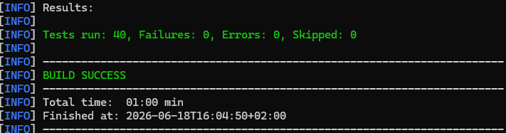
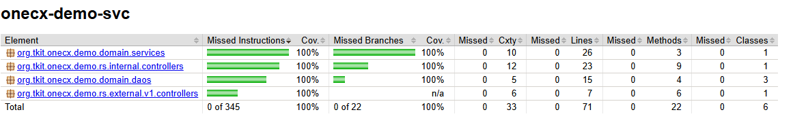

# OneCX Backend Service (SVC) Generator

The OneCX Backend Generator is a powerful tool that simplifies the development of Backend applications within the OneCX framework. It automates the creation of basic Backend structure, database models, and API endpoints, ensuring consistency and adherence to best practices.

**In addition to generation,** significant parts still need to be created or modified manually by the user. Such parts are highlighted in the documentation as **ACTION**. These actions indicate where and what adjustments are necessary to complete the generated code.

**To clearly explain** how the generator works and the necessary adjustments, this guide uses a practical example: an **application named demo to manage Product**. The **onecx-demo-svc** application allows users to create product in database, with name, price and category.

Repository of onecx-svc-generator:<https://github.com/onecx/onecx-svc-generator>

## [](#prerequisites)Prerequisites

### [](#environment-setup)Environment Setup

Make sure your development environment is set up correctly before using the OneCX SVC Generator.  
The following tools must be installed and versions verified:

* **java** version should be 25
* **maven** version should be >= 3.9.15

Check versions

```bash
java --version
mvn --version
```

## [](#generation-by-example)Generation by Example

Let’s explore the capabilities of the OneCX App Generator through a practical example, the **Demo**. We will create a simple backend **Products management**, which includes database and API for storing, searching, deleting and update products.

The generator offers two steps of project generation. First is about bacis structure without any entity, with empty api definition. Second is dedicated to implement basic logic for entity including Liquibase changelog, DAOs, controllers, entity mappers and exception mappers. Api is distinguished for external and internal api.

| |  Please note that the generator does not create the database itself. You will need to set up the database separately and configure the connection in your application. The generator will create the necessary database migration scripts (Liquibase changelogs) to set up the required tables and relationships. |
| ------------------------------------------------------------------------------------------------------------------------------------------------------------------------------------------------------------------------------------------------------------------------------------------------------------------- |

### [](#start-generation)Start Generation

Here is an overview of the application parts that can be generated using the OneCX SVC Generator. Start from top to bottom, i.e. first generate the application, then the entities.

* [OneCX SVC](generator/create-svc.html) ⇐ **start here**
* [Entity Schema and OpenAPI](generator/create-schema.html)

| |  Build the application step by step, roughly following the suggested order above. This iterative approach allows you to understand the structure of the generated code and make necessary adjustments along the way.After generating each part, take the time to review the generated code, run the application, and ensure that everything is working as expected before moving on to the next part (see below for build, lint, test the App). This iterative approach helps in identifying and fixing issues early in the development process, leading to a more robust and maintainable application. |
| --------------------------------------------------------------------------------------------------------------------------------------------------------------------------------------------------------------------------------------------------------------------------------------------------------------------------------------------------------------------------------------------------------------------------------------------------------------------------------------------------------------------------------------------------------------------------------------------------------- |

### [](#build-the-app)Build the App

After generating the Onecx backend SVC you can build the application manually or use the flag for autobuild.  
Use the following command to build the application:

Build the application

```bash
mvn clean package -DskipTests
```

### [](#test-the-app)Test the App

After generating the application and its components, it’s crucial to run the tests to ensure that everything is working as expected. The generator creates basic test cases for the generated components, but you may need to add more tests or adjust the existing ones based on your specific requirements and business logic.  
Use the following command to run the tests:

Test the application

```bash
mvn test
```

 

Figure 1\. Excerpt of the test result (exemplary for **demo** application)

 

Figure 2\. Excerpt of the test coverage (exemplary for **demo** application)

Backend Generator Structure

```text
onecx-svc-generator/
├─ .github/
│  └─ workflows/
│     └─ release.yml
├─ examples/
│  └─ model.yaml
├─ src/
│  ├─ main/
│  │  ├─ java/
│  │  │  └─ org/tkit/onecx/onecxsvcgen/
│  │  │     ├─ Main.java
│  │  │     ├─ commands/
│  │  │     │  ├─ AddEntityCommand.java
│  │  │     │  ├─ BatchModelCommand.java
│  │  │     │  └─ CreateSvcCommand.java
│  │  │     ├─ model/
│  │  │     │  ├─ ApiDef.java
│  │  │     │  ├─ EntityDef.java
│  │  │     │  ├─ FieldDef.java
│  │  │     │  └─ RelationDef.java
│  │  │     └─ service/
│  │  │        ├─ BuildService.java
│  │  │        ├─ GitHubActionsService.java
│  │  │        ├─ LiquibaseChangelogService.java
│  │  │        ├─ ModelParserService.java
│  │  │        ├─ NamingService.java
│  │  │        ├─ OpenApiService.java
│  │  │        └─ TemplateService.java
│  │  └─ resources/
│  │     ├─ application.properties
│  │     └─ templates/
│  │        ├─ entity/
│  │        │  ├─ Controller.java.tpl
│  │        │  ├─ DAO.java.tpl
│  │        │  ├─ Entity.java.tpl
│  │        │  ├─ ExternalController.java.tpl
│  │        │  ├─ ExternalExceptionMapper.java.tpl
│  │        │  ├─ ExternalMapper.java.tpl
│  │        │  ├─ InternalExceptionMapper.java.tpl
│  │        │  ├─ Liquibase-changelog.xml.tpl
│  │        │  ├─ Liquibase-changeset.xml.tpl
│  │        │  ├─ Mapper.java.tpl
│  │        │  ├─ NonRootDAO.java.tpl
│  │        │  └─ Service.java.tpl
│  │        ├─ github/
│  │        │  ├─ renovate.json.tpl
│  │        │  └─ workflows/
│  │        │     ├─ build.yml.tpl
│  │        │     ├─ build-branch.yml.tpl
│  │        │     ├─ build-pr.yml.tpl
│  │        │     ├─ build-pr-merge.yml.tpl
│  │        │     ├─ build-release.yml.tpl
│  │        │     ├─ create-fix-branch.yml.tpl
│  │        │     ├─ create-new-build.yml.tpl
│  │        │     ├─ create-release.yml.tpl
│  │        │     ├─ documentation.yml.tpl
│  │        │     ├─ security.yml.tpl
│  │        │     └─ sonar-pr.yml.tpl
│  │        ├─ svc-project/
│  │        │  ├─ Chart.yaml.tpl
│  │        │  ├─ Dockerfile.jvm.tpl
│  │        │  ├─ Dockerfile.native.tpl
│  │        │  ├─ application.properties.tpl
│  │        │  ├─ gitignore.tpl
│  │        │  ├─ openapi-skeleton.yaml.tpl
│  │        │  ├─ pom.xml.tpl
│  │        │  └─ values.yaml.tpl
│  │        └─ test/
│  │           ├─ AbstractTest.java.tpl
│  │           ├─ ControllerIT.java.tpl
│  │           ├─ ControllerTest.java.tpl
│  │           ├─ ExternalControllerIT.java.tpl
│  │           └─ ExternalControllerTest.java.tpl
├─ .gitignore
├─ LICENSE
├─ pom.xml
└─ README.md
```

If you need to customize the generated code, you can modify the templates located in `src/main/resources/templates/`. These templates are used by the generator to create the necessary files for your application. + For example, if you want to change the structure of the generated controllers, you can edit the `Controller.java.tpl` template file. After making changes to the templates, you can re-run the generator to apply your customizations to the generated code. + This allows you to tailor the generated code to better fit your specific requirements and coding standards while still benefiting from the automation provided by the generator.
