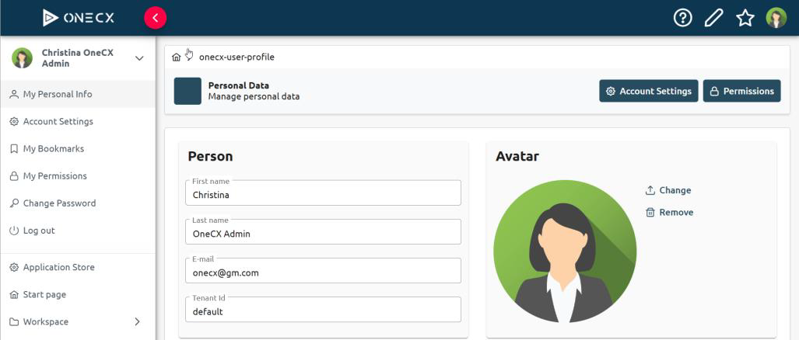
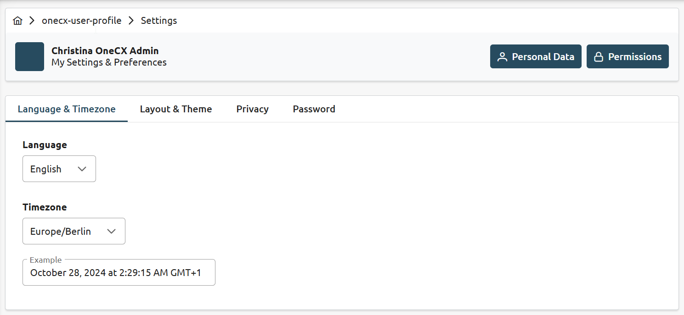
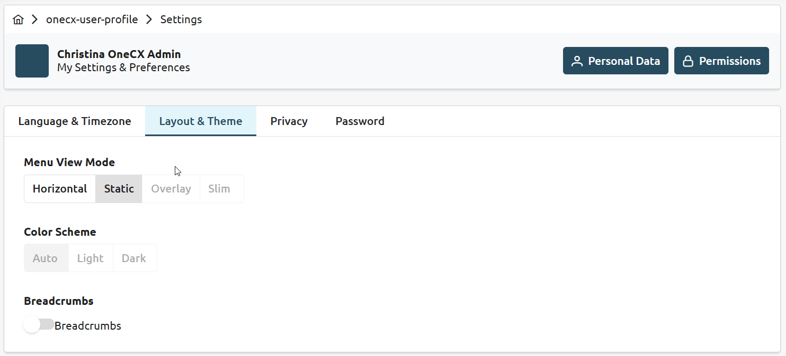
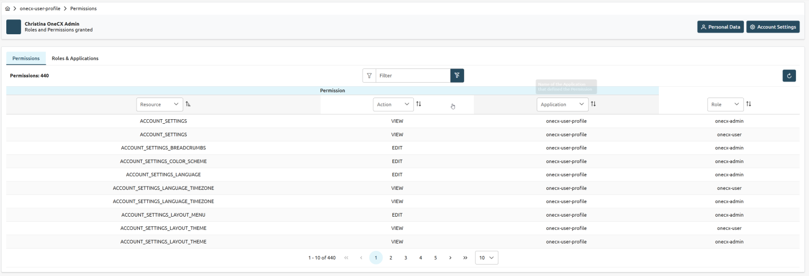
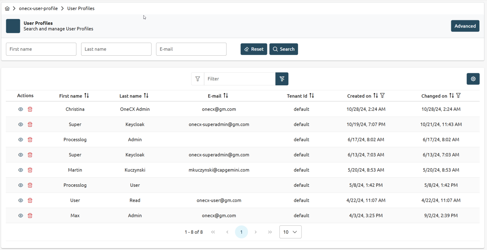
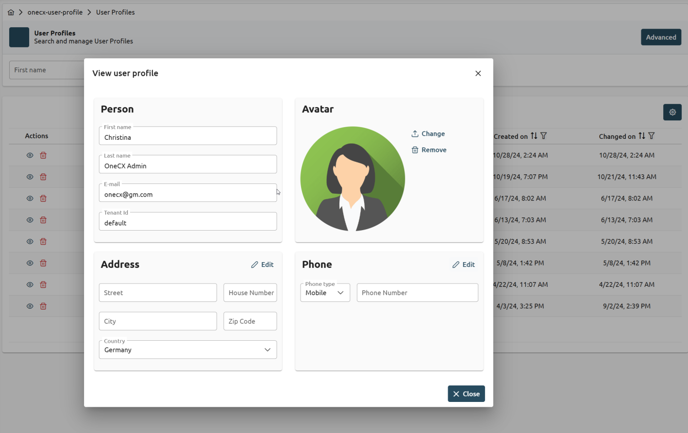

# OneCX User Profile

 

Figure 1\. User Profile UI

## Overview

A **user profile** is created when the user logs in for the first time in the system. This profile allows users to customize their experience and manage their settings. Key features include:

**Profile Management**

* View Profile: Display stored information.
* Edit Profile: Allow changes to profile picture, bio, language, timezone, and menu orientation. Note: Name, email, and password are not editable.

**Customization Settings**

* Menu Orientation: Choose between horizontal and vertical navigation menus.
* Language: Select preferred language.
* Timezone: Set the timezone.
* Avatar: Upload a profile picture. Privacy features & Password Change is not supported in the initial version.

**Admin Features**

* Profile Access: Admins can view and edit user profiles to assist with support issues.
* Activity Log: Track changes made by admins for security and auditing purposes.

**Permissions & Roles**

* View Permissions: Users can see their permissions and roles within the system.

## Benefits

* Better User Experience: Provides a personalized and user-friendly interface for managing profiles, enhancing overall satisfaction.
* Efficient Management: Streamlines the process of managing user profiles, saving time and resources for administrators.

## UI Examples

 

Figure 2\. Language and timezone settings

 

Figure 3\. Layout and theme settings

 

Figure 4\. User permissions

### User Profile Administration

 

Figure 5\. Users management

 

Figure 6\. User configuration

## Licence

This software is licensed under the Apache License, Version 2.0\. You may obtain a copy of the license in the corresponding LICENSE file or visit the [Apache website](https://www.apache.org/licenses/LICENSE-2.0) for more information.

## Contributing

We welcome contributions from the community. If you would like to contribute to the development of OneCX User Profile Software, please follow our contribution guidelines (tbd).

## Issue Tracking

All OneCX User Profile issues are tracked and maintained at the [issue tracking tool](https://xyz.com).

## Structure Overview

OneCX User Profile Software is a comprehensive solution for managing User Profiles in a user-friendly and efficient manner. It is a solution that consists of three main components: a backend service, a user interface and a backend-for-frontend (BFF) layer.

The three components of the OneCX User Profile Software are as follows:

1. User Profile User Interface (UI) The user interface component is based on Angular, a popular JavaScript framework for building dynamic web applications. It offers a user-friendly and intuitive interface for interacting with the User Profile system. Users can perform actions such as searching and editing of User Profiles.
2. User Profile Backend for Frontend (BFF) The BFF layer acts as an intermediary between the frontend user interface and the backend service. It handles tasks such as data aggregation, transformation, and composition to provide an optimized API for the UI. The BFF layer is designed to enhance performance and simplify the integration of the frontend with the backend service.
3. User Profile Backend Service (SVC) This component provides the core functionality. It handles tasks such as storage, retrieval and editing of User Profiles. The backend is built cloud native using Quarkus.

Interfaces are based on the TM-Forum standard [TMF 667](https://github.com/tmforum-apis/TMF667%5FDocument).

## Getting Started

To get started with OneCX User Profile Software, please refer to the following installation and setup instructions specific to each component:

* [OneCX User Profile UI (User Interface) - Getting Started](https://onecx.github.io/docs/onecx-user-profile/current/onecx-user-profile-ui/index.html)
* [OneCX User Profile BFF (Backend for Frontend) - Getting Started](https://onecx.github.io/docs/onecx-user-profile/current/onecx-user-profile-bff/index.html)
* [OneCX User Profile SVC (Backend) - Getting Started](https://onecx.github.io/docs/onecx-user-profile/current/onecx-user-profile-svc/index.html)

For detailed usage instructions and API documentation, please refer to the respective documentation files for each component.

## Roadmap

tbd
