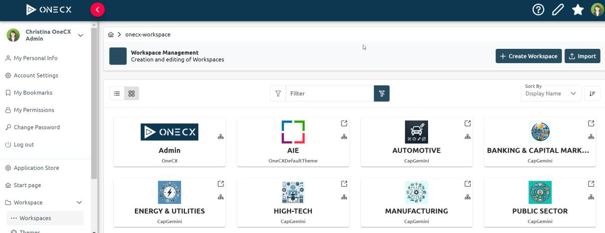
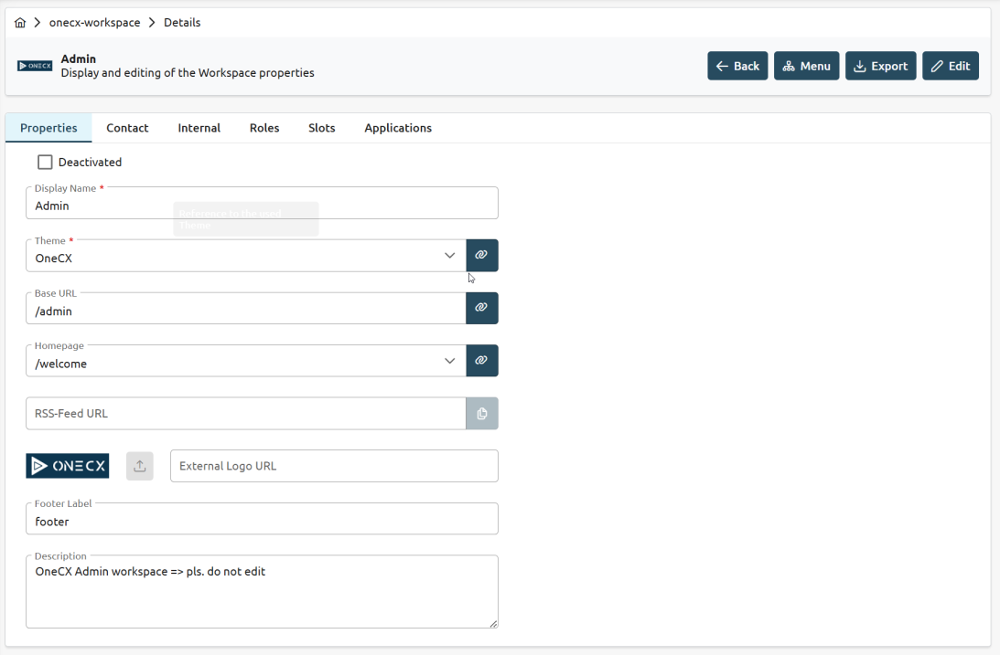
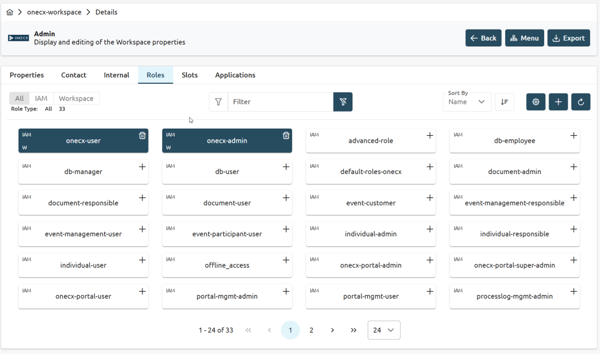
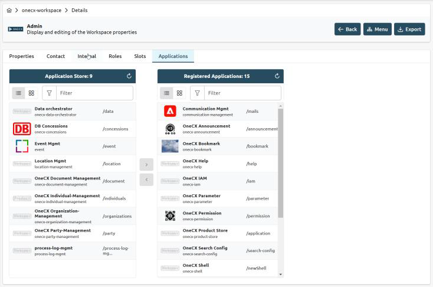
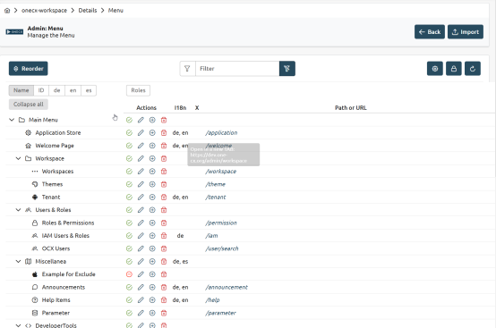
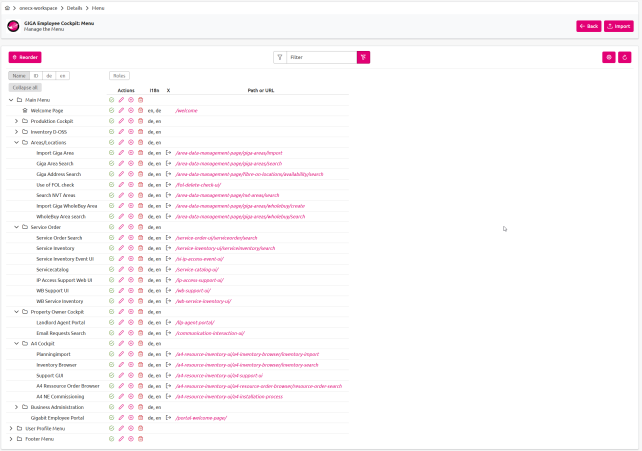
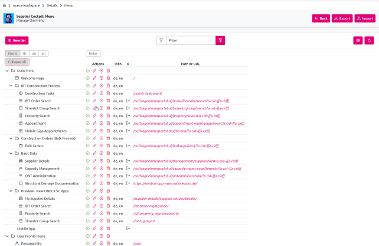
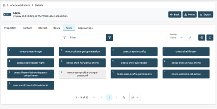
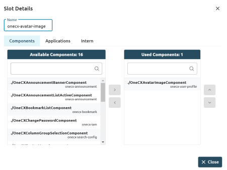

# OneCX Workspace Management

 

Figure 1\. Workspace UI

## Overview

The OneCX Workspace Management Solution is designed to create and manage workspaces tailored to the specific needs of different personas or user roles within an organization. This ensures that users have access to the relevant tools and services they need to perform their tasks efficiently and securely. Key features include:

**Persona-Based Workspace Creation**:

* **Tailored Workspaces**: Facilitates the creation of workspaces that are customized for different user roles or personas, ensuring that each user has access to the tools and services most relevant to their responsibilities.
* **Role-Specific Tools**: Provides a curated set of applications and resources that align with the specific needs of each user role. Menu Configuration\*:
* **Customizable Menu Items**: Allows administrators to configure menu items to ensure that users can easily navigate to the tools and services they need.
* **Dynamic Menus**: Menus can be dynamically updated to reflect changes in user roles or organizational needs. Enhanced Security\*:
* **Access Control**: Implements robust access control mechanisms to ensure that only authorized users can access specific tools and services.
* **Secure Workspaces**: Configures workspace features to enhance security, protecting sensitive information and ensuring compliance with organizational policies. Usability Enhancements\*:
* **User-Friendly Interface**: Designed with usability in mind, providing an intuitive interface that makes it easy for users to find and use the tools they need.
* **Personalized Experience**: Offers a personalized user experience by tailoring workspace features to individual preferences and needs.

## Benefits

* Increased Productivity: By providing users with the tools and services they need, the solution helps to increase productivity and efficiency.
* Improved User Satisfaction: Tailored workspaces and a user-friendly interface enhance the overall user experience, leading to higher satisfaction.
* Enhanced Security: Robust security features ensure that sensitive information is protected and that users only have access to the tools and services they are authorized to use.
* Flexibility: The ability to customize workspaces and menus allows the solution to adapt to changing organizational needs and user roles.

## Dialogues

### Workspace General Data

 

Figure 2\. Workspace general data

### Workspace Role Management

 

Figure 3\. Workspace role management

### Workspace Application Registration

 

Figure 4\. Workspace application registration

### Workspace Menu Management

 

Figure 5\. Workspace menu example 1

 

Figure 6\. Workspace menu example 2

 

Figure 7\. Workspace menu example 3

### Workspace Slots

 

Figure 8\. Workspace slots registration

 

Figure 9\. Workspace slots assignment

## Licence

This software is licensed under the Apache License, Version 2.0\. You may obtain a copy of the license in the corresponding LICENSE file or visit the [Apache website](https://www.apache.org/licenses/LICENSE-2.0) for more information.

## Contributing

We welcome contributions from the community. If you would like to contribute to the development of OneCX Workspace Management Software, please follow our contribution guidelines (tbd).

## Issue Tracking

All OneCX Workspace issues are tracked and maintained at the [issue tracking tool](https://xyz.com).

## Structure Overview

OneCX Workspace Software is a comprehensive solution for managing Workspaces in a user-friendly and efficient manner. It is a solution that consists of three main components: a backend service, a user interface and a backend-for-frontend (BFF) layer.

The three components of the OneCX Workspace Software are as follows:

1. Workspace User Interface (UI) The user interface component is based on Angular, a popular JavaScript framework for building dynamic web applications. It offers a user-friendly and intuitive interface for interacting with the Workspace system. Users can perform actions such as searching and editing of Workspaces.
2. Workspace Backend for Frontend (BFF) The BFF layer acts as an intermediary between the frontend user interface and the backend service. It handles tasks such as data aggregation, transformation, and composition to provide an optimized API for the UI. The BFF layer is designed to enhance performance and simplify the integration of the frontend with the backend service.
3. Workspace Backend Service (SVC) This component provides the core functionality. It handles tasks such as storage, retrieval and editing of Workspaces. The backend is built cloud native using Quarkus.

Interfaces are based on the TM-Forum standard [TMF 667](https://github.com/tmforum-apis/TMF667%5FDocument).

## Getting Started

To get started with OneCX Workspace Software, please refer to the following installation and setup instructions specific to each component:

* [OneCX Workspace UI (User Interface) - Getting Started](https://onecx.github.io/docs/onecx-workspace/current/onecx-workspace-ui/index.html)
* [OneCX Workspace BFF (Backend for Frontend) - Getting Started](https://onecx.github.io/docs/onecx-workspace/current/onecx-workspace-bff/index.html)
* [OneCX Workspace SVC (Backend) - Getting Started](https://onecx.github.io/docs/onecx-workspace/current/onecx-workspace-svc/index.html)

For detailed usage instructions and API documentation, please refer to the respective documentation files for each component.

## Roadmap

tbd
